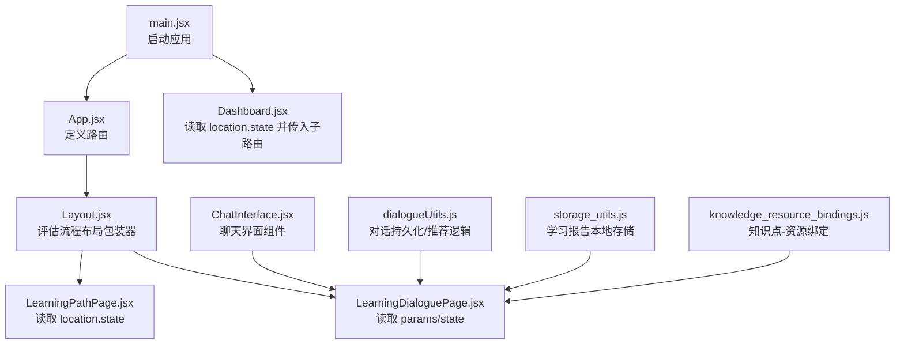
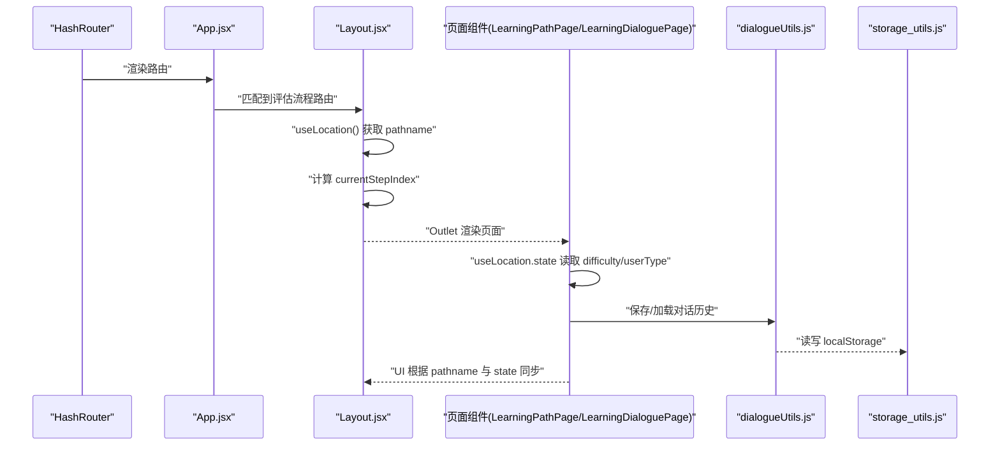
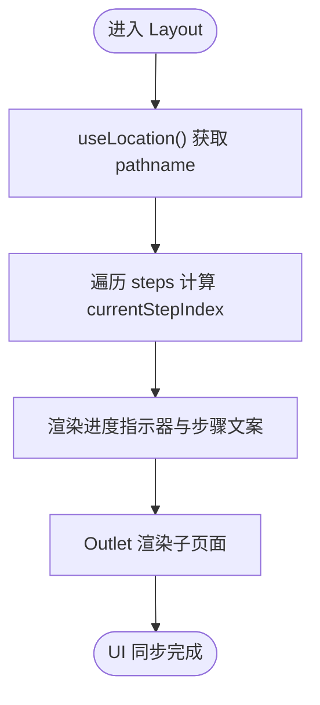
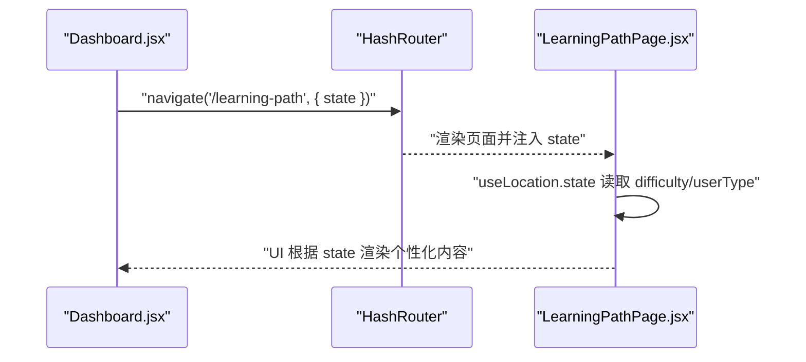
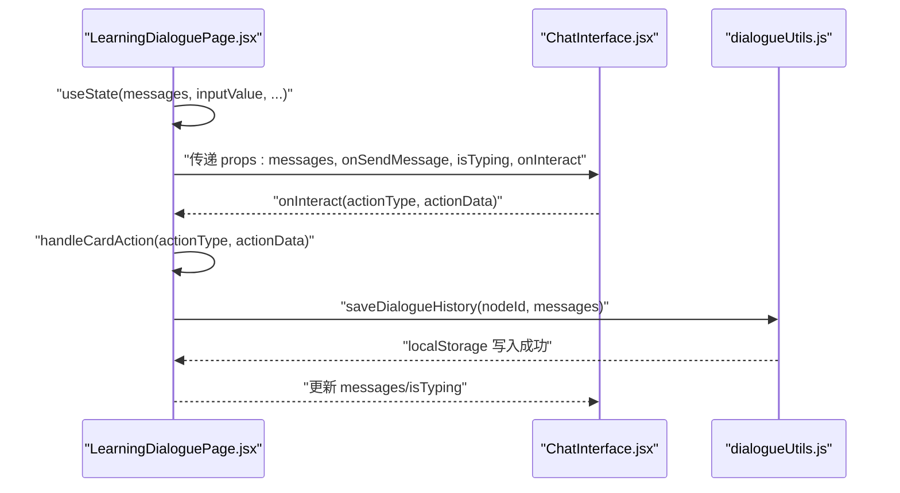
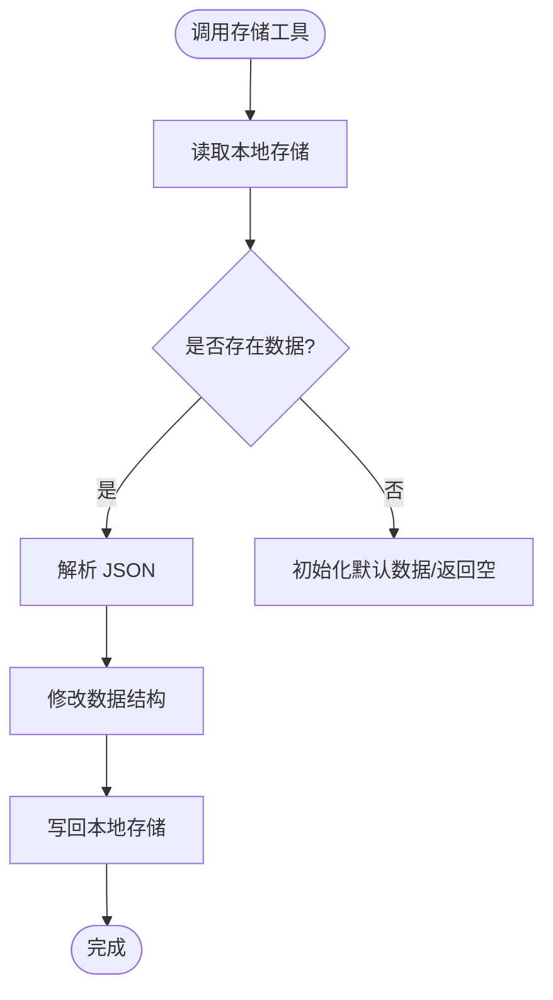
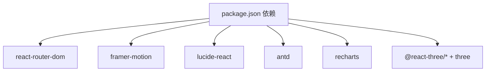

# 状态与组件通信

<cite>
**本文引用的文件**
- [src/main.jsx](file://src/main.jsx)
- [src/App.jsx](file://src/App.jsx)
- [src/components/Layout.jsx](file://src/components/Layout.jsx)
- [src/pages/Dashboard.jsx](file://src/pages/Dashboard.jsx)
- [src/pages/LearningPathPage.jsx](file://src/pages/LearningPathPage.jsx)
- [src/pages/LearningDialoguePage.jsx](file://src/pages/LearningDialoguePage.jsx)
- [src/components/ChatInterface.jsx](file://src/components/ChatInterface.jsx)
- [src/utils/dialogueUtils.js](file://src/utils/dialogueUtils.js)
- [src/utils/storage_utils.js](file://src/utils/storage_utils.js)
- [src/data/knowledge_resource_bindings.js](file://src/data/knowledge_resource_bindings.js)
- [package.json](file://package.json)
</cite>

## 目录
1. [引言](#引言)
2. [项目结构](#项目结构)
3. [核心组件](#核心组件)
4. [架构总览](#架构总览)
5. [详细组件分析](#详细组件分析)
6. [依赖分析](#依赖分析)
7. [性能考虑](#性能考虑)
8. [故障排查指南](#故障排查指南)
9. [结论](#结论)

## 引言
本文件聚焦于 gemini 项目中的“组件状态管理与通信机制”。我们将围绕以下主题展开：
- 如何通过 React Router 的 useLocation 等 Hook 在 App.jsx、Layout.jsx 等组件间传递路由状态，实现 UI 同步；
- 跨组件数据流设计模式：布局组件与页面组件之间的隐式状态共享；
- props 传递、Context 使用场景以及避免 prop drilling 的策略；
- 结合 storage_utils 的状态持久化与性能优化（避免不必要的重渲染）最佳实践。

## 项目结构
项目采用基于路由的页面组织方式，入口通过 HashRouter 提供路由支持；App.jsx 定义路由层级，Layout.jsx 作为评估流程的布局包装器，页面组件通过 useLocation/useNavigate 获取/传递状态，配合本地存储工具实现持久化。

图表来源
- [src/main.jsx](file://src/main.jsx#L1-L13)
- [src/App.jsx](file://src/App.jsx#L1-L101)
- [src/components/Layout.jsx](file://src/components/Layout.jsx#L1-L144)
- [src/pages/LearningPathPage.jsx](file://src/pages/LearningPathPage.jsx#L1-L63)
- [src/pages/LearningDialoguePage.jsx](file://src/pages/LearningDialoguePage.jsx#L1-L536)
- [src/components/ChatInterface.jsx](file://src/components/ChatInterface.jsx#L1-L170)
- [src/utils/dialogueUtils.js](file://src/utils/dialogueUtils.js#L1-L495)
- [src/utils/storage_utils.js](file://src/utils/storage_utils.js#L1-L438)
- [src/data/knowledge_resource_bindings.js](file://src/data/knowledge_resource_bindings.js#L1-L61)

章节来源
- [src/main.jsx](file://src/main.jsx#L1-L13)
- [src/App.jsx](file://src/App.jsx#L1-L101)

## 核心组件
- 路由入口与根组件
  - main.jsx 使用 HashRouter 包裹 App.jsx，确保路由功能可用。
  - App.jsx 定义多条路由，其中评估流程路由以 Layout.jsx 作为父级包装器，使布局与页面共享“步骤进度”等状态。
- 布局组件
  - Layout.jsx 使用 useLocation 获取当前 pathname，并据此计算“当前步骤索引”，驱动进度指示器与标题文案的 UI 同步。
- 页面组件
  - Dashboard.jsx 通过 useLocation 读取 state 中的 difficulty 与 userType，并在导航到学习报告时将这些状态通过 state 传递给子路由。
  - LearningPathPage.jsx 通过 useLocation.state 读取难度与用户类型，用于渲染个性化内容。
  - LearningDialoguePage.jsx 使用 useParams 获取节点标识，结合 dialogueUtils 实现对话历史与学习进度的本地持久化；同时通过 onCardAction 与子组件通信，实现卡片交互驱动的状态变更。
- 通信与状态
  - ChatInterface.jsx 作为聊天界面的通用组件，接收 messages、onSendMessage、isTyping、placeholder、onInteract 等 props，实现与父组件的双向通信。
  - storage_utils.js 提供学习报告数据的增删改查与导出导入，作为跨页面/组件的状态持久化载体。
  - knowledge_resource_bindings.js 提供知识点与资源的绑定关系，便于页面按需查询。

章节来源
- [src/main.jsx](file://src/main.jsx#L1-L13)
- [src/App.jsx](file://src/App.jsx#L1-L101)
- [src/components/Layout.jsx](file://src/components/Layout.jsx#L1-L144)
- [src/pages/Dashboard.jsx](file://src/pages/Dashboard.jsx#L1-L211)
- [src/pages/LearningPathPage.jsx](file://src/pages/LearningPathPage.jsx#L1-L63)
- [src/pages/LearningDialoguePage.jsx](file://src/pages/LearningDialoguePage.jsx#L1-L536)
- [src/components/ChatInterface.jsx](file://src/components/ChatInterface.jsx#L1-L170)
- [src/utils/dialogueUtils.js](file://src/utils/dialogueUtils.js#L1-L495)
- [src/utils/storage_utils.js](file://src/utils/storage_utils.js#L1-L438)
- [src/data/knowledge_resource_bindings.js](file://src/data/knowledge_resource_bindings.js#L1-L61)

## 架构总览
下面的序列图展示了“布局组件与页面组件之间的隐式状态共享”如何通过 useLocation 与 state 传递实现 UI 同步。

图表来源
- [src/main.jsx](file://src/main.jsx#L1-L13)
- [src/App.jsx](file://src/App.jsx#L1-L101)
- [src/components/Layout.jsx](file://src/components/Layout.jsx#L1-L144)
- [src/pages/LearningPathPage.jsx](file://src/pages/LearningPathPage.jsx#L1-L63)
- [src/pages/LearningDialoguePage.jsx](file://src/pages/LearningDialoguePage.jsx#L1-L536)
- [src/utils/dialogueUtils.js](file://src/utils/dialogueUtils.js#L1-L495)
- [src/utils/storage_utils.js](file://src/utils/storage_utils.js#L1-L438)

## 详细组件分析

### 布局组件与路由状态同步（Layout.jsx）
- 设计要点
  - 使用 useLocation 获取当前 pathname，维护 steps 列表，计算 currentStepIndex，驱动进度指示器与步骤文案。
  - 使用滚动监听设置 scrolled 状态，动态控制导航栏阴影样式。
  - 使用 key={location.pathname} 配合动画库实现页面切换的过渡效果。
- 与页面组件的协作
  - 通过 Outlet 渲染子页面，子页面可读取 location.state（如 LearningPathPage.jsx）或 params（如 LearningDialoguePage.jsx），实现隐式状态共享。

图表来源
- [src/components/Layout.jsx](file://src/components/Layout.jsx#L1-L144)

章节来源
- [src/components/Layout.jsx](file://src/components/Layout.jsx#L1-L144)

### 页面组件与路由状态传递（Dashboard.jsx、LearningPathPage.jsx）
- 设计要点
  - Dashboard.jsx 通过 useLocation 读取 state 中的 difficulty 与 userType，并在导航到学习报告时将这些状态通过 state 传递给子路由。
  - LearningPathPage.jsx 通过 useLocation.state 读取难度与用户类型，用于渲染个性化内容。
- 通信模式
  - 通过 useNavigate 的第二个参数 state 实现父子路由间的隐式状态传递，避免深层 props drilling。

图表来源
- [src/pages/Dashboard.jsx](file://src/pages/Dashboard.jsx#L1-L211)
- [src/pages/LearningPathPage.jsx](file://src/pages/LearningPathPage.jsx#L1-L63)

章节来源
- [src/pages/Dashboard.jsx](file://src/pages/Dashboard.jsx#L1-L211)
- [src/pages/LearningPathPage.jsx](file://src/pages/LearningPathPage.jsx#L1-L63)

### 对话页面与组件通信（LearningDialoguePage.jsx、ChatInterface.jsx、dialogueUtils.js）
- 设计要点
  - LearningDialoguePage.jsx 使用 useState 管理 messages、inputValue、showQuickReplies、currentMasteryLevel、mode 等状态；通过 useEffect 保存对话历史到 localStorage。
  - ChatInterface.jsx 作为通用聊天界面，接收 messages、onSendMessage、isTyping、placeholder、onInteract 等 props，实现与父组件的双向通信。
  - dialogueUtils.js 提供对话历史的保存/加载、学习进度保存、掌握程度分析、内容类型选择、消息格式化与统计分析等工具函数。
- 通信链路
  - 子组件（如卡片组件）通过 onInteract/onCardAction 通知父组件；父组件更新状态并持久化。

图表来源
- [src/pages/LearningDialoguePage.jsx](file://src/pages/LearningDialoguePage.jsx#L1-L536)
- [src/components/ChatInterface.jsx](file://src/components/ChatInterface.jsx#L1-L170)
- [src/utils/dialogueUtils.js](file://src/utils/dialogueUtils.js#L1-L495)

章节来源
- [src/pages/LearningDialoguePage.jsx](file://src/pages/LearningDialoguePage.jsx#L1-L536)
- [src/components/ChatInterface.jsx](file://src/components/ChatInterface.jsx#L1-L170)
- [src/utils/dialogueUtils.js](file://src/utils/dialogueUtils.js#L1-L495)

### 状态持久化与跨组件共享（storage_utils.js、knowledge_resource_bindings.js）
- 设计要点
  - storage_utils.js 提供学习报告数据的增删改查、进度更新、成就添加、能力分数更新、推荐完成标记、学习记录添加、连续打卡更新、导出导入、清空与重置等功能，统一管理 localStorage。
  - knowledge_resource_bindings.js 提供知识点与资源的绑定关系，支持保存/加载至 localStorage，便于页面按需查询。
- 最佳实践
  - 将“跨页面/组件共享”的状态集中到 storage_utils.js，避免在多处重复读写 localStorage。
  - 对于频繁更新的数据（如对话历史、学习进度），使用工具函数封装，减少页面组件的样板代码。

图表来源
- [src/utils/storage_utils.js](file://src/utils/storage_utils.js#L1-L438)
- [src/data/knowledge_resource_bindings.js](file://src/data/knowledge_resource_bindings.js#L1-L61)

章节来源
- [src/utils/storage_utils.js](file://src/utils/storage_utils.js#L1-L438)
- [src/data/knowledge_resource_bindings.js](file://src/data/knowledge_resource_bindings.js#L1-L61)

## 依赖分析
- 路由与动画
  - react-router-dom 提供 HashRouter、Routes、Route、useNavigate、useLocation、useParams、Outlet 等能力，支撑路由状态传递与页面切换。
  - framer-motion 提供页面切换动画与元素动画，增强用户体验。
- UI 与图标
  - lucide-react 提供图标组件，简化界面元素。
  - antd 提供头像、下拉菜单等 UI 组件。
- 工具与第三方
  - recharts 用于图表展示（在部分页面中使用）。
  - three、@react-three/fiber、@react-three/drei 用于 3D 场景（在部分页面中使用）。

图表来源
- [package.json](file://package.json#L1-L42)

章节来源
- [package.json](file://package.json#L1-L42)

## 性能考虑
- 避免不必要的重渲染
  - 使用 key={location.pathname} 驱动页面切换动画，确保每次路由变化都触发新的 key，避免同一路由下的重复渲染。
  - 在 ChatInterface.jsx 中，将消息列表渲染与输入状态拆分为独立的子组件，减少父组件状态变更对子树的影响。
  - 在 LearningDialoguePage.jsx 中，仅在 messages 变化时保存历史，避免频繁写入 localStorage。
- 本地存储访问优化
  - 将 localStorage 读写封装到 dialogueUtils.js 与 storage_utils.js，避免分散在各处导致的重复解析与写入。
  - 对于大数据结构（如学习报告），在读取时进行必要的字段校验与默认值处理，防止异常导致的渲染中断。
- 动画与滚动
  - Layout.jsx 的滚动监听在组件卸载时清理事件，避免内存泄漏。
  - ChatInterface.jsx 的滚动到最新消息使用 useEffect 依赖 messages/isTyping，避免无效滚动。

章节来源
- [src/components/Layout.jsx](file://src/components/Layout.jsx#L1-L144)
- [src/components/ChatInterface.jsx](file://src/components/ChatInterface.jsx#L1-L170)
- [src/pages/LearningDialoguePage.jsx](file://src/pages/LearningDialoguePage.jsx#L1-L536)
- [src/utils/dialogueUtils.js](file://src/utils/dialogueUtils.js#L1-L495)
- [src/utils/storage_utils.js](file://src/utils/storage_utils.js#L1-L438)

## 故障排查指南
- 路由状态丢失
  - 现象：页面无法读取 difficulty/userType 或 nodeId。
  - 排查：确认导航时是否通过 state 传递；检查 useLocation.state 是否存在默认值。
  - 参考路径
    - [src/pages/Dashboard.jsx](file://src/pages/Dashboard.jsx#L1-L211)
    - [src/pages/LearningPathPage.jsx](file://src/pages/LearningPathPage.jsx#L1-L63)
    - [src/pages/LearningDialoguePage.jsx](file://src/pages/LearningDialoguePage.jsx#L1-L536)
- 对话历史未保存/加载
  - 现象：刷新后对话丢失或历史为空。
  - 排查：检查 dialogueUtils.js 的保存/加载逻辑；确认 localStorage 权限与容量；检查过期时间判断。
  - 参考路径
    - [src/utils/dialogueUtils.js](file://src/utils/dialogueUtils.js#L1-L495)
- 错题本与学习报告不同步
  - 现象：错题状态改变后学习报告未更新。
  - 排查：确认 storage_utils.js 的同步逻辑是否被调用；检查同步函数中的过滤与排序逻辑。
  - 参考路径
    - [src/utils/storage_utils.js](file://src/utils/storage_utils.js#L1-L438)
- 知识点-资源绑定异常
  - 现象：页面无法获取绑定资源。
  - 排查：确认 KNOWLEDGE_RESOURCE_BINDINGS 是否存在；检查本地存储加载逻辑。
  - 参考路径
    - [src/data/knowledge_resource_bindings.js](file://src/data/knowledge_resource_bindings.js#L1-L61)

章节来源
- [src/pages/Dashboard.jsx](file://src/pages/Dashboard.jsx#L1-L211)
- [src/pages/LearningPathPage.jsx](file://src/pages/LearningPathPage.jsx#L1-L63)
- [src/pages/LearningDialoguePage.jsx](file://src/pages/LearningDialoguePage.jsx#L1-L536)
- [src/utils/dialogueUtils.js](file://src/utils/dialogueUtils.js#L1-L495)
- [src/utils/storage_utils.js](file://src/utils/storage_utils.js#L1-L438)
- [src/data/knowledge_resource_bindings.js](file://src/data/knowledge_resource_bindings.js#L1-L61)

## 结论
本项目通过 React Router 的 useLocation/useNavigate 与 state 传递，实现了布局组件与页面组件之间的隐式状态共享；通过 ChatInterface.jsx 的 props 通信与 dialogueUtils.js 的工具函数，构建了清晰的组件间数据流；借助 storage_utils.js 与 knowledge_resource_bindings.js，完成了跨页面的状态持久化与资源绑定管理。整体设计遵循“就近职责、集中持久化、避免 prop drilling”的原则，兼顾了可维护性与性能。