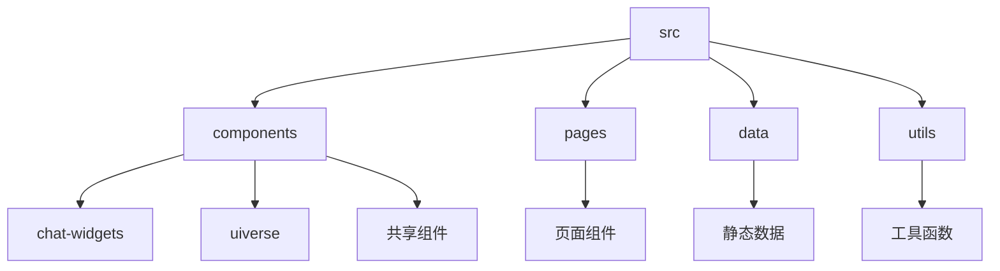
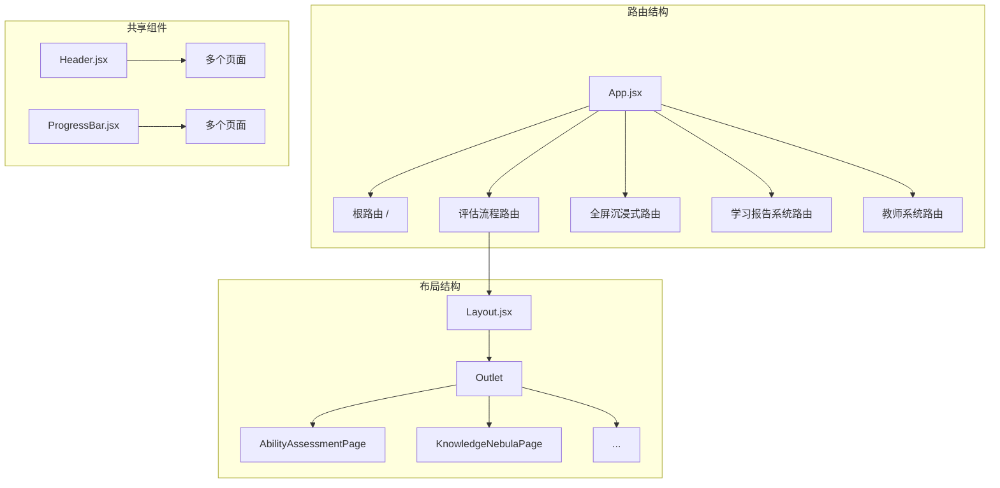
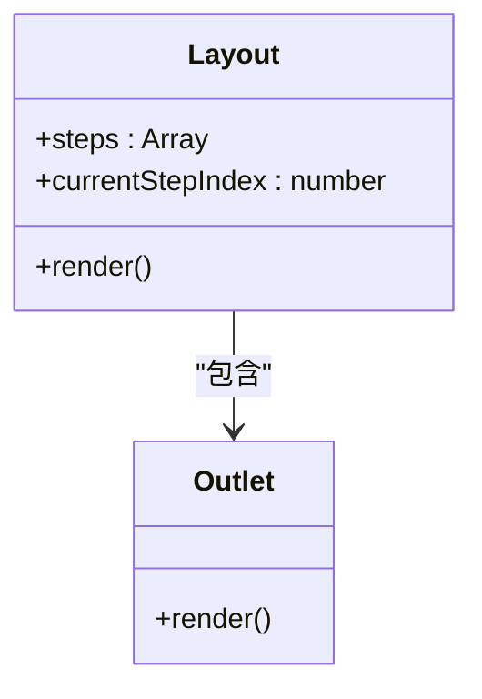
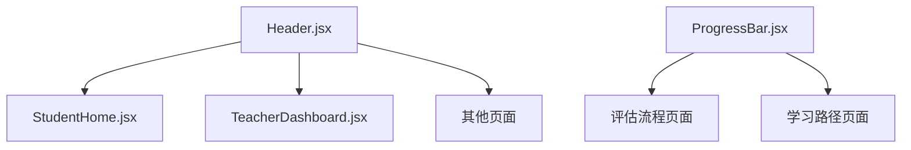
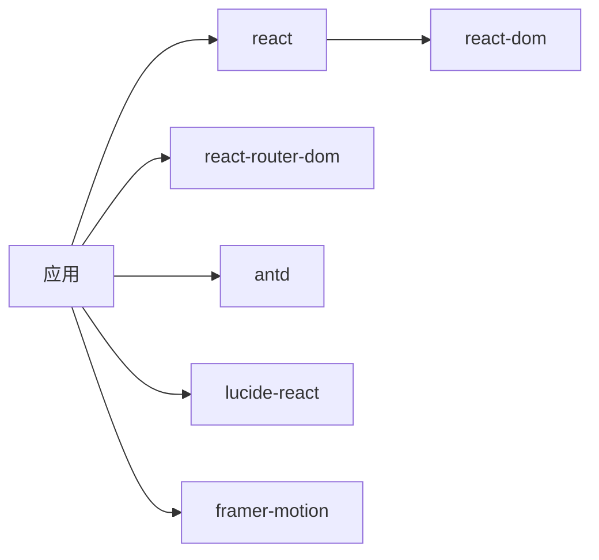

# 组件化架构

<cite>
**本文档引用的文件**
- [App.jsx](file://src/App.jsx)
- [Layout.jsx](file://src/components/Layout.jsx)
- [Header.jsx](file://src/components/Header.jsx)
- [main.jsx](file://src/main.jsx)
- [StudentHome.jsx](file://src/pages/StudentHome.jsx)
- [ChatInterface.jsx](file://src/components/ChatInterface.jsx)
- [DigitalTeacherAvatar.jsx](file://src/components/DigitalTeacherAvatar.jsx)
- [ProgressBar.jsx](file://src/components/ProgressBar.jsx)
- [QuizCard.jsx](file://src/components/chat-widgets/QuizCard.jsx)
- [VideoCard.jsx](file://src/components/chat-widgets/VideoCard.jsx)
- [UiverseButton.jsx](file://src/components/uiverse/UiverseButton.jsx)
- [GlassCard.jsx](file://src/components/uiverse/GlassCard.jsx)
- [learning_dialogue_assessment_data.js](file://src/data/learning_dialogue_assessment_data.js)
- [dialogueUtils.js](file://src/utils/dialogueUtils.js)
</cite>

## 目录
1. [项目结构](#项目结构)
2. [核心组件](#核心组件)
3. [架构概览](#架构概览)
4. [详细组件分析](#详细组件分析)
5. [依赖分析](#依赖分析)
6. [性能考虑](#性能考虑)
7. [故障排除指南](#故障排除指南)
8. [结论](#结论)

## 项目结构

项目采用基于功能的分层目录结构，清晰地分离了不同类型的组件和资源。`src` 目录下包含主要的源代码，其中 `components` 目录存放可复用的UI组件，`pages` 目录存放页面级组件，`data` 目录存放静态数据和配置，`utils` 目录存放工具函数。`legacy_backup` 目录保留了旧版的HTML、CSS和JavaScript文件，表明项目是从传统Web应用向现代React应用迁移的。



**图示来源**
- [src/components](file://src/components)
- [src/pages](file://src/pages)
- [src/data](file://src/data)
- [src/utils](file://src/utils)

**本节来源**
- [src/components](file://src/components)
- [src/pages](file://src/pages)
- [src/data](file://src/data)
- [src/utils](file://src/utils)

## 核心组件

项目的核心组件包括根组件 `App.jsx`、布局组件 `Layout.jsx` 和共享组件如 `Header.jsx`。这些组件共同构成了应用的基础架构，实现了路由管理、页面布局和UI一致性。

**本节来源**
- [src/App.jsx](file://src/App.jsx)
- [src/components/Layout.jsx](file://src/components/Layout.jsx)
- [src/components/Header.jsx](file://src/components/Header.jsx)

## 架构概览

`App.jsx` 作为应用的根组件，使用 `React Router` 来组织路由结构。它通过 `Routes` 和 `Route` 组件定义了应用的导航路径，将不同的URL映射到相应的页面组件。`Layout.jsx` 作为一个通用的布局容器，被用作多个路由的父组件，封装了页面的公共UI元素，如顶部导航栏和进度条。`Header.jsx` 是一个共享组件，被多个页面复用，确保了应用头部的一致性。



**图示来源**
- [src/App.jsx](file://src/App.jsx)
- [src/components/Layout.jsx](file://src/components/Layout.jsx)
- [src/components/Header.jsx](file://src/components/Header.jsx)

## 详细组件分析

### App.jsx 分析

`App.jsx` 是应用的入口点，负责定义整个应用的路由结构。它使用 `React Router` 的 `Routes` 组件来声明式地定义路由，通过 `Route` 组件的 `element` 属性指定每个路由对应的组件。`App.jsx` 还引入了 `Layout` 组件作为多个路由的父组件，实现了路由级别的布局复用。

#### 路由结构
```mermaid
graph TD
A[/] --> B[StudentHome]
C[/goal-selection] --> D[UnifiedAssessmentPage]
E[/ability-assessment] --> F[AbilityAssessmentPage]
G[/learning-report] --> H[LearningReportLayout]
H --> I[overview]
H --> J[details]
H --> K[recommendations]
```

**图示来源**
- [src/App.jsx](file://src/App.jsx)

**本节来源**
- [src/App.jsx](file://src/App.jsx)

### Layout.jsx 分析

`Layout.jsx` 是一个高阶布局组件，为评估流程中的多个页面提供统一的UI框架。它包含一个固定的顶部导航栏，显示应用标题和一个进度条，指示用户在评估流程中的当前位置。`Layout.jsx` 使用 `Outlet` 组件来渲染子路由的内容，实现了布局与内容的分离。

#### 布局组件结构


**图示来源**
- [src/components/Layout.jsx](file://src/components/Layout.jsx)

**本节来源**
- [src/components/Layout.jsx](file://src/components/Layout.jsx)

### 共享组件分析

共享组件如 `Header.jsx` 和 `ProgressBar.jsx` 被设计为可复用的UI元素，贯穿于整个应用中。`Header.jsx` 提供了应用的头部区域，包含品牌标识和帮助按钮。`ProgressBar.jsx` 显示了用户在特定流程中的进度。

#### 共享组件复用


**图示来源**
- [src/components/Header.jsx](file://src/components/Header.jsx)
- [src/components/ProgressBar.jsx](file://src/components/ProgressBar.jsx)

**本节来源**
- [src/components/Header.jsx](file://src/components/Header.jsx)
- [src/components/ProgressBar.jsx](file://src/components/ProgressBar.jsx)

## 依赖分析

项目依赖于多个第三方库，包括 `react`、`react-dom`、`react-router-dom` 用于构建UI和路由，`antd` 和 `lucide-react` 用于UI组件和图标，`framer-motion` 用于动画效果。这些依赖在 `package.json` 文件中定义，通过 `vite` 进行构建和打包。



**图示来源**
- [package.json](file://package.json)

**本节来源**
- [package.json](file://package.json)

## 性能考虑

应用在性能方面采用了多种优化策略。使用 `React.lazy` 和 `Suspense` 可以实现组件的懒加载，减少初始加载时间。`framer-motion` 的动画效果经过优化，确保在不同设备上都能流畅运行。`localStorage` 被用于持久化对话历史和学习进度，减少了不必要的网络请求。

## 故障排除指南

当遇到组件无法正确渲染或路由失效的问题时，应首先检查 `App.jsx` 中的路由配置是否正确。确保 `Route` 组件的 `path` 属性与URL匹配，`element` 属性指向正确的组件。对于布局问题，检查 `Layout.jsx` 中的 `Outlet` 组件是否正确放置。对于共享组件的样式问题，确认CSS类名是否正确应用。

**本节来源**
- [src/App.jsx](file://src/App.jsx)
- [src/components/Layout.jsx](file://src/components/Layout.jsx)
- [src/components/Header.jsx](file://src/components/Header.jsx)

## 结论

gemini项目采用了一种清晰的组件化架构，基于React 19的特性，实现了UI组件与页面组件的职责分离。通过 `App.jsx` 的路由组织、`Layout.jsx` 的布局封装和共享组件的复用，项目构建了一个可维护、可扩展的应用。这种架构不仅提高了代码的可读性和可维护性，还为未来的功能扩展提供了坚实的基础。