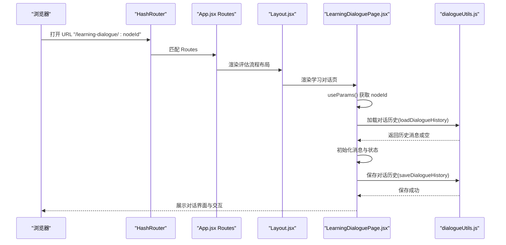
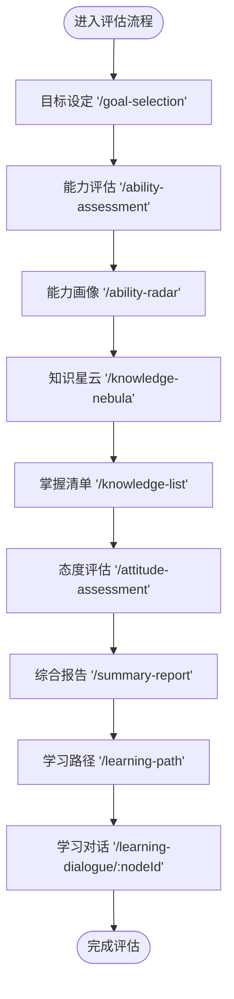
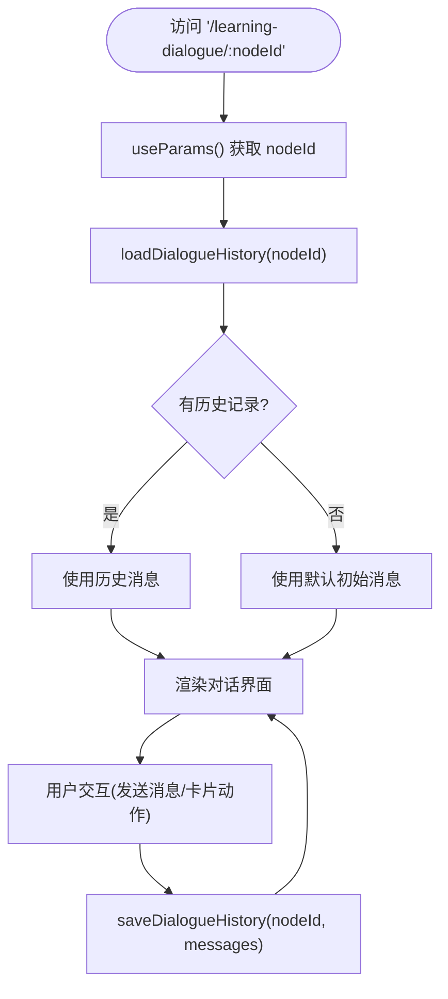
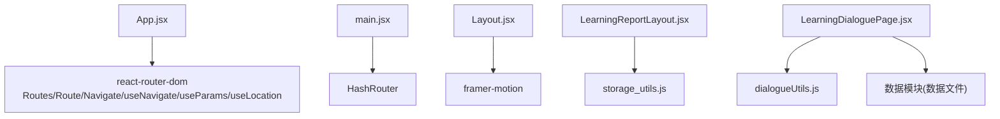

# 路由架构

<cite>
**本文引用的文件列表**
- [App.jsx](file://src/App.jsx)
- [main.jsx](file://src/main.jsx)
- [Layout.jsx](file://src/components/Layout.jsx)
- [LearningReportLayout.jsx](file://src/components/LearningReportLayout.jsx)
- [LearningDialoguePage.jsx](file://src/pages/LearningDialoguePage.jsx)
- [LearningPathPage.jsx](file://src/pages/LearningPathPage.jsx)
- [MyLearningPathPage.jsx](file://src/pages/MyLearningPathPage.jsx)
- [MyLearningTrajectoryPage.jsx](file://src/pages/MyLearningTrajectoryPage.jsx)
- [KnowledgeProfilePage.jsx](file://src/pages/KnowledgeProfilePage.jsx)
- [storage_utils.js](file://src/utils/storage_utils.js)
- [dialogueUtils.js](file://src/utils/dialogueUtils.js)
- [package.json](file://package.json)
</cite>

## 目录
1. [引言](#引言)
2. [项目结构](#项目结构)
3. [核心组件](#核心组件)
4. [架构总览](#架构总览)
5. [详细组件分析](#详细组件分析)
6. [依赖关系分析](#依赖关系分析)
7. [性能考量](#性能考量)
8. [故障排查指南](#故障排查指南)
9. [结论](#结论)
10. [附录](#附录)

## 引言
本文件围绕 gemini 项目的路由架构展开，重点解析 React Router 在 App.jsx 中的实现方式，涵盖根路径、嵌套路由（以 Layout 包裹的评估流程）、动态路由（如 learning-dialogue/:nodeId）的配置与组织；同时梳理路由分组策略（学生评估流程、教师系统、学习报告子路由），并结合代码示例说明路由守卫、导航控制与路由参数传递机制。最后给出最佳实践建议，包括路径命名规范、组件懒加载策略与性能优化要点，帮助开发者高效维护与扩展路由体系。

## 项目结构
- 入口与路由容器
  - 应用入口通过 HashRouter 包裹，根组件为 App，内部集中声明所有路由规则。
  - 路由采用 HashRouter，便于静态部署与本地预览。
- 路由分层与布局
  - 顶层路由包含仪表盘、目标设置、全屏沉浸式页面等。
  - 评估流程通过 Layout 组件包裹，形成统一的进度条与步骤导航。
  - 学习报告系统以 LearningReportLayout 作为父级布局，提供统一的导航与导出分享能力。
  - 教师系统路由独立分组，覆盖课程、路径、难度、分组推荐、学生分析等。
- 动态路由与参数
  - 学习对话页使用动态路由 learning-dialogue/:nodeId，组件内通过 useParams 获取节点标识，并据此加载数据与状态。

```mermaid
graph TB
main["main.jsx<br/>HashRouter 包裹 App"] --> app["App.jsx<br/>顶层 Routes 定义"]
app --> home["根路径 '/' -> StudentHome"]
app --> goal_setting["'/goal-setting' -> GoalSetting"]
app --> dashboard["'/dashboard' -> Dashboard"]
app --> layout_group["评估流程组<br/>Layout 包裹"]
layout_group --> goal_selection["'/goal-selection' -> UnifiedAssessmentPage"]
layout_group --> ability_assessment["'/ability-assessment' -> AbilityAssessmentPage"]
layout_group --> ability_radar["'/ability-radar' -> AbilityRadarPage"]
layout_group --> knowledge_nebula["'/knowledge-nebula' -> KnowledgeNebulaPage"]
layout_group --> knowledge_list["'/knowledge-list' -> KnowledgeListPage"]
layout_group --> attitude_assessment["'/attitude-assessment' -> AttitudeAssessmentPage"]
layout_group --> summary_report["'/summary-report' -> SummaryReportPage"]
layout_group --> report["'/report' -> AssessmentReportPage"]
layout_group --> learning_path["'/learning-path' -> LearningPathPage"]
layout_group --> learning_dialogue["'/learning-dialogue/:nodeId' -> LearningDialoguePage"]
layout_group --> knowledge_profile["'/knowledge-profile' -> KnowledgeProfilePage"]
app --> immersive["全屏沉浸式路由<br/>'/my-learning-path'<br/>'/my-learning-trajectory'<br/>'/error-log'"]
app --> lr_layout["学习报告布局 '/learning-report' -> LearningReportLayout"]
lr_layout --> lr_overview["'overview' -> LearningReportOverview"]
lr_layout --> lr_details["'details' -> LearningReportDetails"]
lr_layout --> lr_recommendations["'recommendations' -> LearningReportRecommendations"]
app --> teacher["教师系统路由组 '/teacher' 下各子路由"]
```



图表来源
- [main.jsx](file://src/main.jsx#L1-L14)
- [App.jsx](file://src/App.jsx#L1-L101)

章节来源
- [main.jsx](file://src/main.jsx#L1-L14)
- [App.jsx](file://src/App.jsx#L1-L101)

## 核心组件
- HashRouter 容器
  - 应用通过 HashRouter 提供基于哈希的路由能力，适合静态部署与 Vite 预览环境。
- App 路由总控
  - 集中声明所有顶层与嵌套路由，按功能域分组，便于维护与扩展。
- Layout 评估流程布局
  - 提供统一头部、进度指示与 Outlet，承载评估流程的步骤导航与过渡动画。
- LearningReportLayout 学习报告布局
  - 提供统一的导航标签、返回与导出分享能力，配合存储工具读取学生信息。
- 动态路由组件
  - LearningDialoguePage 使用 useParams 获取 nodeId，结合对话工具与数据模块实现对话与推荐逻辑。

章节来源
- [main.jsx](file://src/main.jsx#L1-L14)
- [App.jsx](file://src/App.jsx#L1-L101)
- [Layout.jsx](file://src/components/Layout.jsx#L1-L144)
- [LearningReportLayout.jsx](file://src/components/LearningReportLayout.jsx#L1-L129)
- [LearningDialoguePage.jsx](file://src/pages/LearningDialoguePage.jsx#L1-L536)

## 架构总览
- 路由分层设计
  - 根路径与仪表盘：面向通用入口与首页。
  - 评估流程组：以 Layout 包裹，形成统一的进度条与步骤导航，提升用户体验一致性。
  - 学习报告组：以 LearningReportLayout 作为父级布局，子路由按“概览/详情/建议”组织。
  - 教师系统组：独立分组，覆盖课程、路径、难度、分组推荐、学生分析等。
  - 全屏沉浸式路由：如我的学习路径、轨迹回放、错误日志等，强调沉浸体验。
- 动态路由与参数传递
  - 评估流程组内的学习对话页使用动态路由 learning-dialogue/:nodeId，组件通过 useParams 获取节点标识，结合对话工具与数据模块进行状态管理与推荐。
- 导航控制与守卫
  - 通过 useNavigate 实现返回与跳转；部分页面通过 useLocation 获取 state 参数（如学习路径页的难度与用户类型）。
  - 未发现显式的路由守卫实现，可通过自定义 Hook 或中间件扩展。



图表来源
- [App.jsx](file://src/App.jsx#L57-L70)
- [Layout.jsx](file://src/components/Layout.jsx#L126-L141)
- [LearningDialoguePage.jsx](file://src/pages/LearningDialoguePage.jsx#L128-L200)
- [dialogueUtils.js](file://src/utils/dialogueUtils.js#L1-L91)

章节来源
- [App.jsx](file://src/App.jsx#L57-L70)
- [Layout.jsx](file://src/components/Layout.jsx#L1-L144)
- [LearningDialoguePage.jsx](file://src/pages/LearningDialoguePage.jsx#L128-L200)
- [dialogueUtils.js](file://src/utils/dialogueUtils.js#L1-L91)

## 详细组件分析

### 评估流程路由组（Layout 包裹）
- 设计要点
  - 通过 Layout 组件统一头部与进度条，利用 useLocation 与步骤数组定位当前步骤，提供视觉进度与步骤提示。
  - 子路由覆盖目标设定、能力评估、能力画像、知识星云、掌握清单、态度评估、综合报告、学习路径、知识画像等。
- 路由参数与导航
  - 评估流程内的学习对话页使用动态路由 learning-dialogue/:nodeId，组件通过 useParams 获取节点标识，结合对话工具与数据模块进行状态管理与推荐。
- 交互与动画
  - Layout 使用 Framer Motion 实现页面切换的淡入淡出与滑动过渡，增强用户体验。



图表来源
- [App.jsx](file://src/App.jsx#L57-L70)
- [Layout.jsx](file://src/components/Layout.jsx#L1-L144)

章节来源
- [App.jsx](file://src/App.jsx#L57-L70)
- [Layout.jsx](file://src/components/Layout.jsx#L1-L144)

### 学习对话页（动态路由与参数传递）
- 动态路由配置
  - 路由定义为 learning-dialogue/:nodeId，组件通过 useParams 获取 nodeId。
- 参数与数据绑定
  - 组件根据 nodeId 从数据模块加载初始消息与标题等信息；若无历史记录，则使用默认初始消息。
- 状态持久化
  - 使用对话工具的 loadDialogueHistory 与 saveDialogueHistory 实现对话历史的读写，支持过期清理与时间戳管理。
- 导航控制
  - 顶部返回按钮使用 useNavigate(-1) 实现返回上一页；支持模式切换（问答/教学）与快捷回复。



图表来源
- [App.jsx](file://src/App.jsx#L67-L69)
- [LearningDialoguePage.jsx](file://src/pages/LearningDialoguePage.jsx#L128-L200)
- [dialogueUtils.js](file://src/utils/dialogueUtils.js#L1-L91)

章节来源
- [App.jsx](file://src/App.jsx#L67-L69)
- [LearningDialoguePage.jsx](file://src/pages/LearningDialoguePage.jsx#L128-L200)
- [dialogueUtils.js](file://src/utils/dialogueUtils.js#L1-L91)

### 学习报告子路由（嵌套路由与布局）
- 布局与导航
  - 学习报告系统以 LearningReportLayout 作为父级布局，提供统一的导航标签与返回按钮。
  - 子路由按“概览/详情/建议”组织，index 路由用于默认跳转。
- 数据与交互
  - 布局组件通过存储工具读取学生信息，提供导出 PDF 与分享按钮。
- 导航控制
  - 使用 useNavigate 与 useLocation 实现标签切换与返回仪表盘。

```mermaid
sequenceDiagram
participant User as "用户"
participant LRLayout as "LearningReportLayout"
participant Overview as "LearningReportOverview"
participant Details as "LearningReportDetails"
participant Recommendations as "LearningReportRecommendations"
User->>LRLayout : 访问 '/learning-report'
LRLayout->>Overview : 渲染概览(index)
User->>LRLayout : 点击"报告详情"
LRLayout->>Details : 渲染详情
User->>LRLayout : 点击"学习建议"
LRLayout->>Recommendations : 渲染建议
User->>LRLayout : 点击"返回"
LRLayout->>LRLayout : useNavigate('/dashboard')
```

图表来源
- [App.jsx](file://src/App.jsx#L77-L84)
- [LearningReportLayout.jsx](file://src/components/LearningReportLayout.jsx#L1-L129)

章节来源
- [App.jsx](file://src/App.jsx#L77-L84)
- [LearningReportLayout.jsx](file://src/components/LearningReportLayout.jsx#L1-L129)

### 教师系统路由组（路径命名与分组策略）
- 路由分组
  - 以 '/teacher' 为前缀，子路由覆盖课程、难度设置、路径管理、路径编辑、班级概览、AI 分组、学生详情与分析、评估配置等。
- 路径命名规范
  - 采用层级前缀与语义化路径，便于团队协作与维护。
- 导航控制
  - 多处页面使用 useNavigate(-1) 实现返回，保持一致的导航体验。

章节来源
- [App.jsx](file://src/App.jsx#L85-L96)
- [LearningPathPage.jsx](file://src/pages/LearningPathPage.jsx#L1-L63)
- [MyLearningPathPage.jsx](file://src/pages/MyLearningPathPage.jsx#L113-L128)
- [MyLearningTrajectoryPage.jsx](file://src/pages/MyLearningTrajectoryPage.jsx#L288-L307)
- [KnowledgeProfilePage.jsx](file://src/pages/KnowledgeProfilePage.jsx#L1-L23)

### 全屏沉浸式路由（特殊场景）
- 路由定义
  - 包括 '/my-learning-path'、'/my-learning-trajectory'、'/error-log' 等，强调沉浸式体验。
- 导航控制
  - 页面普遍使用 useNavigate(-1) 返回上一页，保证一致性。

章节来源
- [App.jsx](file://src/App.jsx#L72-L76)
- [MyLearningPathPage.jsx](file://src/pages/MyLearningPathPage.jsx#L113-L128)
- [MyLearningTrajectoryPage.jsx](file://src/pages/MyLearningTrajectoryPage.jsx#L288-L307)

## 依赖关系分析
- 路由依赖
  - App.jsx 依赖 react-router-dom 的 Routes、Route、Navigate、useNavigate、useParams、useLocation。
  - HashRouter 来源于 react-router-dom。
- 组件依赖
  - Layout 与 LearningReportLayout 依赖 Framer Motion 实现过渡动画。
  - 学习对话页依赖对话工具与数据模块，实现消息与进度的持久化。
- 存储依赖
  - 学习报告布局依赖存储工具读取学生信息；学习对话页依赖对话工具进行历史读写。



图表来源
- [App.jsx](file://src/App.jsx#L1-L101)
- [main.jsx](file://src/main.jsx#L1-L14)
- [Layout.jsx](file://src/components/Layout.jsx#L1-L144)
- [LearningReportLayout.jsx](file://src/components/LearningReportLayout.jsx#L1-L129)
- [LearningDialoguePage.jsx](file://src/pages/LearningDialoguePage.jsx#L1-L536)
- [storage_utils.js](file://src/utils/storage_utils.js#L1-L438)
- [dialogueUtils.js](file://src/utils/dialogueUtils.js#L1-L91)
- [package.json](file://package.json#L1-L42)

章节来源
- [package.json](file://package.json#L1-L42)

## 性能考量
- 路由切换性能
  - 使用 Framer Motion 的过渡动画时，注意避免在大组件树中频繁触发重排；可将动画组件拆分为更细粒度的子组件。
- 路由懒加载
  - 建议对大型页面组件采用动态导入与 Suspense，减少首屏包体与初次渲染时间。
- 状态持久化
  - 对 localStorage 的频繁读写可能影响性能，建议合并写入、限制存储大小与键数量，必要时使用 IndexedDB。
- 嵌套路由渲染
  - 嵌套布局组件应尽量复用，避免重复渲染；合理使用 React.memo 与 useMemo 优化重渲染。

## 故障排查指南
- 动态路由参数为空
  - 检查路由定义与 useParams 使用是否匹配；确认 nodeId 是否存在对应的数据。
- 对话历史无法加载或过期
  - 检查对话工具的 loadDialogueHistory 逻辑与过期判断；确认 localStorage 中是否存在对应键值。
- 学习报告布局学生信息为空
  - 检查存储工具的 getLearningData 是否初始化默认数据；确认 localStorage 中是否存在对应键值。
- 导航异常
  - 检查 useNavigate(-1) 是否在正确的上下文中调用；确认路由栈状态。

章节来源
- [LearningDialoguePage.jsx](file://src/pages/LearningDialoguePage.jsx#L128-L200)
- [dialogueUtils.js](file://src/utils/dialogueUtils.js#L1-L91)
- [LearningReportLayout.jsx](file://src/components/LearningReportLayout.jsx#L1-L129)
- [storage_utils.js](file://src/utils/storage_utils.js#L1-L180)

## 结论
本项目路由架构以 App.jsx 为核心，采用 HashRouter 与多层嵌套路由组织评估流程、学习报告与教师系统三大功能域。通过 Layout 与 LearningReportLayout 提供统一的导航与过渡体验，动态路由 learning-dialogue/:nodeId 支持以节点标识驱动的对话与推荐。建议后续引入路由守卫、组件懒加载与性能监控，进一步提升可维护性与用户体验。

## 附录
- 最佳实践建议
  - 路径命名规范：采用层级前缀与语义化命名，如 '/teacher/*'、'/learning-report/*'。
  - 路由守卫：通过自定义 Hook 或中间件实现登录校验与权限控制。
  - 组件懒加载：对大型页面组件使用动态导入与 Suspense，减少首屏体积。
  - 性能优化：合并 localStorage 写入、限制键数量、使用 IndexedDB；优化动画与重渲染。
  - 参数传递：统一通过 useLocation.state 与 useParams 传递数据，避免全局状态污染。