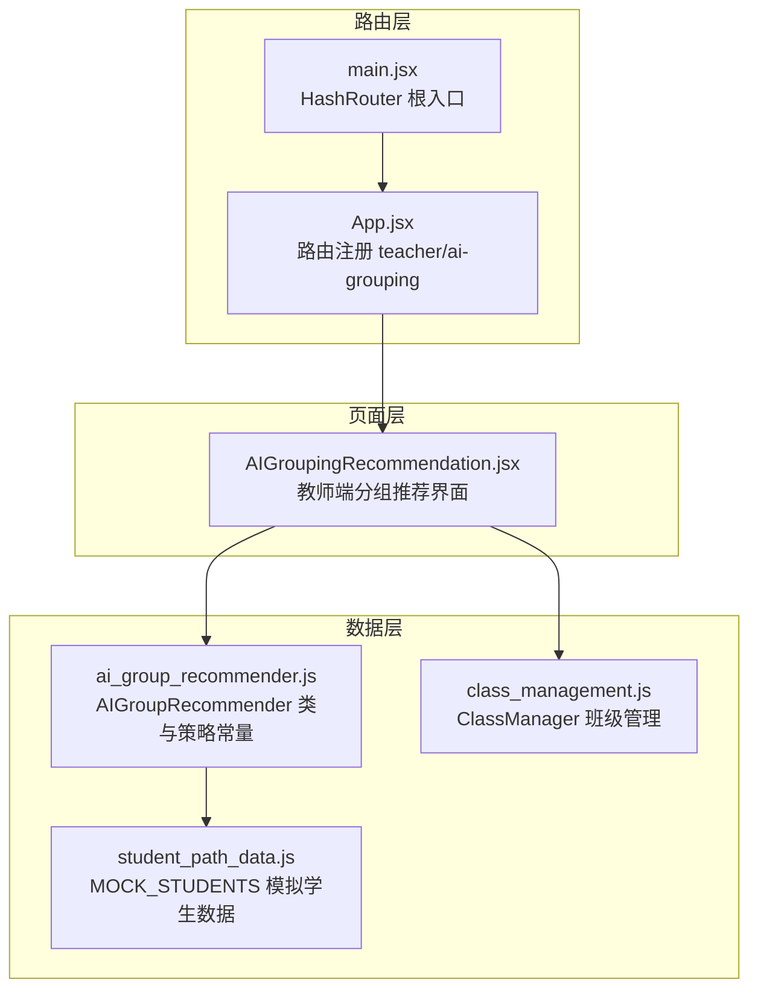
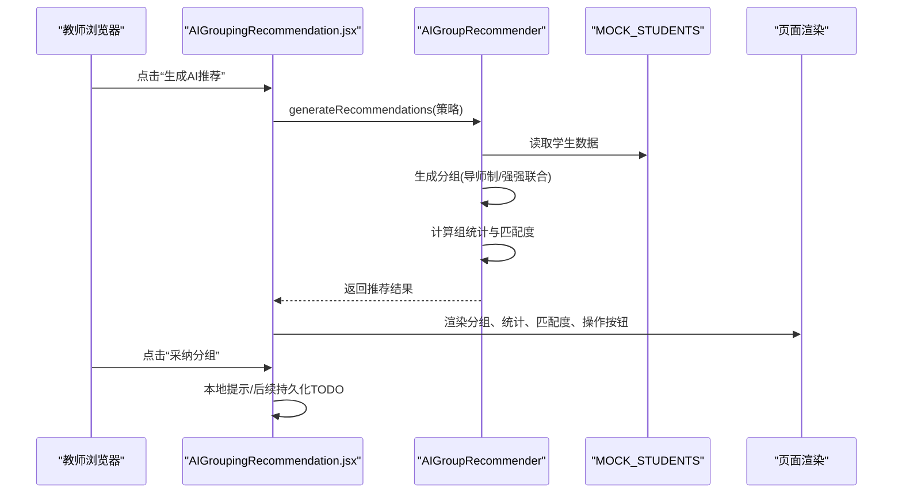
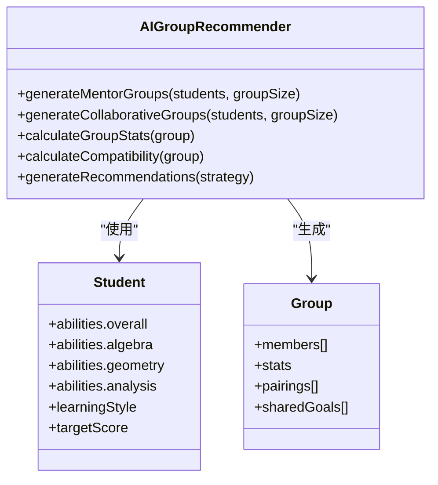
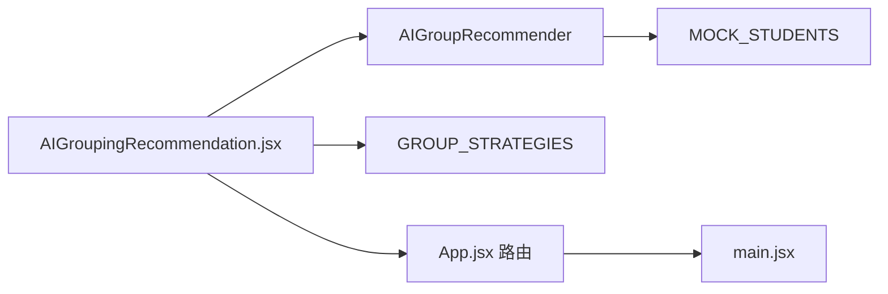
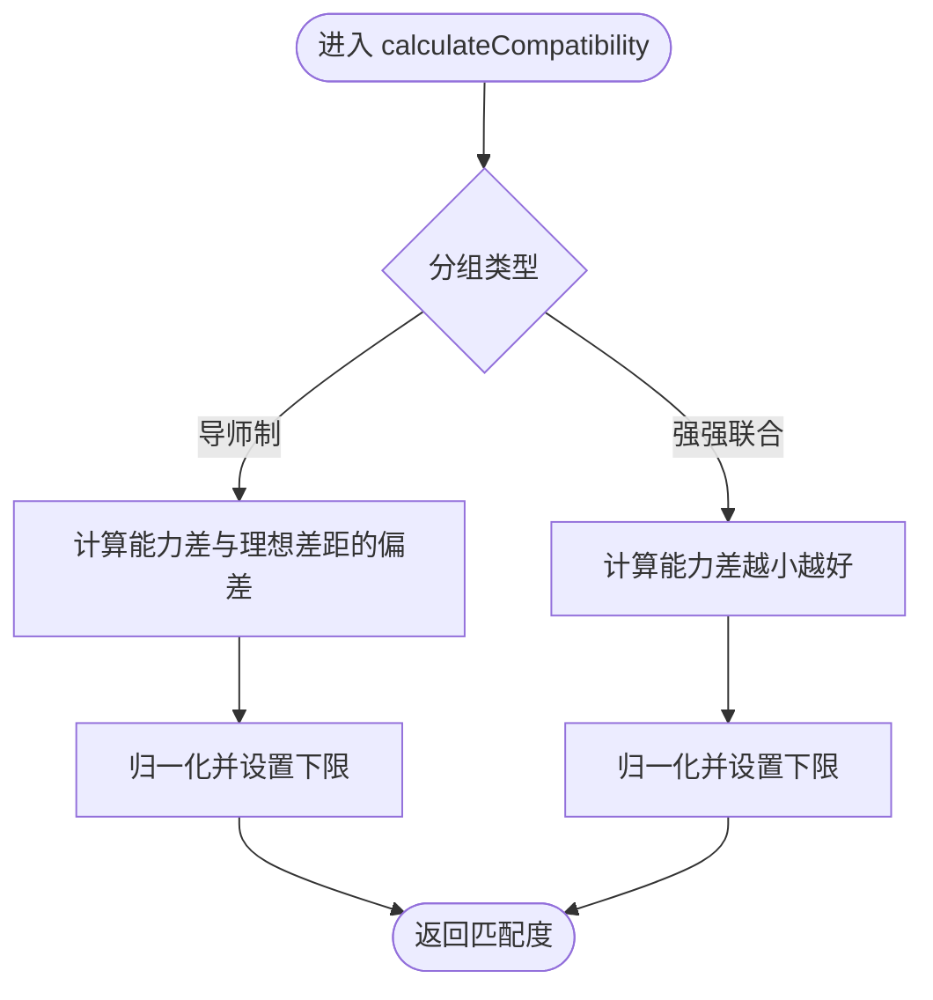

# AI分组推荐

<cite>
**本文引用的文件**
- [AIGroupingRecommendation.jsx](file://src/pages/AIGroupingRecommendation.jsx)
- [ai_group_recommender.js](file://src/data/ai_group_recommender.js)
- [student_path_data.js](file://src/data/student_path_data.js)
- [class_management.js](file://src/data/class_management.js)
- [App.jsx](file://src/App.jsx)
- [main.jsx](file://src/main.jsx)
</cite>

## 目录
1. [引言](#引言)
2. [项目结构](#项目结构)
3. [核心组件](#核心组件)
4. [架构总览](#架构总览)
5. [详细组件分析](#详细组件分析)
6. [依赖分析](#依赖分析)
7. [性能考虑](#性能考虑)
8. [故障排查指南](#故障排查指南)
9. [结论](#结论)
10. [附录](#附录)

## 引言
本文件围绕“AI智能学习小组推荐”功能展开，重点解析前端页面 AIGroupingRecommendation.jsx 如何调用后端数据层 ai_group_recommender.js 中的 AIGroupRecommender 类，实现基于学生能力、学习风格与目标的智能分组。文档覆盖：
- 两种核心策略：导师制（传帮带）与强强联合（协作组队）
- 聚类与匹配度计算方法
- 结果采纳流程与参数调整建议
- 教师侧入口与数据来源

## 项目结构
该功能位于 src/pages 与 src/data 两个目录中，页面负责交互与展示，数据层负责算法与数据源。

图表来源
- [AIGroupingRecommendation.jsx](file://src/pages/AIGroupingRecommendation.jsx#L1-L269)
- [ai_group_recommender.js](file://src/data/ai_group_recommender.js#L1-L215)
- [student_path_data.js](file://src/data/student_path_data.js#L1-L80)
- [class_management.js](file://src/data/class_management.js#L1-L66)
- [App.jsx](file://src/App.jsx#L85-L96)
- [main.jsx](file://src/main.jsx#L1-L14)

章节来源
- [AIGroupingRecommendation.jsx](file://src/pages/AIGroupingRecommendation.jsx#L1-L269)
- [ai_group_recommender.js](file://src/data/ai_group_recommender.js#L1-L215)
- [student_path_data.js](file://src/data/student_path_data.js#L1-L80)
- [class_management.js](file://src/data/class_management.js#L1-L66)
- [App.jsx](file://src/App.jsx#L85-L96)
- [main.jsx](file://src/main.jsx#L1-L14)

## 核心组件
- 页面组件 AIGroupingRecommendation.jsx
  - 提供策略选择（导师制、强强联合）、生成推荐、展示分组详情与匹配度、采纳分组等交互。
  - 通过导入 GROUP_STRATEGIES 与 AIGroupRecommender，调用 generateRecommendations(strategy) 生成推荐。
- 数据模块 ai_group_recommender.js
  - 定义分组策略常量 GROUP_STRATEGIES。
  - AIGroupRecommender 类包含：
    - generateMentorGroups(students, groupSize)：导师制分组（强弱搭配）
    - generateCollaborativeGroups(students, groupSize)：强强联合分组（同水平组队）
    - calculateGroupStats(group)：计算组内统计（平均/最高/最低能力、能力差、成员数、兼容性评分）
    - calculateCompatibility(group)：匹配度计算（不同策略下不同的权重与阈值）
    - generateRecommendations(strategy)：统一入口，返回包含策略、分组、统计信息的结果对象
- 学生数据 student_path_data.js
  - MOCK_STUDENTS 提供学生能力、学习风格、目标分数等字段，作为算法输入。
- 班级管理 class_management.js
  - ClassManager 提供获取当前班级、设置当前班级、按班级筛选学生等能力（用于扩展真实场景）。

章节来源
- [AIGroupingRecommendation.jsx](file://src/pages/AIGroupingRecommendation.jsx#L1-L269)
- [ai_group_recommender.js](file://src/data/ai_group_recommender.js#L1-L215)
- [student_path_data.js](file://src/data/student_path_data.js#L1-L80)
- [class_management.js](file://src/data/class_management.js#L1-L66)

## 架构总览
AI分组推荐的端到端流程如下：

图表来源
- [AIGroupingRecommendation.jsx](file://src/pages/AIGroupingRecommendation.jsx#L13-L26)
- [ai_group_recommender.js](file://src/data/ai_group_recommender.js#L191-L209)
- [student_path_data.js](file://src/data/student_path_data.js#L1-L80)

## 详细组件分析

### 页面组件：AIGroupingRecommendation.jsx
- 策略选择区域：展示两种策略卡片，支持点击切换；选中态以边框与勾选图标标识。
- 生成推荐：调用 AIGroupRecommender.generateRecommendations(selectedStrategy)，并将结果存入 state。
- 展示推荐：遍历 groups，显示组号、名称、成员、统计指标（平均/最高/最低能力、能力差）、匹配度星级与百分比。
- 特色字段：
  - 导师制：每组包含 pairings，记录“导师→学员”的配对关系及关注领域。
  - 强强联合：每组包含 sharedGoals，依据组内平均能力自动设定目标。
- 操作按钮：采纳分组（本地提示，后续可接入持久化），调整成员（预留）。

章节来源
- [AIGroupingRecommendation.jsx](file://src/pages/AIGroupingRecommendation.jsx#L60-L269)

### 数据模块：ai_group_recommender.js
- 策略常量 GROUP_STRATEGIES
  - mentor：传帮带分组
  - collaborative：强强联合分组
- AIGroupRecommender 类
  - generateMentorGroups
    - 将学生按综合能力降序排列，每组固定一个导师（高能力者），其余成员为学员（低能力者）。
    - 为每组生成 pairings，记录导师与学员、能力差距、关注领域（基于弱项识别）。
    - 计算组统计与兼容性评分。
  - generateCollaborativeGroups
    - 将学生按综合能力降序分组，按组内平均能力设定 sharedGoals（竞赛准备/巩固提升/基础巩固等）。
    - 计算组统计与兼容性评分。
  - calculateGroupStats
    - 计算平均能力、最大/最小能力、能力差、成员数，并调用 calculateCompatibility。
  - calculateCompatibility
    - 导师制：以“适度差距”为目标（示例阈值），能力差越接近目标，匹配度越高，但不低于一定下限。
    - 强强联合：差距越小越好，匹配度不低于一定下限。
  - generateRecommendations
    - 统一入口，返回包含策略、分组、时间戳、总人数、组数等信息的对象。

图表来源
- [ai_group_recommender.js](file://src/data/ai_group_recommender.js#L31-L209)
- [student_path_data.js](file://src/data/student_path_data.js#L1-L80)

章节来源
- [ai_group_recommender.js](file://src/data/ai_group_recommender.js#L1-L215)

### 学生数据：student_path_data.js
- MOCK_STUDENTS 字段
  - abilities：包含 algebra、geometry、analysis、overall 四项能力值
  - learningStyle：视觉型/逻辑型/实战型
  - targetScore：目标分数
- 作用：为 AIGroupRecommender 的算法提供输入数据，支撑能力排序、弱项识别与目标设定。

章节来源
- [student_path_data.js](file://src/data/student_path_data.js#L1-L80)

### 班级管理：class_management.js
- ClassManager
  - 获取当前班级、设置当前班级、按班级筛选学生（当前返回 MOCK_STUDENTS，便于演示）
- 用途：为教师端提供按班级维度选择学生的能力，便于扩展真实数据源。

章节来源
- [class_management.js](file://src/data/class_management.js#L1-L66)

### 路由与入口
- 路由注册：/teacher/ai-grouping 指向 AIGroupingRecommendation 页面。
- 根入口：HashRouter 提供前端路由支持。

章节来源
- [App.jsx](file://src/App.jsx#L85-L96)
- [main.jsx](file://src/main.jsx#L1-L14)

## 依赖分析
- 组件耦合
  - AIGroupingRecommendation.jsx 依赖 AIGroupRecommender 与 GROUP_STRATEGIES，以及 MOCK_STUDENTS。
  - AIGroupRecommender 依赖 student_path_data.js 的 MOCK_STUDENTS。
  - 页面与 ClassManager 解耦，ClassManager 可替换为真实数据源。
- 外部依赖
  - React、react-router-dom（用于页面跳转与路由）
  - lucide-react 图标库（用于界面图标）

图表来源
- [AIGroupingRecommendation.jsx](file://src/pages/AIGroupingRecommendation.jsx#L1-L269)
- [ai_group_recommender.js](file://src/data/ai_group_recommender.js#L1-L215)
- [student_path_data.js](file://src/data/student_path_data.js#L1-L80)
- [App.jsx](file://src/App.jsx#L85-L96)
- [main.jsx](file://src/main.jsx#L1-L14)

## 性能考虑
- 时间复杂度
  - 传帮带分组：排序 O(n log n)，分组遍历 O(n)，整体 O(n log n)。
  - 强强联合分组：排序 O(n log n)，线性分组 O(n)，整体 O(n log n)。
  - 统计与匹配度：每组 O(k)，k 为组员数，总体 O(n)。
- 空间复杂度
  - 生成分组数组与统计对象，空间复杂度 O(n)。
- 优化建议
  - 当学生规模扩大时，可考虑缓存排序结果与统计值，避免重复计算。
  - 匹配度计算可引入更复杂的特征（学习风格、目标一致性等），但需权衡复杂度与收益。
  - 前端渲染可结合虚拟滚动优化大列表展示。

[本节为通用性能讨论，不直接分析具体文件，故无章节来源]

## 故障排查指南
- 无法生成推荐
  - 检查策略选择是否有效（mentor 或 collaborative）。
  - 确认 MOCK_STUDENTS 是否存在且非空。
- 分组为空或成员数异常
  - 检查 groupSize 参数与学生总数，确保能整除或合理余数。
  - 确认 isInGroups 防重复逻辑未误判。
- 匹配度异常
  - 检查 calculateCompatibility 的阈值与范围是否符合预期。
  - 确认 calculateGroupStats 的能力差计算是否正确。
- 页面未显示采纳结果
  - handleAdopt 仅弹出提示，后续需接入持久化存储或后端接口。

章节来源
- [AIGroupingRecommendation.jsx](file://src/pages/AIGroupingRecommendation.jsx#L13-L26)
- [ai_group_recommender.js](file://src/data/ai_group_recommender.js#L140-L209)

## 结论
本功能通过简洁高效的算法实现了两类主流分组策略：
- 导师制：强调“强弱搭配”，通过配对关系与关注领域促进互助。
- 强强联合：强调“同水平协作”，通过共同目标提升竞争与合作效率。
配合页面直观的统计与匹配度展示，教师可快速评估并采纳分组方案。建议在实际教学中结合学习风格与目标一致性进一步优化匹配度，并通过参数调优（如组大小、差距阈值）提升分组效果。

[本节为总结性内容，不直接分析具体文件，故无章节来源]

## 附录

### 分组匹配度计算流程（导师制 vs 强强联合）

图表来源
- [ai_group_recommender.js](file://src/data/ai_group_recommender.js#L173-L188)

### 参数调整建议（教师侧）
- 组大小（groupSize）
  - 导师制：建议 3-4 人，保证每组有明确导师与若干学员。
  - 强强联合：建议 3-5 人，便于形成稳定协作氛围。
- 差距阈值
  - 导师制：适度差距（示例 15-30 分区间），可提升指导效率与学习动机。
  - 强强联合：尽量缩小差距，减少组内能力落差带来的沟通成本。
- 统计指标
  - 关注组内能力差（abilityRange）与平均能力（avgAbility），平衡团队整体水平与内部差异。
- 学习风格与目标
  - 当前实现主要基于能力；建议扩展学习风格（视觉/逻辑/实战）与目标一致性（如竞赛、巩固、拓展）作为加权因子，提升匹配度的合理性。

章节来源
- [ai_group_recommender.js](file://src/data/ai_group_recommender.js#L95-L138)
- [ai_group_recommender.js](file://src/data/ai_group_recommender.js#L173-L188)
- [student_path_data.js](file://src/data/student_path_data.js#L1-L80)