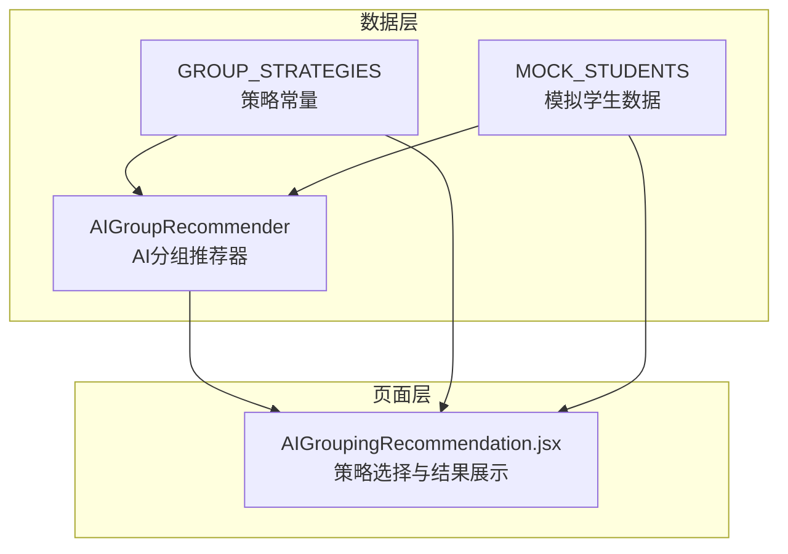
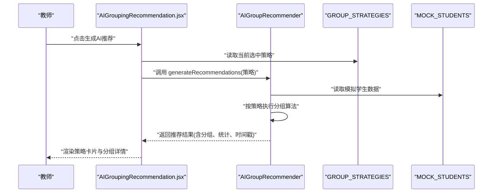
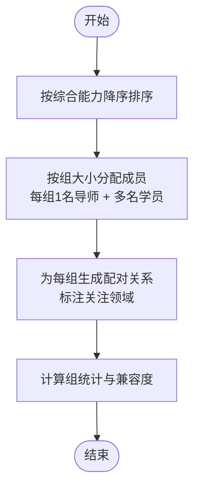
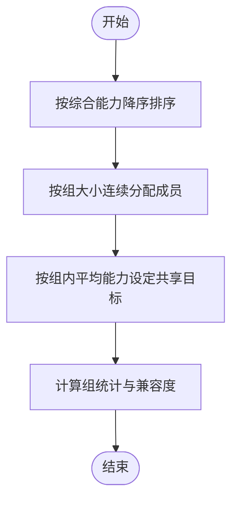
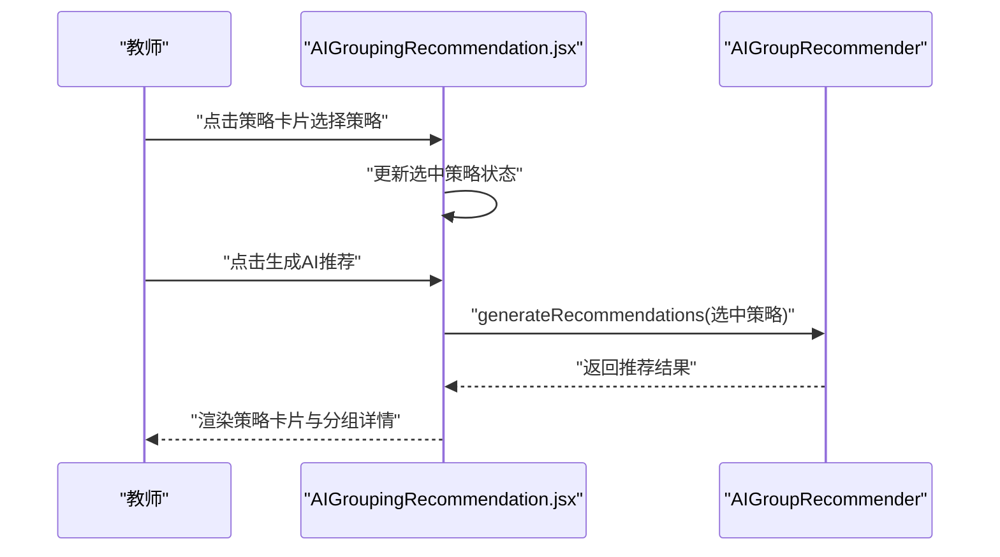
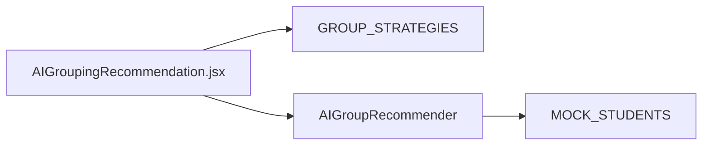

# 分组策略

<cite>
**本文引用的文件**
- [ai_group_recommender.js](file://src/data/ai_group_recommender.js)
- [AIGroupingRecommendation.jsx](file://src/pages/AIGroupingRecommendation.jsx)
- [student_path_data.js](file://src/data/student_path_data.js)
</cite>

## 目录
1. [引言](#引言)
2. [项目结构](#项目结构)
3. [核心组件](#核心组件)
4. [架构总览](#架构总览)
5. [详细组件分析](#详细组件分析)
6. [依赖分析](#依赖分析)
7. [性能考虑](#性能考虑)
8. [故障排查指南](#故障排查指南)
9. [结论](#结论)
10. [附录](#附录)

## 引言
本文件聚焦于AI分组推荐系统中的“分组策略”，重点阐述两种核心策略：传帮带与强强联合。我们将从策略的业务含义、数据模型、算法实现、UI交互到最终分组结果进行系统性说明，并提供策略选择建议与使用示例，帮助教师根据教学目标做出合适决策。

## 项目结构
围绕分组策略的相关代码主要分布在以下位置：
- 数据层：策略常量与AI分组算法
- 页面层：策略选择与结果展示
- 模拟数据：学生能力与学习风格等字段

图表来源
- [ai_group_recommender.js](file://src/data/ai_group_recommender.js#L1-L28)
- [AIGroupingRecommendation.jsx](file://src/pages/AIGroupingRecommendation.jsx#L1-L120)
- [student_path_data.js](file://src/data/student_path_data.js#L1-L80)

章节来源
- [ai_group_recommender.js](file://src/data/ai_group_recommender.js#L1-L28)
- [AIGroupingRecommendation.jsx](file://src/pages/AIGroupingRecommendation.jsx#L1-L120)
- [student_path_data.js](file://src/data/student_path_data.js#L1-L80)

## 核心组件
- 策略常量：定义策略标识、名称、描述、图标与颜色编码，用于UI渲染与语义表达。
- AI分组推荐器：包含两种核心分组算法与通用统计、兼容度计算方法。
- 页面组件：负责策略选择、触发推荐、展示分组结果与交互操作。

章节来源
- [ai_group_recommender.js](file://src/data/ai_group_recommender.js#L1-L28)
- [AIGroupingRecommendation.jsx](file://src/pages/AIGroupingRecommendation.jsx#L1-L120)

## 架构总览
下图展示了从用户选择策略到生成分组推荐的整体流程，以及策略常量与推荐器之间的关系。

图表来源
- [AIGroupingRecommendation.jsx](file://src/pages/AIGroupingRecommendation.jsx#L1-L120)
- [ai_group_recommender.js](file://src/data/ai_group_recommender.js#L190-L209)
- [student_path_data.js](file://src/data/student_path_data.js#L1-L80)

## 详细组件分析

### 策略常量：GROUP_STRATEGIES
- 作用：统一定义可用的分组策略，包含策略标识、名称、描述、图标与颜色编码。
- 适用范围：UI渲染策略卡片、结果页标题与统计信息的颜色映射。
- 当前包含三种策略，但页面仅展示前两种作为可选项：
  - 传帮带：强弱搭配，互帮互助，共同进步
  - 强强联合：同水平组队，激发竞争力
  - 均衡分组：各组水平均衡，公平竞争

章节来源
- [ai_group_recommender.js](file://src/data/ai_group_recommender.js#L6-L28)
- [AIGroupingRecommendation.jsx](file://src/pages/AIGroupingRecommendation.jsx#L62-L96)

### 传帮带分组策略（mentor）
- 业务含义：以高能力学生为导师，搭配若干低能力学生，形成“1对多”的帮扶关系，旨在促进整体提升与知识传递。
- 关键特征：
  - 每组固定1名导师与若干学员
  - 导师优先选择高能力者，学员从低能力者中挑选
  - 为每组生成配对关系，标注学习薄弱点，便于针对性指导
- 算法要点：
  - 将学生按综合能力降序排列
  - 每组由一个导师与若干学员组成
  - 计算组内能力差距与兼容度，兼容度评估偏向“适度差距”
- 结果字段：
  - members：成员列表，含角色（导师/学员）
  - pairings：配对关系，包含导师与学员、能力差距、关注领域
  - stats：组统计（平均能力、最高/最低能力、能力差距、成员数、兼容度）

图表来源
- [ai_group_recommender.js](file://src/data/ai_group_recommender.js#L33-L93)
- [ai_group_recommender.js](file://src/data/ai_group_recommender.js#L140-L189)

章节来源
- [ai_group_recommender.js](file://src/data/ai_group_recommender.js#L33-L93)
- [ai_group_recommender.js](file://src/data/ai_group_recommender.js#L140-L189)

### 强强联合分组策略（collaborative）
- 业务含义：将相近能力水平的学生编入同一组，通过同伴间的相互激励与协作，提升整体学习效率。
- 关键特征：
  - 按能力排序后连续分组，自然形成高级/中级/基础学习组
  - 为每组设定共享目标，目标依据组内平均能力自动分级
- 算法要点：
  - 将学生按综合能力降序排列
  - 连续分组，每组成员能力相近
  - 计算组内能力差距与兼容度，兼容度评估偏向“差距越小越好”
- 结果字段：
  - members：成员列表
  - sharedGoals：共享目标（如竞赛准备、巩固提升、基础巩固等）
  - stats：组统计与兼容度

图表来源
- [ai_group_recommender.js](file://src/data/ai_group_recommender.js#L95-L138)
- [ai_group_recommender.js](file://src/data/ai_group_recommender.js#L156-L189)

章节来源
- [ai_group_recommender.js](file://src/data/ai_group_recommender.js#L95-L138)
- [ai_group_recommender.js](file://src/data/ai_group_recommender.js#L156-L189)

### UI交互：策略选择与结果展示
- 策略选择：
  - 页面提供两个策略卡片（传帮带、强强联合），点击后高亮选中
  - 选中策略会改变卡片边框与背景色，同时在生成按钮处显示确认勾选
- 生成推荐：
  - 点击“生成AI推荐”后，调用推荐器生成对应策略的分组方案
  - 展示分组总数、各组名称与成员列表
- 结果呈现：
  - 匹配度评分以星级展示，数值来自兼容度计算
  - 统计区域展示平均能力、最高/最低能力、能力差距与成员数
  - 传帮带模式额外展示配对关系与关注领域
  - 强强联合模式额外展示共享目标
- 操作按钮：
  - “采纳分组”用于确认采用某组分组
  - “调整成员”用于进一步微调

图表来源
- [AIGroupingRecommendation.jsx](file://src/pages/AIGroupingRecommendation.jsx#L62-L120)
- [AIGroupingRecommendation.jsx](file://src/pages/AIGroupingRecommendation.jsx#L121-L269)
- [ai_group_recommender.js](file://src/data/ai_group_recommender.js#L190-L209)

章节来源
- [AIGroupingRecommendation.jsx](file://src/pages/AIGroupingRecommendation.jsx#L62-L120)
- [AIGroupingRecommendation.jsx](file://src/pages/AIGroupingRecommendation.jsx#L121-L269)

### 数据模型与字段说明
- 学生数据（MOCK_STUDENTS）包含：
  - 基本信息：id、姓名、学号、班级、头像
  - 能力维度：代数、几何、分析、综合能力
  - 学习风格：视觉型、逻辑型、实战型
  - 目标分数：targetScore
- 分组结果包含：
  - 组基本信息：id、名称、类型（mentor/collaborative/balanced）
  - 成员列表：含角色（导师/学员/成员）、能力与学习风格
  - 传帮带专属：配对关系（导师与学员、能力差距、关注领域）
  - 强强联合专属：共享目标
  - 统计信息：平均能力、最高/最低能力、能力差距、成员数、兼容度

章节来源
- [student_path_data.js](file://src/data/student_path_data.js#L1-L80)
- [ai_group_recommender.js](file://src/data/ai_group_recommender.js#L33-L138)
- [AIGroupingRecommendation.jsx](file://src/pages/AIGroupingRecommendation.jsx#L121-L269)

## 依赖分析
- 组件耦合关系：
  - 页面组件依赖策略常量与推荐器类，用于渲染与生成结果
  - 推荐器依赖模拟学生数据，用于分组与统计
- 可能的循环依赖：
  - 当前文件之间无循环导入
- 外部依赖：
  - 页面组件使用路由导航与图标库
  - 推荐器内部使用数组排序与聚合计算

图表来源
- [AIGroupingRecommendation.jsx](file://src/pages/AIGroupingRecommendation.jsx#L1-L120)
- [ai_group_recommender.js](file://src/data/ai_group_recommender.js#L1-L28)
- [student_path_data.js](file://src/data/student_path_data.js#L1-L80)

章节来源
- [AIGroupingRecommendation.jsx](file://src/pages/AIGroupingRecommendation.jsx#L1-L120)
- [ai_group_recommender.js](file://src/data/ai_group_recommender.js#L1-L28)
- [student_path_data.js](file://src/data/student_path_data.js#L1-L80)

## 性能考虑
- 时间复杂度：
  - 传帮带与强强联合均涉及一次全量排序与线性遍历，整体为 O(n log n + n)，n 为学生人数
- 空间复杂度：
  - 生成分组与统计信息的空间开销与组数成正比
- 优化建议：
  - 若学生规模扩大，可考虑分批处理或缓存中间结果
  - 在UI层面避免重复渲染，确保仅在状态变化时重新计算

## 故障排查指南
- 策略未生效：
  - 检查页面是否正确读取选中策略并传入推荐器
  - 确认推荐器入口分支与策略标识一致
- 分组为空：
  - 检查学生数据是否完整，是否存在重复或缺失
  - 确认组大小参数与学生人数的关系
- 兼容度异常：
  - 检查统计计算与兼容度评分逻辑
  - 确认传帮带与强强联合的评分阈值是否符合预期

章节来源
- [AIGroupingRecommendation.jsx](file://src/pages/AIGroupingRecommendation.jsx#L1-L120)
- [ai_group_recommender.js](file://src/data/ai_group_recommender.js#L156-L209)

## 结论
传帮带与强强联合是两类互补的分组策略。前者强调“适度差距”的导师制帮扶，后者强调“相近能力”的协作式提升。教师可根据教学目标灵活选择：若需提升整体水平与知识传递，优先传帮带；若需激发竞争与高效协作，优先强强联合。页面提供了直观的策略选择与结果展示，便于快速决策与落地执行。

## 附录

### 使用示例与效果对比
- 示例场景一：提升整体水平
  - 选择“传帮带”策略
  - 结果特征：每组包含1名高能力导师与多名低能力学员；展示配对关系与关注领域；兼容度评估偏向“适度差距”
- 示例场景二：激发竞争与高效协作
  - 选择“强强联合”策略
  - 结果特征：按能力连续分组，形成高级/中级/基础学习组；每组设定共享目标；兼容度评估偏向“差距越小越好”

章节来源
- [ai_group_recommender.js](file://src/data/ai_group_recommender.js#L33-L138)
- [AIGroupingRecommendation.jsx](file://src/pages/AIGroupingRecommendation.jsx#L121-L269)

### 策略选择建议
- 提升整体水平与知识传递：优先“传帮带”
- 激发竞争与高效协作：优先“强强联合”
- 平衡教学目标与公平性：可参考“均衡分组”策略（当前页面未直接展示，但策略常量已定义）

章节来源
- [ai_group_recommender.js](file://src/data/ai_group_recommender.js#L6-L28)
- [AIGroupingRecommendation.jsx](file://src/pages/AIGroupingRecommendation.jsx#L62-L96)