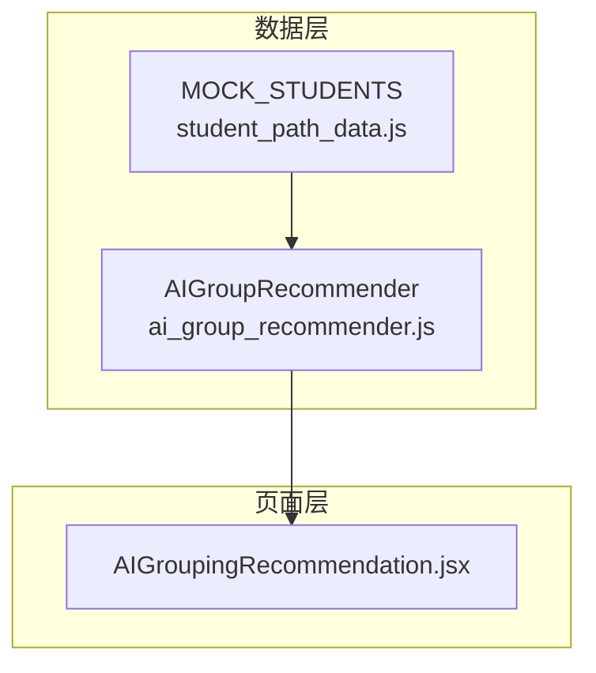
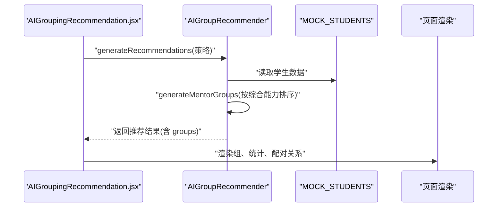
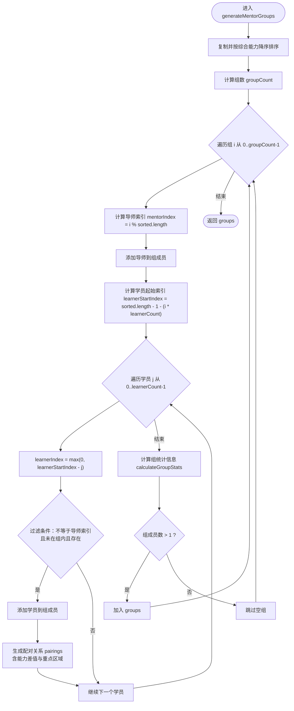
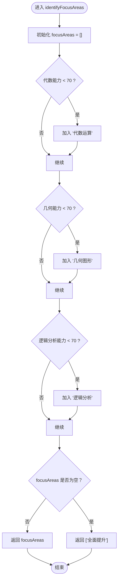
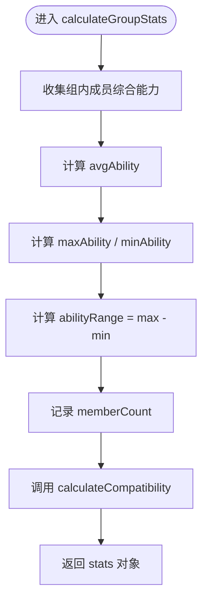
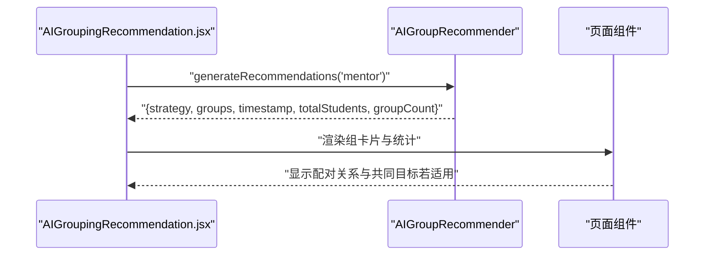
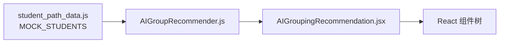

# 传帮带算法

<cite>
**本文引用的文件**
- [ai_group_recommender.js](file://src/data/ai_group_recommender.js)
- [AIGroupingRecommendation.jsx](file://src/pages/AIGroupingRecommendation.jsx)
- [student_path_data.js](file://src/data/student_path_data.js)
</cite>

## 目录
1. [简介](#简介)
2. [项目结构](#项目结构)
3. [核心组件](#核心组件)
4. [架构总览](#架构总览)
5. [详细组件分析](#详细组件分析)
6. [依赖分析](#依赖分析)
7. [性能考虑](#性能考虑)
8. [故障排查指南](#故障排查指南)
9. [结论](#结论)
10. [附录](#附录)

## 简介
本文件围绕“传帮带分组算法”展开，聚焦于 AIGroupRecommender 类中的 generateMentorGroups 方法。该算法旨在将学生按综合能力从高到低排序，每组分配一名高能力学生作为导师，其余为低能力学员；通过索引计算确保导师与学员的能力差距合理，并避免重复分组；同时在配对关系（pairings）中生成“辅导重点区域”，由 identifyFocusAreas 识别学员薄弱知识点；最后计算组统计信息（平均能力、能力范围等），用于评估分组质量。

## 项目结构
与传帮带算法直接相关的核心文件如下：
- 数据层：ai_group_recommender.js 提供分组策略与推荐器实现
- 页面层：AIGroupingRecommendation.jsx 展示推荐结果、统计与配对信息
- 示例数据：student_path_data.js 提供 MOCK_STUDENTS 作为输入样例

图表来源
- [ai_group_recommender.js](file://src/data/ai_group_recommender.js#L31-L209)
- [AIGroupingRecommendation.jsx](file://src/pages/AIGroupingRecommendation.jsx#L1-L268)
- [student_path_data.js](file://src/data/student_path_data.js#L1-L80)

章节来源
- [ai_group_recommender.js](file://src/data/ai_group_recommender.js#L1-L214)
- [AIGroupingRecommendation.jsx](file://src/pages/AIGroupingRecommendation.jsx#L1-L268)
- [student_path_data.js](file://src/data/student_path_data.js#L1-L80)

## 核心组件
- AIGroupRecommender：包含多种分组策略，其中 generateMentorGroups 实现传帮带分组算法
- AIGroupingRecommendation 页面：调用 generateRecommendations 并渲染推荐结果、统计与配对信息
- MOCK_STUDENTS：示例学生数据，包含 id、name、abilities.overall 等字段

章节来源
- [ai_group_recommender.js](file://src/data/ai_group_recommender.js#L31-L209)
- [AIGroupingRecommendation.jsx](file://src/pages/AIGroupingRecommendation.jsx#L1-L268)
- [student_path_data.js](file://src/data/student_path_data.js#L1-L80)

## 架构总览
下图展示了从页面到推荐器再到页面渲染的整体流程。

图表来源
- [AIGroupingRecommendation.jsx](file://src/pages/AIGroupingRecommendation.jsx#L12-L16)
- [ai_group_recommender.js](file://src/data/ai_group_recommender.js#L191-L209)
- [student_path_data.js](file://src/data/student_path_data.js#L1-L80)

## 详细组件分析

### 传帮带分组算法：generateMentorGroups
该方法负责将学生按综合能力从高到低排序，每组固定包含 1 名导师（高能力）与若干学员（低能力）。其关键步骤如下：
- 输入：学生数组 students、可选组大小 groupSize（默认 3）
- 步骤：
  1) 复制并按综合能力降序排序得到 sorted
  2) 计算组数 groupCount = ceil(学生总数 / groupSize)
  3) 循环创建 group，每组初始包含 1 名导师
  4) 使用索引计算确定导师 mentorIndex = i % sorted.length
  5) 选择 learnerCount = groupSize - 1 名学员，起始索引 learnerStartIndex = sorted.length - 1 - (i * learnerCount)，逐个向前取值
  6) 过滤条件：排除与导师相同索引、不在已有组内、存在性校验
  7) 为每对导师-学员生成配对关系 pairings，包含能力差值 abilityGap 与辅导重点 focusAreas
  8) 计算组统计信息 calculateGroupStats，包括 avgAbility、maxAbility、minAbility、abilityRange、memberCount、compatibilityScore
  9) 仅当组成员数大于 1 时加入最终 groups

关键变量与计算要点：
- mentorIndex：使用 i % sorted.length 在排序后的数组上循环选取导师，确保不同组的导师来自不同位置
- learnerStartIndex：从排序末尾开始，按组号 i 计算起始学员索引，保证每组学员尽可能覆盖低能力学生且不重复
- learnerIndex：从 learnerStartIndex 开始递减，Math.max(0, ...) 保证不越界
- isInGroups：避免同一学员被多次分配到不同组
- identifyFocusAreas：根据学员各项能力阈值（例如低于 70 分）识别薄弱知识点，若均达标则返回“全面提升”
- calculateGroupStats：计算组内平均能力、最大最小能力、能力范围与成员数，并调用 calculateCompatibility
- calculateCompatibility：针对传帮带策略，设定理想能力差距（约 22 分），据此评分，范围在 0.5 到 1 之间

图表来源
- [ai_group_recommender.js](file://src/data/ai_group_recommender.js#L33-L93)
- [ai_group_recommender.js](file://src/data/ai_group_recommender.js#L140-L171)
- [ai_group_recommender.js](file://src/data/ai_group_recommender.js#L173-L189)

章节来源
- [ai_group_recommender.js](file://src/data/ai_group_recommender.js#L33-L93)
- [ai_group_recommender.js](file://src/data/ai_group_recommender.js#L140-L189)

### 配对关系 pairings 的生成逻辑：identifyFocusAreas
- 输入：单个学员对象
- 输出：薄弱知识点数组 focusAreas
- 识别规则：当某项能力（如代数、几何、逻辑分析）低于阈值（例如 70）时，将其加入 focusAreas；若均达标，则返回“全面提升”

图表来源
- [ai_group_recommender.js](file://src/data/ai_group_recommender.js#L147-L154)

章节来源
- [ai_group_recommender.js](file://src/data/ai_group_recommender.js#L147-L154)

### 组统计信息与兼容性评分
- calculateGroupStats：计算组内平均能力、最大最小能力、能力范围与成员数，并调用 calculateCompatibility
- calculateCompatibility：
  - 传帮带策略：以理想差距 22 分为目标，能力范围越接近理想差距，评分越高，范围在 0.5 到 1 之间
  - 强强联合策略：能力范围越小越好，评分不低于 0.7

图表来源
- [ai_group_recommender.js](file://src/data/ai_group_recommender.js#L156-L171)
- [ai_group_recommender.js](file://src/data/ai_group_recommender.js#L173-L189)

章节来源
- [ai_group_recommender.js](file://src/data/ai_group_recommender.js#L156-L189)

### 页面渲染与交互
- 页面通过 generateRecommendations 调用推荐器，获取策略、组列表、时间戳、总人数与组数
- 渲染每个组的统计信息（平均能力、最高/最低能力、能力差距、匹配度星级）
- 渲染组成员列表与角色（导师/学员）
- 渲染配对关系（导师→学员，标注辅导重点区域）

图表来源
- [AIGroupingRecommendation.jsx](file://src/pages/AIGroupingRecommendation.jsx#L12-L16)
- [AIGroupingRecommendation.jsx](file://src/pages/AIGroupingRecommendation.jsx#L100-L251)
- [ai_group_recommender.js](file://src/data/ai_group_recommender.js#L191-L209)

章节来源
- [AIGroupingRecommendation.jsx](file://src/pages/AIGroupingRecommendation.jsx#L1-L268)
- [ai_group_recommender.js](file://src/data/ai_group_recommender.js#L191-L209)

## 依赖分析
- AIGroupRecommender 依赖 student_path_data.js 中的 MOCK_STUDENTS 作为输入
- AIGroupingRecommendation 页面依赖 AIGroupRecommender 与 GROUP_STRATEGIES 常量
- 页面渲染依赖 react-router 的 useNavigate 与 lucide-react 图标库

图表来源
- [ai_group_recommender.js](file://src/data/ai_group_recommender.js#L1-L214)
- [AIGroupingRecommendation.jsx](file://src/pages/AIGroupingRecommendation.jsx#L1-L268)
- [student_path_data.js](file://src/data/student_path_data.js#L1-L80)

章节来源
- [ai_group_recommender.js](file://src/data/ai_group_recommender.js#L1-L214)
- [AIGroupingRecommendation.jsx](file://src/pages/AIGroupingRecommendation.jsx#L1-L268)
- [student_path_data.js](file://src/data/student_path_data.js#L1-L80)

## 性能考虑
- 时间复杂度：
  - 排序：O(n log n)
  - 生成分组：O(n × k)，k 为每组学员数（固定为 groupSize-1）
  - 遍历组与成员：O(n)
  - 整体近似 O(n log n + n × k)
- 空间复杂度：O(n) 用于存储排序后的临时数组与结果 groups
- 优化建议：
  - 若组大小较大，可考虑预计算 learnerStartIndex 与 learnerIndex，减少重复计算
  - 若需避免重复分组，可在 isInGroups 中使用哈希表加速查找
  - 对于大规模数据，可采用分页或增量分组策略

[本节为通用性能讨论，无需特定文件引用]

## 故障排查指南
- 学员重复分组
  - 现象：同一学员出现在多个组
  - 排查：确认 isInGroups 的实现与 groups 结构一致，确保按成员 id 检索
  - 参考路径：[ai_group_recommender.js](file://src/data/ai_group_recommender.js#L140-L145)
- 学员越界或空值
  - 现象：learnerIndex 越界或 undefined
  - 排查：检查 learnerStartIndex 与 learnerIndex 的边界处理，确保 Math.max(0, ...) 生效
  - 参考路径：[ai_group_recommender.js](file://src/data/ai_group_recommender.js#L60-L67)
- 导师与学员能力差距过大或过小
  - 现象：组内能力差距偏离预期
  - 排查：检查 calculateCompatibility 的理想差距与评分区间，必要时调整阈值
  - 参考路径：[ai_group_recommender.js](file://src/data/ai_group_recommender.js#L173-L189)
- 配对关系 focusAreas 为空
  - 现象：学员各项能力均达标导致 focusAreas 为“全面提升”
  - 排查：适当降低阈值或扩展薄弱点识别维度
  - 参考路径：[ai_group_recommender.js](file://src/data/ai_group_recommender.js#L147-L154)

章节来源
- [ai_group_recommender.js](file://src/data/ai_group_recommender.js#L140-L189)

## 结论
传帮带分组算法通过“导师+学员”的固定配比，在保证导师能力优势的同时，将低能力学员纳入组内进行针对性辅导。算法利用索引计算确保导师与学员的综合能力差距处于合理范围，并通过 identifyFocusAreas 为每对学员生成“薄弱知识点”作为辅导重点。组统计信息与兼容性评分有助于量化分组质量，便于教师评估与调整策略。

[本节为总结性内容，无需特定文件引用]

## 附录

### 输入学生数据结构示例
- 字段概览（来自示例数据）：
  - id、name、studentId、class、avatar
  - abilities：algebra、geometry、analysis、overall
  - learningStyle、targetScore
- 示例参考路径：
  - [student_path_data.js](file://src/data/student_path_data.js#L1-L80)

章节来源
- [student_path_data.js](file://src/data/student_path_data.js#L1-L80)

### 输出分组结果格式说明
- 推荐结果对象包含：
  - strategy：策略标识
  - groups：分组数组
  - timestamp：生成时间
  - totalStudents：总人数
  - groupCount：组数
- 单个组对象包含：
  - id、name、type（mentor/collaborative/balanced）
  - members：成员数组（含 role：mentor/learner/member）
  - pairings：配对关系数组（mentor、learner、abilityGap、focusAreas）
  - stats：组统计信息（avgAbility、maxAbility、minAbility、abilityRange、memberCount、compatibilityScore）
- 参考路径：
  - [ai_group_recommender.js](file://src/data/ai_group_recommender.js#L191-L209)
  - [ai_group_recommender.js](file://src/data/ai_group_recommender.js#L33-L93)
  - [ai_group_recommender.js](file://src/data/ai_group_recommender.js#L147-L189)

章节来源
- [ai_group_recommender.js](file://src/data/ai_group_recommender.js#L33-L93)
- [ai_group_recommender.js](file://src/data/ai_group_recommender.js#L147-L209)

### 关键变量与计算过程示例路径
- 导师索引 mentorIndex：[ai_group_recommender.js](file://src/data/ai_group_recommender.js#L50-L57)
- 学员起始索引 learnerStartIndex：[ai_group_recommender.js](file://src/data/ai_group_recommender.js#L60-L67)
- 学员索引 learnerIndex：[ai_group_recommender.js](file://src/data/ai_group_recommender.js#L63-L67)
- 配对关系 abilityGap 与 focusAreas：[ai_group_recommender.js](file://src/data/ai_group_recommender.js#L72-L81)
- 组统计信息 calculateGroupStats：[ai_group_recommender.js](file://src/data/ai_group_recommender.js#L156-L171)
- 兼容性评分 calculateCompatibility：[ai_group_recommender.js](file://src/data/ai_group_recommender.js#L173-L189)

章节来源
- [ai_group_recommender.js](file://src/data/ai_group_recommender.js#L50-L81)
- [ai_group_recommender.js](file://src/data/ai_group_recommender.js#L156-L189)