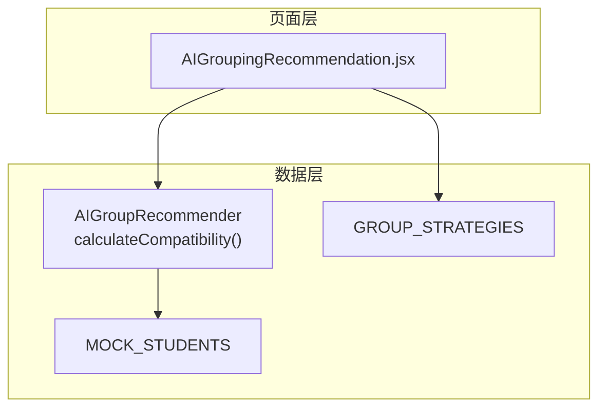
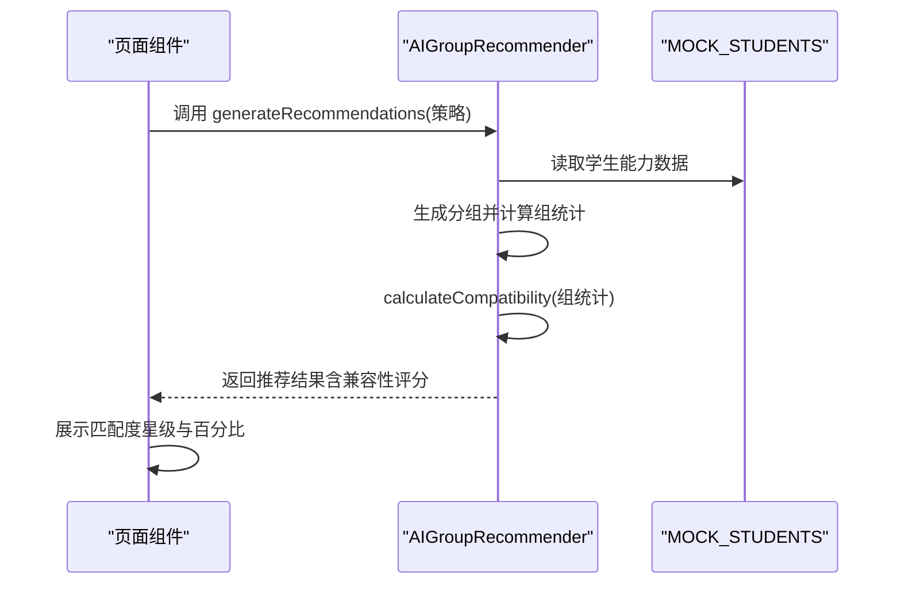
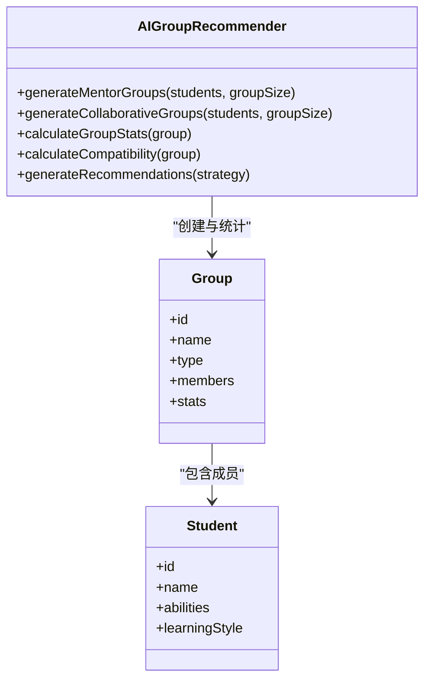
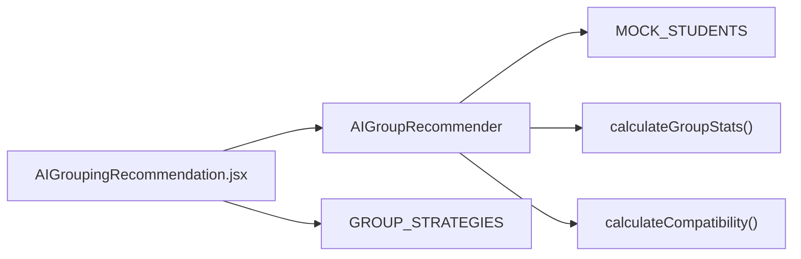

# 匹配度计算

<cite>
**本文引用的文件**
- [ai_group_recommender.js](file://src/data/ai_group_recommender.js)
- [AIGroupingRecommendation.jsx](file://src/pages/AIGroupingRecommendation.jsx)
- [student_path_data.js](file://src/data/student_path_data.js)
</cite>

## 目录
1. [引言](#引言)
2. [项目结构](#项目结构)
3. [核心组件](#核心组件)
4. [架构总览](#架构总览)
5. [详细组件分析](#详细组件分析)
6. [依赖分析](#依赖分析)
7. [性能考虑](#性能考虑)
8. [故障排查指南](#故障排查指南)
9. [结论](#结论)

## 引言
本文件系统性阐述“匹配度评分机制”，聚焦于 calculateCompatibility 方法的数学模型与业务逻辑。该方法针对两类分组策略采用差异化评分：
- 传帮带分组（mentor）：以“适度能力差距”为目标，使用线性偏差函数，将能力差距围绕理想值进行评分，并通过上下界限制保证分组质量下限。
- 强强联合分组（collaborative）：追求组内能力差异最小化，采用“能力范围与满分比例”的反向评分，并通过下限阈值确保高能力组的稳定性。

同时，本文结合具体数值示例说明公式应用，并讨论该评分机制在推荐系统中的决策支持作用。

## 项目结构
本项目采用按功能模块划分的组织方式，匹配度评分位于数据层，前端页面负责展示与交互：
- 数据层：提供分组策略、AI分组推荐器与学生模拟数据
- 页面层：渲染推荐结果、展示匹配度星级与百分比

图表来源
- [AIGroupingRecommendation.jsx](file://src/pages/AIGroupingRecommendation.jsx#L1-L200)
- [ai_group_recommender.js](file://src/data/ai_group_recommender.js#L1-L215)
- [student_path_data.js](file://src/data/student_path_data.js#L1-L80)

章节来源
- [AIGroupingRecommendation.jsx](file://src/pages/AIGroupingRecommendation.jsx#L1-L200)
- [ai_group_recommender.js](file://src/data/ai_group_recommender.js#L1-L215)
- [student_path_data.js](file://src/data/student_path_data.js#L1-L80)

## 核心组件
- 分组策略常量：定义 mentor（传帮带）、collaborative（强强联合）、balanced（均衡）三种策略及其元信息。
- AI分组推荐器：封装生成分组、统计组内能力指标、计算兼容性评分等逻辑。
- 前端页面：调用推荐器生成分组，展示匹配度星级与百分比，以及组内统计信息。

章节来源
- [ai_group_recommender.js](file://src/data/ai_group_recommender.js#L1-L215)
- [AIGroupingRecommendation.jsx](file://src/pages/AIGroupingRecommendation.jsx#L1-L200)

## 架构总览
匹配度评分贯穿以下流程：
- 输入：一组学生的综合能力值
- 中间：计算组内统计（均值、最大值、最小值、能力范围）
- 输出：兼容性评分（0~1之间），用于指导分组质量与后续决策

图表来源
- [AIGroupingRecommendation.jsx](file://src/pages/AIGroupingRecommendation.jsx#L1-L200)
- [ai_group_recommender.js](file://src/data/ai_group_recommender.js#L156-L209)
- [student_path_data.js](file://src/data/student_path_data.js#L1-L80)

## 详细组件分析

### calculateCompatibility 数学模型与业务逻辑
- 输入：组内统计对象（包含能力范围与成员数量）
- 分组类型分支：
  - 传帮带（mentor）：以“适度差距”为目标，使用线性偏差函数，围绕理想差距进行评分，并通过上下界限制保证下限。
  - 强强联合（collaborative）：以“能力差异最小化”为目标，采用能力范围与满分比例的反向评分，并通过下限阈值确保高能力组的稳定性。

- 数学表达式要点（不直接展示代码，仅说明公式语义）：
  - 传帮带（mentor）：以理想差距为中心，计算偏离程度，得到一个介于0~1之间的分数，再通过下限与上限裁剪，确保评分不低于某个下限。
  - 强强联合（collaborative）：以能力范围占满分的比例作为惩罚因子，构造反向评分，再通过下限阈值裁剪，确保高能力组的评分不会过低。

- 上下界裁剪：
  - 传帮带：使用下限与上限裁剪，确保评分不低于某个下限（例如0.5）。
  - 强强联合：使用下限裁剪，确保评分不低于某个下限（例如0.7）。

- 评分与展示：
  - 页面层将兼容性评分映射为星级与百分比，便于直观判断分组质量。

章节来源
- [ai_group_recommender.js](file://src/data/ai_group_recommender.js#L156-L209)
- [AIGroupingRecommendation.jsx](file://src/pages/AIGroupingRecommendation.jsx#L120-L150)

### 具体数值示例与公式应用
- 示例场景：某组能力差为25分
  - 传帮带（mentor）：以理想差距为中心，计算偏离程度，得到一个介于0~1之间的分数，再通过下限与上限裁剪，确保评分不低于某个下限（例如0.5）。具体数值请参考实现文件中的裁剪逻辑。
  - 强强联合（collaborative）：以能力范围占满分的比例作为惩罚因子，构造反向评分，再通过下限阈值裁剪，确保高能力组的评分不会过低。具体数值请参考实现文件中的裁剪逻辑。

- 评分区间与质量下限：
  - 传帮带：评分被限制在合理区间（例如不低于0.5），确保即使能力差距稍大也能维持基本的协作效率。
  - 强强联合：评分被限制在较高区间（例如不低于0.7），确保高能力组的稳定性和协同潜力。

章节来源
- [ai_group_recommender.js](file://src/data/ai_group_recommender.js#L173-L188)
- [AIGroupingRecommendation.jsx](file://src/pages/AIGroupingRecommendation.jsx#L120-L150)

### 类关系与职责

图表来源
- [ai_group_recommender.js](file://src/data/ai_group_recommender.js#L1-L215)
- [student_path_data.js](file://src/data/student_path_data.js#L1-L80)

## 依赖分析
- 页面组件依赖推荐器与策略常量，推荐器依赖学生模拟数据。
- 计算兼容性评分前需先计算组内统计（均值、最大值、最小值、能力范围）。

图表来源
- [AIGroupingRecommendation.jsx](file://src/pages/AIGroupingRecommendation.jsx#L1-L200)
- [ai_group_recommender.js](file://src/data/ai_group_recommender.js#L156-L209)
- [student_path_data.js](file://src/data/student_path_data.js#L1-L80)

章节来源
- [AIGroupingRecommendation.jsx](file://src/pages/AIGroupingRecommendation.jsx#L1-L200)
- [ai_group_recommender.js](file://src/data/ai_group_recommender.js#L156-L209)
- [student_path_data.js](file://src/data/student_path_data.js#L1-L80)

## 性能考虑
- 计算复杂度：兼容性评分仅依赖组内统计（均值、最值、范围），时间复杂度为 O(n)，n 为组内成员数。
- 剪枝与边界处理：通过上下界裁剪避免极端评分，减少后续排序或筛选的不确定性。
- 可扩展性：若未来引入更多分组策略，可在推荐器中新增策略分支，并复用统计与评分接口。

## 故障排查指南
- 评分异常偏低或偏高：
  - 检查组内统计是否正确计算（均值、最值、范围）。
  - 检查分组类型是否正确传递至兼容性评分函数。
  - 检查裁剪下限是否符合预期策略（传帮带与强强联合的下限不同）。
- 页面显示不一致：
  - 确认页面层对兼容性评分的映射逻辑（星级与百分比）与后端一致。

章节来源
- [ai_group_recommender.js](file://src/data/ai_group_recommender.js#L156-L209)
- [AIGroupingRecommendation.jsx](file://src/pages/AIGroupingRecommendation.jsx#L120-L150)

## 结论
本节文档系统阐述了匹配度评分机制的数学模型与业务逻辑，明确了两类分组策略下的评分差异与裁剪规则，并通过具体示例说明了评分的应用方式。该机制在推荐系统中起到关键的决策支持作用：一方面通过评分量化分组质量，另一方面通过上下界裁剪确保不同策略下的质量下限，从而提升推荐结果的可解释性与稳定性。