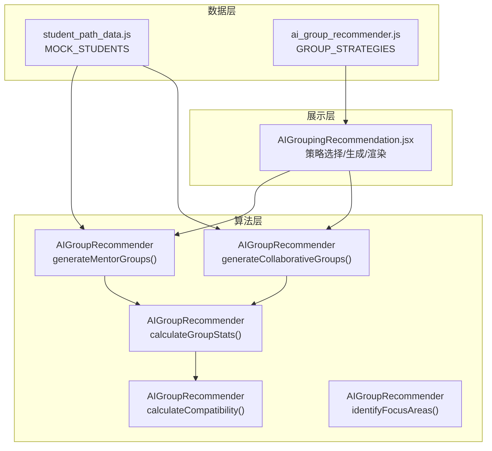
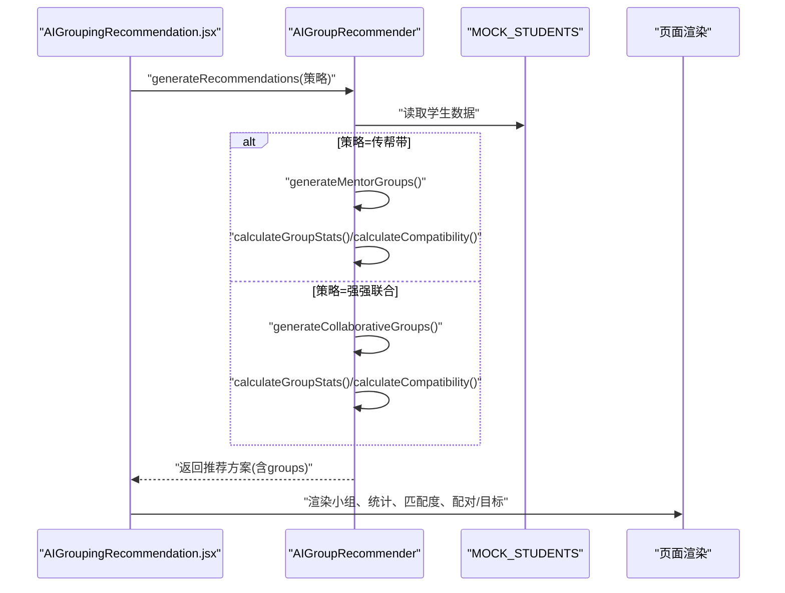
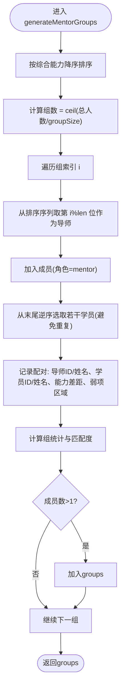
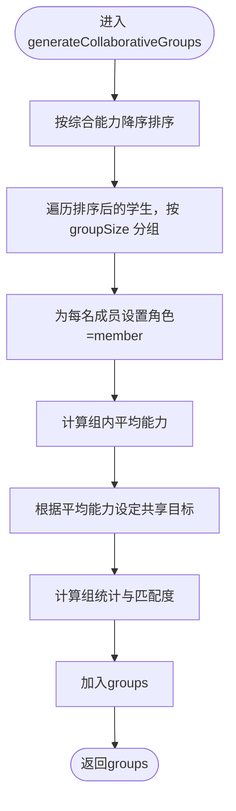
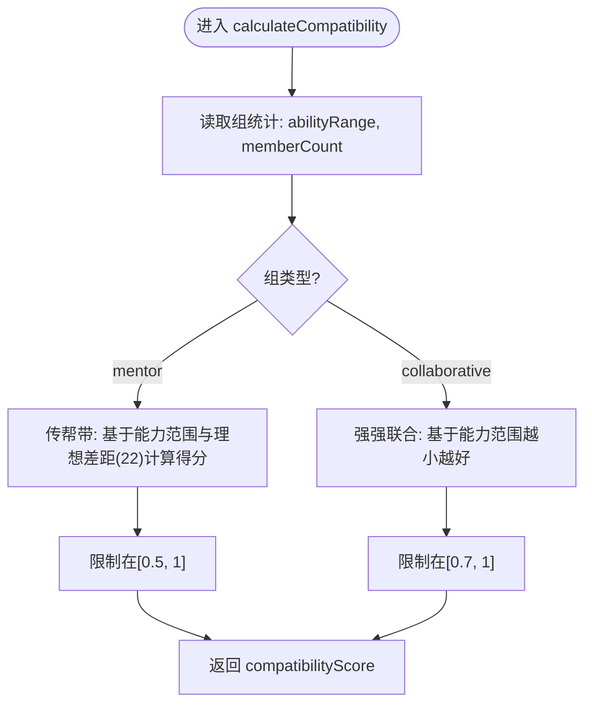
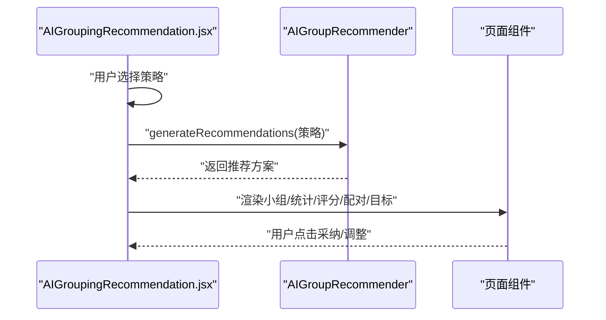
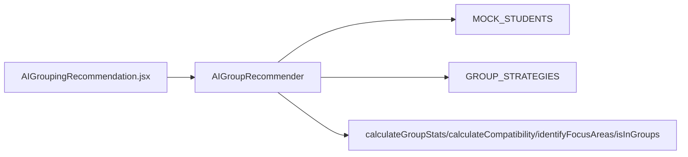

# 匹配算法

<cite>
**本文引用的文件**
- [src/data/ai_group_recommender.js](file://src/data/ai_group_recommender.js)
- [src/pages/AIGroupingRecommendation.jsx](file://src/pages/AIGroupingRecommendation.jsx)
- [src/data/student_path_data.js](file://src/data/student_path_data.js)
</cite>

## 目录
1. [引言](#引言)
2. [项目结构](#项目结构)
3. [核心组件](#核心组件)
4. [架构总览](#架构总览)
5. [详细组件分析](#详细组件分析)
6. [依赖分析](#依赖分析)
7. [性能考虑](#性能考虑)
8. [故障排查指南](#故障排查指南)
9. [结论](#结论)
10. [附录](#附录)

## 引言
本文件聚焦于AI分组推荐系统中的匹配算法实现，围绕AIGroupRecommender类的两个核心方法：generateMentorGroups（传帮带分组）与generateCollaborativeGroups（强强联合分组），以及calculateCompatibility（匹配度评分）方法。我们将从算法输入输出结构、关键计算步骤、评分逻辑与边界条件等方面进行深入解析，并结合前端页面展示流程，帮助读者全面理解“导师-学员配对”与“同水平聚类”的实现思路与工程落地方式。

## 项目结构
本节概述与匹配算法直接相关的模块组织与职责划分：
- 数据层：提供模拟学生数据与分组策略常量，供算法与页面使用。
- 算法层：AIGroupRecommender类封装两类分组策略与通用统计、评分逻辑。
- 展示层：AIGroupingRecommendation页面负责策略选择、调用算法、渲染推荐结果与交互操作。

图表来源
- [src/data/ai_group_recommender.js](file://src/data/ai_group_recommender.js#L1-L214)
- [src/pages/AIGroupingRecommendation.jsx](file://src/pages/AIGroupingRecommendation.jsx#L1-L268)
- [src/data/student_path_data.js](file://src/data/student_path_data.js#L1-L80)

章节来源
- [src/data/ai_group_recommender.js](file://src/data/ai_group_recommender.js#L1-L214)
- [src/pages/AIGroupingRecommendation.jsx](file://src/pages/AIGroupingRecommendation.jsx#L1-L268)
- [src/data/student_path_data.js](file://src/data/student_path_data.js#L1-L80)

## 核心组件
- AIGroupRecommender：封装两类分组策略与通用工具方法，统一生成推荐方案。
- GROUP_STRATEGIES：定义分组策略的标识、名称、描述、图标与颜色，供UI选择。
- MOCK_STUDENTS：提供算法所需的输入数据，包含每个学生的综合能力与学习风格等字段。

章节来源
- [src/data/ai_group_recommender.js](file://src/data/ai_group_recommender.js#L1-L28)
- [src/data/ai_group_recommender.js](file://src/data/ai_group_recommender.js#L190-L209)
- [src/data/student_path_data.js](file://src/data/student_path_data.js#L1-L80)

## 架构总览
下图展示了从前端策略选择到算法执行再到结果渲染的整体流程。

图表来源
- [src/pages/AIGroupingRecommendation.jsx](file://src/pages/AIGroupingRecommendation.jsx#L12-L21)
- [src/data/ai_group_recommender.js](file://src/data/ai_group_recommender.js#L190-L209)
- [src/data/ai_group_recommender.js](file://src/data/ai_group_recommender.js#L33-L93)
- [src/data/ai_group_recommender.js](file://src/data/ai_group_recommender.js#L95-L138)

## 详细组件分析

### 传帮带分组算法：generateMentorGroups
- 输入
  - students：学生数组，元素包含id、name、abilities（含overall）、learningStyle等。
  - groupSize：每组人数，默认3。
- 处理流程
  - 将学生按综合能力overall降序排序。
  - 计算组数：向上取整(total/students/groupSize)。
  - 循环构建每组：
    - 每组固定1名导师（从排序后的前部循环选取），其余为学员。
    - 学员从排序末尾开始逆序选取，避免重复且保证能力差距合理。
    - 为每对导师-学员记录配对信息，包含能力差距与学员弱项区域。
  - 计算组内统计与匹配度。
- 输出
  - 返回groups数组，每组包含：id、name、type、members（含role）、pairings（传帮带特有）、stats（含compatibilityScore）。

图表来源
- [src/data/ai_group_recommender.js](file://src/data/ai_group_recommender.js#L33-L93)
- [src/data/ai_group_recommender.js](file://src/data/ai_group_recommender.js#L140-L154)
- [src/data/ai_group_recommender.js](file://src/data/ai_group_recommender.js#L156-L171)

章节来源
- [src/data/ai_group_recommender.js](file://src/data/ai_group_recommender.js#L33-L93)
- [src/data/ai_group_recommender.js](file://src/data/ai_group_recommender.js#L140-L154)
- [src/data/ai_group_recommender.js](file://src/data/ai_group_recommender.js#L156-L171)

### 强强联合分组算法：generateCollaborativeGroups
- 输入
  - students：学生数组。
  - groupSize：每组人数，默认3。
- 处理流程
  - 将学生按综合能力overall降序排序。
  - 按顺序将连续的groupSize个学生分为一组，形成不同层级的组名（高级/中级/基础）。
  - 计算每组平均能力，根据阈值设定共享目标（竞赛准备/巩固提升/基础巩固等）。
  - 计算组内统计与匹配度。
- 输出
  - 返回groups数组，每组包含：id、name、type、members（含role）、sharedGoals（强强联合特有）、stats（含compatibilityScore）。

图表来源
- [src/data/ai_group_recommender.js](file://src/data/ai_group_recommender.js#L95-L138)
- [src/data/ai_group_recommender.js](file://src/data/ai_group_recommender.js#L156-L171)

章节来源
- [src/data/ai_group_recommender.js](file://src/data/ai_group_recommender.js#L95-L138)
- [src/data/ai_group_recommender.js](file://src/data/ai_group_recommender.js#L156-L171)

### 匹配度评分：calculateCompatibility
- 功能：根据组内能力范围（或能力差距）与组内人数，计算兼容性分数，用于评估分组质量。
- 传帮带策略
  - 基于组内能力范围（max-min），设定理想差距区间（例如22分左右），越接近理想值分数越高，但不低于0.5。
- 强强联合策略
  - 基于组内能力范围（max-min），差距越小越好，且不低于0.7。
- 输入
  - group：包含members与stats（含abilityRange、memberCount）。
- 输出
  - compatibilityScore：0~1之间的数值，用于UI评分展示。

图表来源
- [src/data/ai_group_recommender.js](file://src/data/ai_group_recommender.js#L173-L188)
- [src/data/ai_group_recommender.js](file://src/data/ai_group_recommender.js#L156-L171)

章节来源
- [src/data/ai_group_recommender.js](file://src/data/ai_group_recommender.js#L173-L188)
- [src/data/ai_group_recommender.js](file://src/data/ai_group_recommender.js#L156-L171)

### 组统计与弱项识别：calculateGroupStats 与 identifyFocusAreas
- calculateGroupStats
  - 计算组内平均能力、最高/最低能力、能力范围、成员数，并调用calculateCompatibility得到compatibilityScore。
- identifyFocusAreas
  - 基于代数、几何、逻辑分析三项能力低于阈值（如70分）时，返回对应弱项；否则返回“全面提升”。

章节来源
- [src/data/ai_group_recommender.js](file://src/data/ai_group_recommender.js#L156-L171)
- [src/data/ai_group_recommender.js](file://src/data/ai_group_recommender.js#L147-L154)

### 前端集成与展示：AIGroupingRecommendation 页面
- 策略选择：支持传帮带与强强联合两种策略，点击生成按钮触发算法。
- 结果渲染：展示小组编号、成员列表、统计卡片（平均/最高/最低能力与能力差距）、匹配度星级评分、传帮带配对关系或强强联合共享目标。
- 交互：提供采纳分组与调整成员等操作入口。

图表来源
- [src/pages/AIGroupingRecommendation.jsx](file://src/pages/AIGroupingRecommendation.jsx#L12-L21)
- [src/pages/AIGroupingRecommendation.jsx](file://src/pages/AIGroupingRecommendation.jsx#L98-L253)
- [src/data/ai_group_recommender.js](file://src/data/ai_group_recommender.js#L190-L209)

章节来源
- [src/pages/AIGroupingRecommendation.jsx](file://src/pages/AIGroupingRecommendation.jsx#L1-L268)

## 依赖分析
- 组件耦合
  - AIGroupRecommender依赖MOCK_STUDENTS提供输入数据；依赖自身内部工具方法（calculateGroupStats、calculateCompatibility、identifyFocusAreas、isInGroups）。
  - AIGroupingRecommendation页面依赖AIGroupRecommender与GROUP_STRATEGIES，负责策略选择与结果展示。
- 外部依赖
  - 无第三方库依赖，纯前端实现。
- 可能的改进点
  - isInGroups存在O(n^2)复杂度（在大组数场景下），可优化为哈希表加速查找。
  - calculateCompatibility当前仅基于能力范围，可扩展为多维特征加权评分。

图表来源
- [src/pages/AIGroupingRecommendation.jsx](file://src/pages/AIGroupingRecommendation.jsx#L1-L268)
- [src/data/ai_group_recommender.js](file://src/data/ai_group_recommender.js#L1-L214)
- [src/data/student_path_data.js](file://src/data/student_path_data.js#L1-L80)

章节来源
- [src/pages/AIGroupingRecommendation.jsx](file://src/pages/AIGroupingRecommendation.jsx#L1-L268)
- [src/data/ai_group_recommender.js](file://src/data/ai_group_recommender.js#L1-L214)
- [src/data/student_path_data.js](file://src/data/student_path_data.js#L1-L80)

## 性能考虑
- 时间复杂度
  - generateMentorGroups：排序O(n log n)，构建组O(n)，整体近似O(n log n)。
  - generateCollaborativeGroups：排序O(n log n)，分组O(n)，整体近似O(n log n)。
  - calculateGroupStats：O(n)。
  - calculateCompatibility：O(1)。
- 空间复杂度
  - 主要为输出groups与中间临时数组，空间复杂度O(n)。
- 优化建议
  - isInGroups可改为Set存储已分配学生ID，查询O(1)，降低整体复杂度。
  - 批量计算统计与评分时可减少重复遍历。

[本节为通用性能讨论，不直接分析具体文件]

## 故障排查指南
- 传帮带分组出现重复成员
  - 检查isInGroups逻辑与学员选取索引计算，确保避免重复与越界。
  - 参考路径：[src/data/ai_group_recommender.js](file://src/data/ai_group_recommender.js#L140-L154)
- 强强联合分组目标为空
  - 检查calculateGroupStats是否正确计算abilityRange与compatibilityScore，确认sharedGoals分支覆盖完整。
  - 参考路径：[src/data/ai_group_recommender.js](file://src/data/ai_group_recommender.js#L156-L171)
- 匹配度异常偏低
  - 检查calculateCompatibility的阈值与归一化逻辑，确认传帮带与强强联合分支均满足下限要求。
  - 参考路径：[src/data/ai_group_recommender.js](file://src/data/ai_group_recommender.js#L173-L188)
- 页面未显示结果
  - 确认handleGenerate已调用generateRecommendations并更新recommendation状态。
  - 参考路径：[src/pages/AIGroupingRecommendation.jsx](file://src/pages/AIGroupingRecommendation.jsx#L12-L21)

章节来源
- [src/data/ai_group_recommender.js](file://src/data/ai_group_recommender.js#L140-L188)
- [src/pages/AIGroupingRecommendation.jsx](file://src/pages/AIGroupingRecommendation.jsx#L12-L21)

## 结论
本实现以“能力排序+策略化分组”为核心，通过传帮带与强强联合两类策略分别满足“导师-学员互补”与“同水平协作”的需求，并以能力范围与理想差距为依据进行匹配度评分。前端页面直观呈现小组统计、配对关系与共享目标，便于教师快速采纳与调整。未来可在去重效率、评分维度与目标动态调整方面进一步优化。

[本节为总结性内容，不直接分析具体文件]

## 附录

### 算法输入输出结构说明
- 输入：students（数组），每项包含id、name、abilities（含overall）、learningStyle等。
- 输出：groups（数组），每项包含id、name、type、members（含role）、stats（含avgAbility、maxAbility、minAbility、abilityRange、memberCount、compatibilityScore），以及传帮带特有的pairings或强强联合特有的sharedGoals。

章节来源
- [src/data/ai_group_recommender.js](file://src/data/ai_group_recommender.js#L33-L138)
- [src/data/ai_group_recommender.js](file://src/data/ai_group_recommender.js#L156-L188)
- [src/data/student_path_data.js](file://src/data/student_path_data.js#L1-L80)