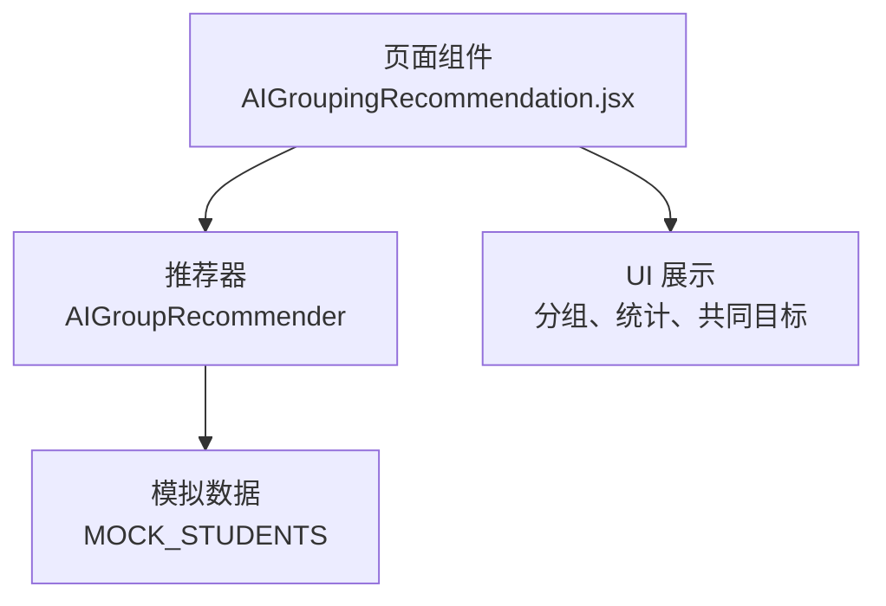
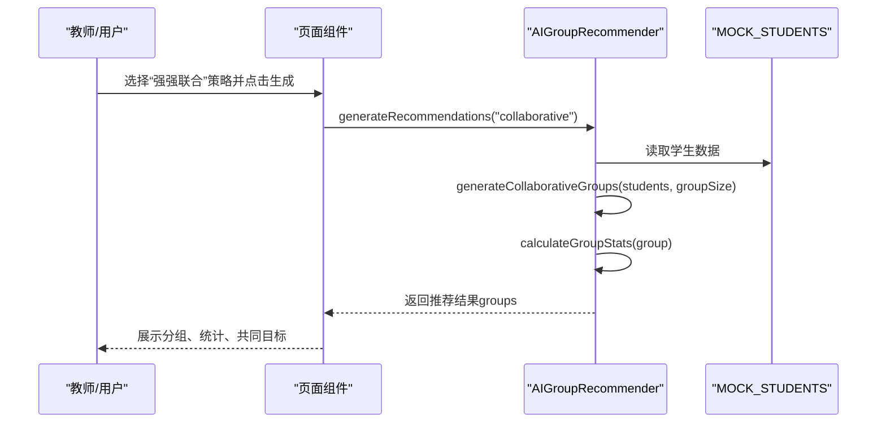
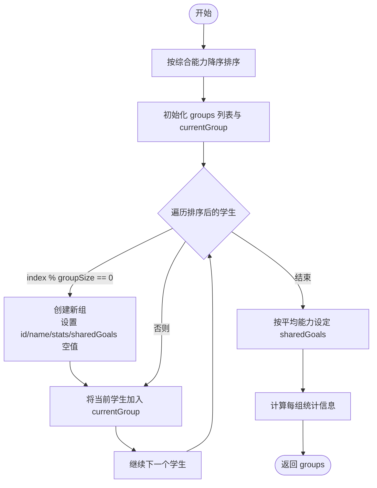
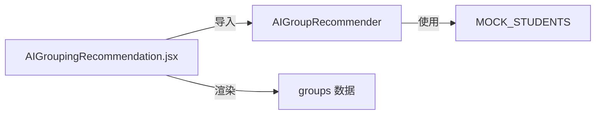

# 强强联合算法

<cite>
**本文引用的文件**
- [AIGroupingRecommendation.jsx](file://src/pages/AIGroupingRecommendation.jsx)
- [ai_group_recommender.js](file://src/data/ai_group_recommender.js)
- [student_path_data.js](file://src/data/student_path_data.js)
</cite>

## 目录
1. [简介](#简介)
2. [项目结构](#项目结构)
3. [核心组件](#核心组件)
4. [架构总览](#架构总览)
5. [详细组件分析](#详细组件分析)
6. [依赖分析](#依赖分析)
7. [性能考虑](#性能考虑)
8. [故障排查指南](#故障排查指南)
9. [结论](#结论)
10. [附录](#附录)

## 简介
本技术文档围绕“强强联合分组”策略展开，重点解析 generateCollaborativeGroups 方法的实现机制与策略设计意图。该策略将学生按综合能力降序排列后，以固定大小（如3人）进行连续分组，形成同质化小组；同时依据各组成员的平均能力水平动态设定共同学习目标（sharedGoals），例如高级组聚焦竞赛准备，基础组侧重查漏补缺。文档还解释 calculateGroupStats 在该策略下的应用，以及分组后的统计信息对教师评估小组潜力的价值，并讨论该策略在激发学生竞争意识和协作学习方面的设计意图。

## 项目结构
本功能涉及三个关键模块：
- 页面组件：负责用户交互与结果展示
- 推荐器：包含多种分组策略与统计计算
- 模拟数据：提供学生能力与学习风格等基础数据

图表来源
- [AIGroupingRecommendation.jsx](file://src/pages/AIGroupingRecommendation.jsx#L1-L268)
- [ai_group_recommender.js](file://src/data/ai_group_recommender.js#L95-L215)
- [student_path_data.js](file://src/data/student_path_data.js#L1-L80)

章节来源
- [AIGroupingRecommendation.jsx](file://src/pages/AIGroupingRecommendation.jsx#L1-L268)
- [ai_group_recommender.js](file://src/data/ai_group_recommender.js#L95-L215)
- [student_path_data.js](file://src/data/student_path_data.js#L1-L80)

## 核心组件
- 页面组件 AIGroupingRecommendation.jsx
  - 提供策略选择与推荐生成入口
  - 渲染推荐结果，包括组统计、匹配度、共同目标等
- 推荐器 AIGroupRecommender
  - 定义分组策略常量与推荐生成流程
  - 实现 generateCollaborativeGroups、calculateGroupStats、calculateCompatibility 等核心方法
- 模拟数据 MOCK_STUDENTS
  - 提供学生能力维度与学习风格等字段，作为分组依据

章节来源
- [AIGroupingRecommendation.jsx](file://src/pages/AIGroupingRecommendation.jsx#L1-L268)
- [ai_group_recommender.js](file://src/data/ai_group_recommender.js#L1-L215)
- [student_path_data.js](file://src/data/student_path_data.js#L1-L80)

## 架构总览
强强联合分组的整体流程如下：
- 输入：学生集合（含综合能力等）
- 处理：按综合能力降序排序，按固定大小连续分组
- 输出：每组包含成员、共享目标、统计信息与兼容性评分

图表来源
- [AIGroupingRecommendation.jsx](file://src/pages/AIGroupingRecommendation.jsx#L12-L20)
- [ai_group_recommender.js](file://src/data/ai_group_recommender.js#L190-L209)
- [student_path_data.js](file://src/data/student_path_data.js#L1-L80)

## 详细组件分析

### generateCollaborativeGroups 方法实现机制
- 输入与预处理
  - 将输入学生数组复制并按综合能力降序排序
- 分组策略
  - 使用索引对组大小取模（index % groupSize）决定新组的开启
  - 连续地将当前学生加入当前组，形成同质化小组
- 组命名策略
  - 根据索引范围动态命名：前 groupSize 个学生为“高级学习组”，次 groupSize 人为“中级学习组”，其余为“基础学习组”
- 共同学习目标（sharedGoals）设定
  - 计算组内平均综合能力，按阈值划分目标：
    - 平均能力≥85：竞赛准备、深度学习、拓展提高
    - 平均能力∈[70,85)：巩固提升、典型例题、同步提高
    - 平均能力<70：基础巩固、查漏补缺、稳步提升
- 统计与兼容性
  - 为每组调用 calculateGroupStats 计算平均能力、最高/最低能力、能力差距、成员数与兼容性评分

图表来源
- [ai_group_recommender.js](file://src/data/ai_group_recommender.js#L95-L138)
- [ai_group_recommender.js](file://src/data/ai_group_recommender.js#L156-L171)

章节来源
- [ai_group_recommender.js](file://src/data/ai_group_recommender.js#L95-L138)
- [ai_group_recommender.js](file://src/data/ai_group_recommender.js#L156-L171)

### 索引分配逻辑（index % groupSize）
- 作用：决定何时开启新组，确保每组人数不超过固定大小
- 特点：连续分组，天然形成同质化小组，避免跨组跳跃导致的异质组合
- 影响：当学生总数不能被组大小整除时，最后一组人数可能小于组大小

章节来源
- [ai_group_recommender.js](file://src/data/ai_group_recommender.js#L103-L120)

### 组别命名策略
- 命名依据：索引范围映射到不同层级的组名
- 设计意图：直观体现组内整体能力水平，便于教师快速识别与管理

章节来源
- [ai_group_recommender.js](file://src/data/ai_group_recommender.js#L106-L108)

### calculateGroupStats 的应用
- 计算指标
  - 平均能力、最高能力、最低能力、能力差距、成员数
  - 兼容性评分（由 calculateCompatibility 决定）
- 在强强联合策略中的意义
  - 用于评估组内同质化程度与协作潜力
  - 为教师提供量化参考，辅助判断是否需要调整分组

章节来源
- [ai_group_recommender.js](file://src/data/ai_group_recommender.js#L156-L171)
- [ai_group_recommender.js](file://src/data/ai_group_recommender.js#L173-L188)

### 共同学习目标（sharedGoals）设定
- 动态设定：基于组内平均综合能力自动匹配目标
- 教学价值：
  - 高级组聚焦竞赛准备与深度学习，契合高能力学生的发展需求
  - 中级组强调巩固提升与典型例题，帮助稳定提升
  - 基础组侧重查漏补缺与稳步提升，满足薄弱环节强化

章节来源
- [ai_group_recommender.js](file://src/data/ai_group_recommender.js#L122-L133)

### 页面渲染与交互
- 展示内容
  - 分组名称、成员列表、角色标识（如导师）、能力与学习风格
  - 组统计（平均能力、最高/最低能力、能力差距）
  - 匹配度星级与百分比
  - 共同目标标签
- 用户操作
  - 生成推荐、采纳分组、调整成员（预留）

章节来源
- [AIGroupingRecommendation.jsx](file://src/pages/AIGroupingRecommendation.jsx#L99-L268)

## 依赖分析
- 页面组件依赖推荐器导出的策略与推荐结果
- 推荐器依赖模拟数据中的学生能力字段
- 页面组件渲染时使用 MOCK_STUDENTS 与推荐器返回的 groups

图表来源
- [AIGroupingRecommendation.jsx](file://src/pages/AIGroupingRecommendation.jsx#L1-L20)
- [ai_group_recommender.js](file://src/data/ai_group_recommender.js#L190-L209)
- [student_path_data.js](file://src/data/student_path_data.js#L1-L80)

章节来源
- [AIGroupingRecommendation.jsx](file://src/pages/AIGroupingRecommendation.jsx#L1-L20)
- [ai_group_recommender.js](file://src/data/ai_group_recommender.js#L190-L209)
- [student_path_data.js](file://src/data/student_path_data.js#L1-L80)

## 性能考虑
- 时间复杂度
  - 排序：O(n log n)
  - 分组遍历：O(n)
  - 每组统计：O(m)，m 为组内人数
  - 总体：O(n log n + n + Σm)
- 空间复杂度
  - 输出 groups 占用 O(n)
- 优化建议
  - 当学生规模较大时，可考虑分批处理或缓存中间结果
  - 统计计算可并行化（若组数较多且独立）

## 故障排查指南
- 分组人数异常
  - 现象：最后一组人数小于组大小
  - 原因：学生总数不能被组大小整除
  - 处理：接受连续分组的自然结果，或在业务层统一补齐
- 共同目标不符合预期
  - 现象：某组目标与期望不符
  - 原因：平均能力阈值或组内成员构成导致
  - 处理：调整阈值或微调组内成员
- 统计信息显示异常
  - 现象：能力差距或平均能力异常
  - 原因：数据缺失或字段不一致
  - 处理：检查 MOCK_STUDENTS 中 abilities 字段完整性

章节来源
- [ai_group_recommender.js](file://src/data/ai_group_recommender.js#L95-L138)
- [ai_group_recommender.js](file://src/data/ai_group_recommender.js#L156-L171)
- [student_path_data.js](file://src/data/student_path_data.js#L1-L80)

## 结论
强强联合分组策略通过“能力降序+固定大小连续分组”的方式，有效形成同质化小组，并以平均能力为依据动态设定共同学习目标，既体现了差异化教学理念，又兼顾了协作学习与竞争激励。配合 calculateGroupStats 与兼容性评分，教师可快速评估小组潜力并进行针对性指导。该策略在提升高能力学生挑战性的同时，也为中低能力学生提供稳定成长路径，有助于营造积极向上的课堂氛围。

## 附录
- 关键实现位置
  - generateCollaborativeGroups：[ai_group_recommender.js](file://src/data/ai_group_recommender.js#L95-L138)
  - calculateGroupStats：[ai_group_recommender.js](file://src/data/ai_group_recommender.js#L156-L171)
  - calculateCompatibility：[ai_group_recommender.js](file://src/data/ai_group_recommender.js#L173-L188)
  - 页面渲染与交互：[AIGroupingRecommendation.jsx](file://src/pages/AIGroupingRecommendation.jsx#L99-L268)
  - 模拟数据结构：[student_path_data.js](file://src/data/student_path_data.js#L1-L80)