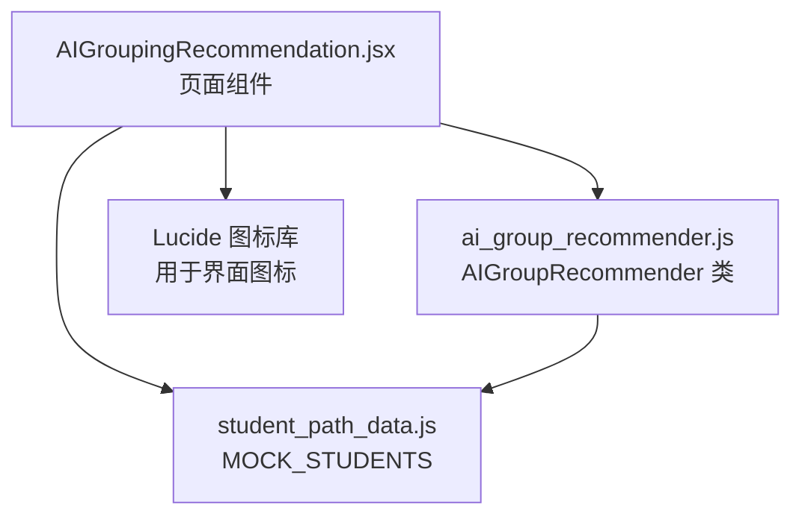
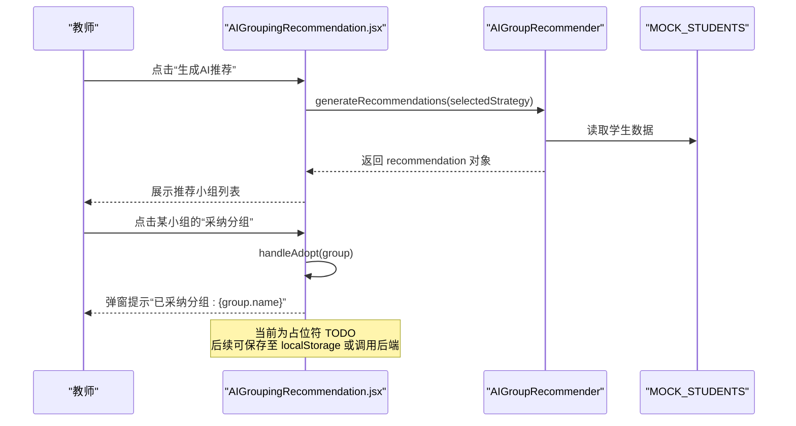
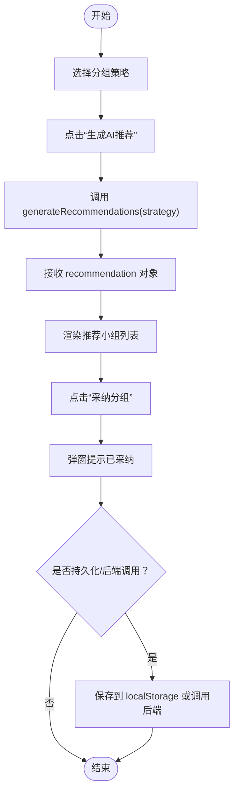
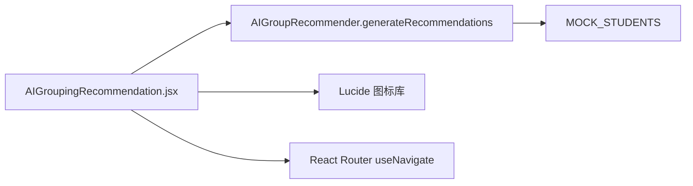

# 结果采纳

<cite>
**本文引用的文件**
- [AIGroupingRecommendation.jsx](file://src/pages/AIGroupingRecommendation.jsx)
- [ai_group_recommender.js](file://src/data/ai_group_recommender.js)
- [student_path_data.js](file://src/data/student_path_data.js)
</cite>

## 目录
1. [引言](#引言)
2. [项目结构](#项目结构)
3. [核心组件](#核心组件)
4. [架构总览](#架构总览)
5. [详细组件分析](#详细组件分析)
6. [依赖分析](#依赖分析)
7. [性能考虑](#性能考虑)
8. [故障排查指南](#故障排查指南)
9. [结论](#结论)

## 引言
本文件聚焦于“AI分组推荐结果采纳流程”，围绕页面组件 AIGroupingRecommendation.jsx 中 handleAdopt 函数的实现逻辑展开，梳理教师点击“采纳分组”按钮后的交互流程，并解释 recommendation 对象的数据结构如何支撑后续的本地持久化或后端集成。同时结合 generateRecommendations 返回的时间戳、小组数量等元数据，给出完整的结果采纳生命周期，包括状态管理、反馈提示以及可能的后端集成路径。

## 项目结构
- 页面组件位于 src/pages/AIGroupingRecommendation.jsx，负责展示分组策略、生成推荐、渲染推荐结果以及处理“采纳分组”按钮事件。
- 推荐算法与数据结构定义位于 src/data/ai_group_recommender.js，提供策略枚举、分组算法与 generateRecommendations 的输出结构。
- 模拟学生数据位于 src/data/student_path_data.js，被推荐器与页面共同使用。

图表来源
- [AIGroupingRecommendation.jsx](file://src/pages/AIGroupingRecommendation.jsx#L1-L269)
- [ai_group_recommender.js](file://src/data/ai_group_recommender.js#L1-L215)
- [student_path_data.js](file://src/data/student_path_data.js#L1-L200)

章节来源
- [AIGroupingRecommendation.jsx](file://src/pages/AIGroupingRecommendation.jsx#L1-L269)
- [ai_group_recommender.js](file://src/data/ai_group_recommender.js#L1-L215)
- [student_path_data.js](file://src/data/student_path_data.js#L1-L200)

## 核心组件
- 页面组件 AIGroupingRecommendation.jsx
  - 状态管理：selectedStrategy（当前选择的分组策略）、recommendation（推荐结果对象）。
  - 事件处理：
    - handleGenerate：调用 AIGroupRecommender.generateRecommendations 并写入 recommendation。
    - handleAdopt：接收单个小组对象，当前为弹窗提示，后续需扩展为持久化或后端调用。
  - UI 展示：根据 recommendation 渲染各小组详情、统计、成员列表、配对关系与共同目标；顶部显示“生成AI推荐”按钮与策略卡片。

- 推荐器 AIGroupRecommender
  - 提供策略常量 GROUP_STRATEGIES。
  - 提供 generateRecommendations(strategy)：返回包含 strategy、groups、timestamp、totalStudents、groupCount 的对象。
  - 内部算法：
    - generateMentorGroups：传帮带分组，按能力排序，每组配置1名导师+若干学员，计算 pairings 与统计。
    - generateCollaborativeGroups：强强联合分组，按能力分层，为每组设定 sharedGoals 与统计。
  - 统计与兼容性：calculateGroupStats、calculateCompatibility。

- 模拟数据 MOCK_STUDENTS
  - 包含学生 id、姓名、头像、能力维度与学习风格等字段，作为推荐输入。

章节来源
- [AIGroupingRecommendation.jsx](file://src/pages/AIGroupingRecommendation.jsx#L1-L269)
- [ai_group_recommender.js](file://src/data/ai_group_recommender.js#L1-L215)
- [student_path_data.js](file://src/data/student_path_data.js#L1-L200)

## 架构总览
下图展示了“采纳分组”的端到端流程：教师在页面上选择策略并生成推荐，随后逐组点击“采纳分组”，handleAdopt 被触发，当前以弹窗提示代替持久化，最终可接入本地存储或后端接口。

图表来源
- [AIGroupingRecommendation.jsx](file://src/pages/AIGroupingRecommendation.jsx#L1-L269)
- [ai_group_recommender.js](file://src/data/ai_group_recommender.js#L1-L215)
- [student_path_data.js](file://src/data/student_path_data.js#L1-L200)

## 详细组件分析

### handleAdopt 函数实现与UI交互
- 触发时机：用户在每个小组卡片底部点击“采纳分组”按钮时，会调用 handleAdopt(group)。
- 当前行为：弹窗提示“已采纳分组: {group.name}”，随后在注释中留有 TODO，表明后续需实现持久化或后端调用。
- 建议扩展方向：
  - 本地持久化：将 recommendation 或单个 group 写入 localStorage，保留 timestamp 与策略信息，便于回溯与二次编辑。
  - 后端集成：将 recommendation 作为请求体发送到后端接口，携带 strategy、groups、timestamp、totalStudents、groupCount 等元数据，后端据此落库或触发业务流程。
  - 反馈提示：采用更友好的 Toast/通知组件替代 alert，提升交互体验。

章节来源
- [AIGroupingRecommendation.jsx](file://src/pages/AIGroupingRecommendation.jsx#L1-L269)

### recommendation 对象的数据结构与用途
- 字段构成（由 generateRecommendations 返回）：
  - strategy：所选策略标识（如 mentor/collaborative/balanced）。
  - groups：小组数组，每组包含：
    - id、name、type、members、pairings/sharedGoals（视策略而定）、stats。
    - members：成员数组，包含 id、name、abilities、learningStyle、role 等。
    - stats：统计信息，包含 avgAbility、maxAbility、minAbility、abilityRange、memberCount、compatibilityScore。
  - timestamp：生成时间（ISO 字符串）。
  - totalStudents：参与分组的学生总数。
  - groupCount：生成的小组数量。
- 支持的后续操作：
  - 本地存储：可直接序列化 recommendation 并保存，便于后续展示与复用。
  - 后端调用：作为 API 请求体，携带策略、时间戳、小组数量等元数据，便于服务端审计与统计。
  - UI 展示：页面已直接消费 recommendation 的 strategy、groupCount、groups 等字段进行渲染。

章节来源
- [ai_group_recommender.js](file://src/data/ai_group_recommender.js#L1-L215)
- [AIGroupingRecommendation.jsx](file://src/pages/AIGroupingRecommendation.jsx#L1-L269)

### 生成推荐与元数据
- generateRecommendations(strategy)：
  - 输入：策略标识（mentor/collaborative）。
  - 输出：包含 strategy、groups、timestamp、totalStudents、groupCount 的对象。
  - 元数据用途：
    - timestamp：可用于排序、筛选与审计。
    - totalStudents/groupCount：用于页面标题与统计展示。
- 策略差异：
  - mentor：每组配置1名导师与若干学员，生成 pairings，适合“传帮带”场景。
  - collaborative：按能力分层，生成 sharedGoals，适合“强强联合”场景。
  - balanced：此处未在 handleGenerate 中直接使用，但数据结构已预留。

章节来源
- [ai_group_recommender.js](file://src/data/ai_group_recommender.js#L1-L215)
- [AIGroupingRecommendation.jsx](file://src/pages/AIGroupingRecommendation.jsx#L1-L269)

### UI 渲染与交互细节
- 策略卡片：点击切换 selectedStrategy，卡片高亮与选中标记增强视觉反馈。
- 生成按钮：仅在未生成 recommendation 时显示，避免重复生成。
- 推荐列表：按 groups 渲染小组卡片，展示匹配度评分、统计信息、成员列表、配对关系与共同目标。
- 操作按钮：每个小组提供“采纳分组”和“调整成员”按钮；“调整成员”当前为占位符，可扩展为二次编辑入口。

章节来源
- [AIGroupingRecommendation.jsx](file://src/pages/AIGroupingRecommendation.jsx#L1-L269)

### 状态管理与生命周期
- 初始状态：selectedStrategy 默认为 mentor，recommendation 为空。
- 生命周期阶段：
  1) 选择策略并点击“生成AI推荐” → 调用 handleGenerate → 生成 recommendation。
  2) 展示推荐结果 → 教师逐组点击“采纳分组” → handleAdopt 触发。
  3) 当前 TODO：执行持久化或后端调用 → 反馈提示 → 可能跳转或刷新。
- 建议的状态管理优化：
  - 使用 useReducer 或自定义 Hook 管理 recommendation 的生成、采纳、撤销等状态。
  - 在 handleAdopt 中增加 loading 状态与错误处理，提升健壮性。

章节来源
- [AIGroupingRecommendation.jsx](file://src/pages/AIGroupingRecommendation.jsx#L1-L269)

### 数据流与处理逻辑

图表来源
- [AIGroupingRecommendation.jsx](file://src/pages/AIGroupingRecommendation.jsx#L1-L269)
- [ai_group_recommender.js](file://src/data/ai_group_recommender.js#L1-L215)

## 依赖分析
- 组件耦合关系：
  - AIGroupingRecommendation.jsx 依赖 AIGroupRecommender（策略与算法）与 MOCK_STUDENTS（输入数据）。
  - 页面组件与数据模块之间通过函数调用解耦，利于测试与替换。
- 外部依赖：
  - Lucide 图标库用于界面图标。
  - React Router 的 useNavigate 用于页面导航。

图表来源
- [AIGroupingRecommendation.jsx](file://src/pages/AIGroupingRecommendation.jsx#L1-L269)
- [ai_group_recommender.js](file://src/data/ai_group_recommender.js#L1-L215)
- [student_path_data.js](file://src/data/student_path_data.js#L1-L200)

章节来源
- [AIGroupingRecommendation.jsx](file://src/pages/AIGroupingRecommendation.jsx#L1-L269)
- [ai_group_recommender.js](file://src/data/ai_group_recommender.js#L1-L215)
- [student_path_data.js](file://src/data/student_path_data.js#L1-L200)

## 性能考虑
- 推荐算法复杂度：
  - 传帮带与强强联合分组均基于排序与线性遍历，时间复杂度近似 O(n log n + n)，n 为学生数量，满足中小规模数据场景。
- UI 渲染：
  - recommendation.groups 数量通常有限，渲染开销可控；若 groups 数量较大，可考虑虚拟滚动或分页。
- 状态更新：
  - 采用 useState 管理 recommendation，每次生成都会触发全量重渲染；如需优化，可拆分子组件并使用 memo 化。

## 故障排查指南
- “采纳分组”无响应
  - 检查 handleAdopt 是否被正确绑定到按钮 onClick。
  - 确认 recommendation 已生成且 groups 存在。
- 弹窗提示不出现
  - 确认浏览器允许弹窗，或改为 Toast/通知组件。
- 推荐结果为空
  - 确认 selectedStrategy 有效，且 generateRecommendations 返回 groups 非空。
- 数据不一致
  - 检查 generateRecommendations 的 timestamp、totalStudents、groupCount 是否与 UI 展示一致。

章节来源
- [AIGroupingRecommendation.jsx](file://src/pages/AIGroupingRecommendation.jsx#L1-L269)
- [ai_group_recommender.js](file://src/data/ai_group_recommender.js#L1-L215)

## 结论
AIGroupingRecommendation.jsx 的 handleAdopt 函数目前承担“采纳分组”的入口职责，当前以弹窗提示替代持久化。recommendation 对象提供了丰富的元数据（策略、时间戳、小组数量、统计信息等），为后续本地存储或后端集成奠定了良好基础。建议在保持现有 UI 体验的同时，完善 handleAdopt 的持久化与反馈机制，并考虑引入更稳健的状态管理与错误处理，以提升整体可用性与可维护性。