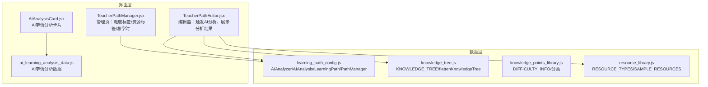
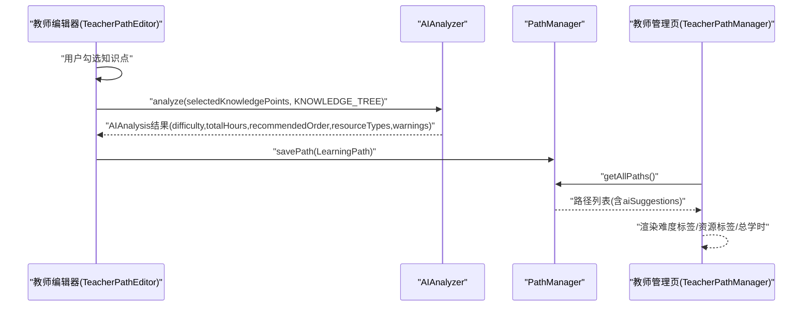
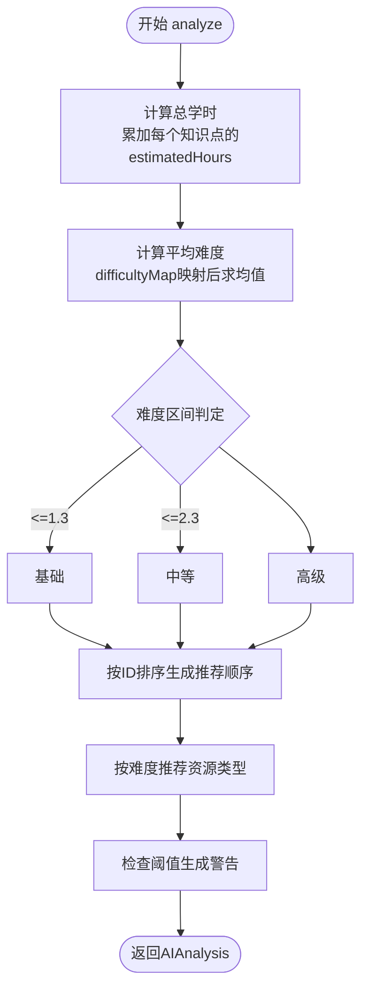
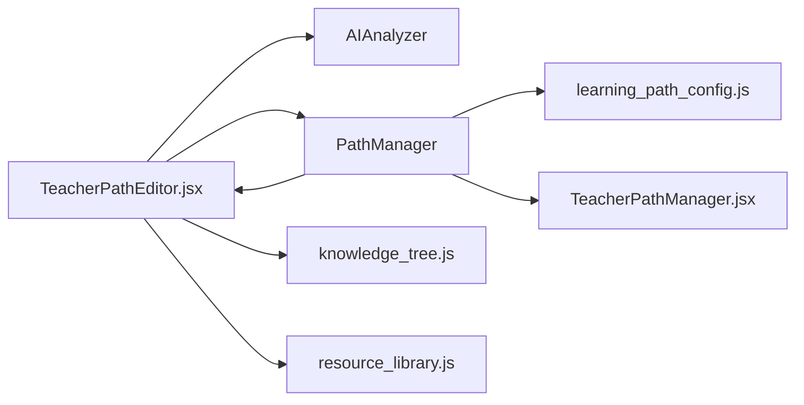

# AI辅助建议

<cite>
**本文引用的文件**
- [learning_path_config.js](file://src/data/learning_path_config.js)
- [TeacherPathEditor.jsx](file://src/pages/TeacherPathEditor.jsx)
- [TeacherPathManager.jsx](file://src/pages/TeacherPathManager.jsx)
- [knowledge_tree.js](file://src/data/knowledge_tree.js)
- [knowledge_points_library.js](file://src/data/knowledge_points_library.js)
- [resource_library.js](file://src/data/resource_library.js)
- [AIAnalysisCard.jsx](file://src/components/uiverse/AIAnalysisCard.jsx)
- [ai_learning_analysis_data.js](file://src/data/ai_learning_analysis_data.js)
</cite>

## 目录
1. [引言](#引言)
2. [项目结构](#项目结构)
3. [核心组件](#核心组件)
4. [架构总览](#架构总览)
5. [详细组件分析](#详细组件分析)
6. [依赖关系分析](#依赖关系分析)
7. [性能考量](#性能考量)
8. [故障排查指南](#故障排查指南)
9. [结论](#结论)
10. [附录](#附录)

## 引言
本文件聚焦“AI辅助建议”功能，围绕 AIAnalyzer 类在学习路径配置中的分析算法进行深入解析，覆盖难度评级、总学时计算、推荐学习顺序、资源类型建议与警告提示的实现逻辑，并说明分析结果在教师端界面 TeacherPathManager.jsx 中的呈现方式（难度标签颜色编码、资源类型标签渲染）。同时给出业务规则与阈值设定，帮助开发者与教师理解并优化AI建议的使用体验。

## 项目结构
AI辅助建议功能涉及以下关键文件：
- 数据与分析：learning_path_config.js（AIAnalyzer、AIAnalysis、LearningPath、PathManager）
- 知识树与知识点：knowledge_tree.js、knowledge_points_library.js
- 教师端编辑器：TeacherPathEditor.jsx（触发AI分析、展示分析结果、保存路径）
- 教师端管理页：TeacherPathManager.jsx（展示难度标签、资源标签、总学时等）
- 资源类型定义：resource_library.js
- 其他AI卡片组件与数据：AIAnalysisCard.jsx、ai_learning_analysis_data.js

图表来源
- [learning_path_config.js](file://src/data/learning_path_config.js#L1-L180)
- [TeacherPathEditor.jsx](file://src/pages/TeacherPathEditor.jsx#L30-L150)
- [TeacherPathManager.jsx](file://src/pages/TeacherPathManager.jsx#L118-L214)
- [knowledge_tree.js](file://src/data/knowledge_tree.js#L1-L120)
- [knowledge_points_library.js](file://src/data/knowledge_points_library.js#L170-L214)
- [resource_library.js](file://src/data/resource_library.js#L1-L40)
- [AIAnalysisCard.jsx](file://src/components/uiverse/AIAnalysisCard.jsx#L1-L60)
- [ai_learning_analysis_data.js](file://src/data/ai_learning_analysis_data.js#L1-L60)

章节来源
- [learning_path_config.js](file://src/data/learning_path_config.js#L1-L180)
- [TeacherPathEditor.jsx](file://src/pages/TeacherPathEditor.jsx#L30-L150)
- [TeacherPathManager.jsx](file://src/pages/TeacherPathManager.jsx#L118-L214)
- [knowledge_tree.js](file://src/data/knowledge_tree.js#L1-L120)
- [knowledge_points_library.js](file://src/data/knowledge_points_library.js#L170-L214)
- [resource_library.js](file://src/data/resource_library.js#L1-L40)
- [AIAnalysisCard.jsx](file://src/components/uiverse/AIAnalysisCard.jsx#L1-L60)
- [ai_learning_analysis_data.js](file://src/data/ai_learning_analysis_data.js#L1-L60)

## 核心组件
- AIAnalyzer：负责对选中的知识点集合进行分析，输出难度评级、总学时、推荐学习顺序、资源类型建议与警告信息。
- AIAnalysis：承载AI分析结果的数据结构。
- LearningPath：学习路径对象，包含知识清单、学习顺序、AI建议等。
- PathManager：本地持久化管理学习路径（localStorage）。
- TeacherPathEditor：教师编辑器，监听知识点选择变化，调用AIAnalyzer并展示分析结果。
- TeacherPathManager：教师管理页，展示各路径的难度标签、资源标签、总学时等。

章节来源
- [learning_path_config.js](file://src/data/learning_path_config.js#L1-L180)
- [TeacherPathEditor.jsx](file://src/pages/TeacherPathEditor.jsx#L30-L150)
- [TeacherPathManager.jsx](file://src/pages/TeacherPathManager.jsx#L118-L214)

## 架构总览
AI辅助建议的端到端流程如下：
- 用户在教师编辑器中勾选知识点，触发AI分析。
- AIAnalyzer 基于知识点集合计算难度、总学时、学习顺序与资源类型，并生成警告。
- 分析结果写入 LearningPath.aiSuggestions，保存到本地存储。
- 教师管理页从本地加载路径，渲染难度标签、资源标签与总学时。

图表来源
- [TeacherPathEditor.jsx](file://src/pages/TeacherPathEditor.jsx#L30-L150)
- [learning_path_config.js](file://src/data/learning_path_config.js#L85-L172)
- [TeacherPathManager.jsx](file://src/pages/TeacherPathManager.jsx#L118-L214)

## 详细组件分析

### AIAnalyzer 类与分析算法
AIAnalyzer 的分析流程由 analyze() 驱动，依次执行：
- 总学时计算：累加每个知识点的预估学时。
- 难度评级：按难度映射计算平均难度，划分等级。
- 推荐学习顺序：按知识点ID字符串排序。
- 资源类型建议：依据平均难度推荐不同资源组合。
- 警告提示：基于知识点数量与总学时生成多条提示。

图表来源
- [learning_path_config.js](file://src/data/learning_path_config.js#L85-L172)

章节来源
- [learning_path_config.js](file://src/data/learning_path_config.js#L85-L172)

### 难度评级规则与阈值
- 难度映射：将知识点难度映射为数值，计算平均难度。
- 阈值划分：
  - 平均难度 ≤ 1.3：基础
  - 平均难度 ≤ 2.3：中等
  - 否则：高级
- 该规则直接决定资源类型建议与难度标签颜色。

章节来源
- [learning_path_config.js](file://src/data/learning_path_config.js#L111-L123)

### 总学时计算
- 依据每个知识点的 estimatedHours 字段累加得到 totalHours。
- 该值用于教师管理页的平均学时统计与编辑器的警告提示。

章节来源
- [learning_path_config.js](file://src/data/learning_path_config.js#L91-L94)
- [TeacherPathManager.jsx](file://src/pages/TeacherPathManager.jsx#L101-L115)

### 推荐学习顺序
- 简单策略：按知识点ID字符串排序，返回推荐顺序。
- 实际使用中，编辑器保存时可选择使用AI推荐顺序或直接使用用户选择顺序。

章节来源
- [learning_path_config.js](file://src/data/learning_path_config.js#L125-L131)
- [TeacherPathEditor.jsx](file://src/pages/TeacherPathEditor.jsx#L132-L154)

### 资源类型建议
- 基础难度：视频讲解、基础练习、概念卡片
- 中等难度：视频讲解、典型例题、巩固练习、知识总结
- 高级难度：深度讲解、高级例题、综合练习、真题演练、竞赛题
- 该建议直接来源于 AIAnalyzer.suggestResources()，并在编辑器右侧卡片中展示。

章节来源
- [learning_path_config.js](file://src/data/learning_path_config.js#L133-L147)
- [TeacherPathEditor.jsx](file://src/pages/TeacherPathEditor.jsx#L320-L370)

### 警告提示与业务阈值
AIAnalyzer.getWarnings() 基于以下业务规则生成警告：
- 知识点数量为0：未选择任何知识点
- 知识点数量为1：建议至少选择2-3个形成完整学习路径
- 知识点数量 > 15：提示可能需要较长学习时间
- 总学时 > 100：建议分阶段学习
- 该逻辑在编辑器中以卡片形式展示，帮助教师优化路径设计。

章节来源
- [learning_path_config.js](file://src/data/learning_path_config.js#L149-L171)
- [TeacherPathEditor.jsx](file://src/pages/TeacherPathEditor.jsx#L358-L370)

### 知识树与知识点数据
- 知识树 KNOWLEDGE_TREE 提供层级化知识点，包含难度、预估学时、标签等字段。
- flattenKnowledgeTree 将树扁平化为叶子节点（实际知识点），便于选择与分析。
- DIFFICULTY_INFO 定义难度级别信息，用于难度映射与阈值判断。

章节来源
- [knowledge_tree.js](file://src/data/knowledge_tree.js#L1-L120)
- [knowledge_tree.js](file://src/data/knowledge_tree.js#L308-L371)
- [knowledge_points_library.js](file://src/data/knowledge_points_library.js#L170-L214)

### 教师编辑器中的AI分析集成
- 编辑器在选中知识点变化时，调用 AIAnalyzer.analyze()，并将结果设置到 aiAnalysis。
- 编辑器右侧卡片展示难度、总学时、推荐资源；顶部警告区展示 AI 警告。
- 保存时将 aiAnalysis 写入 LearningPath.aiSuggestions 并持久化。

章节来源
- [TeacherPathEditor.jsx](file://src/pages/TeacherPathEditor.jsx#L30-L150)
- [TeacherPathEditor.jsx](file://src/pages/TeacherPathEditor.jsx#L320-L393)

### 教师管理页中的UI展示
- 难度标签：根据 aiSuggestions.difficulty 动态设置背景色与文字颜色，区分基础/中等/高级。
- 资源标签：展示 aiSuggestions.resourceTypes 的前三个，超出部分显示“+n”。
- 总学时：展示 aiSuggestions.totalHours，并在统计卡片中计算平均学时。
- 日期与操作：创建/更新时间、复制/删除等。

章节来源
- [TeacherPathManager.jsx](file://src/pages/TeacherPathManager.jsx#L118-L214)

### 资源类型定义与绑定
- RESOURCE_TYPES 定义了资源类型的名称、图标与配色。
- 编辑器右侧卡片展示的是 AI 推荐的资源类型名称，而非具体资源绑定。
- 若需将 AI 建议与具体资源绑定，可结合 knowledge_resource_bindings 与资源库进行扩展。

章节来源
- [resource_library.js](file://src/data/resource_library.js#L1-L40)
- [TeacherPathEditor.jsx](file://src/pages/TeacherPathEditor.jsx#L320-L370)

### AI学情分析卡片（对比参考）
- AIAnalysisCard.jsx 展示的是“学情分析”卡片，包含综合评分、学习状态、关键发现、推荐行动等，与学习路径AI建议不同维度。
- 两者可并存：前者用于学生/学情分析，后者用于教师路径设计辅助。

章节来源
- [AIAnalysisCard.jsx](file://src/components/uiverse/AIAnalysisCard.jsx#L1-L60)
- [ai_learning_analysis_data.js](file://src/data/ai_learning_analysis_data.js#L1-L60)

## 依赖关系分析
- TeacherPathEditor 依赖：
  - AIAnalyzer：用于分析知识点集合
  - PathManager：保存/加载学习路径
  - KNOWLEDGE_TREE：扁平化知识点
  - RESOURCE_TYPES：资源类型定义
- TeacherPathManager 依赖：
  - PathManager：读取路径列表
  - AIAnalysis：渲染难度/资源/学时
- AIAnalyzer 依赖：
  - 知识点集合（包含 difficulty、estimatedHours 等字段）

图表来源
- [TeacherPathEditor.jsx](file://src/pages/TeacherPathEditor.jsx#L30-L150)
- [learning_path_config.js](file://src/data/learning_path_config.js#L1-L180)
- [knowledge_tree.js](file://src/data/knowledge_tree.js#L1-L120)
- [resource_library.js](file://src/data/resource_library.js#L1-L40)
- [TeacherPathManager.jsx](file://src/pages/TeacherPathManager.jsx#L118-L214)

## 性能考量
- 算法复杂度：
  - 总学时与难度计算：O(n)，n为选中知识点数量
  - 推荐顺序：O(n log n)，主要受排序影响
  - 警告生成：O(n)
- 优化建议：
  - 在大数据量场景下，可考虑缓存 flattenKnowledgeTree 结果或按需懒加载
  - 对排序策略可引入更复杂的拓扑排序（基于知识树依赖关系），以提升学习顺序合理性
  - 警告提示可按重要程度分级，避免过多提示干扰

[本节为通用指导，无需列出具体文件来源]

## 故障排查指南
- 未显示AI分析结果
  - 检查是否选择了知识点（编辑器会在空集合时清空分析）
  - 确认 AIAnalyzer.analyze() 是否被调用
- 难度标签颜色异常
  - 检查 aiSuggestions.difficulty 是否为“基础/中等/高级”
  - 确认管理页样式逻辑是否匹配难度值
- 资源标签不显示
  - 检查 aiSuggestions.resourceTypes 是否存在且非空
- 警告未出现
  - 检查知识点数量与总学时是否满足阈值条件
- 保存后未生效
  - 确认 PathManager.savePath() 是否成功写入 localStorage
  - 刷新页面或重新加载路径列表

章节来源
- [TeacherPathEditor.jsx](file://src/pages/TeacherPathEditor.jsx#L30-L150)
- [TeacherPathManager.jsx](file://src/pages/TeacherPathManager.jsx#L118-L214)
- [learning_path_config.js](file://src/data/learning_path_config.js#L149-L171)

## 结论
AI辅助建议通过简洁高效的算法，为教师提供难度评级、总学时、学习顺序与资源类型建议，并以警告提示帮助优化路径设计。在教师编辑器与管理页中，AI分析结果以直观的标签与卡片形式呈现，便于快速决策。后续可考虑引入更精细的拓扑排序与资源绑定机制，进一步提升建议的实用性与可落地性。

[本节为总结性内容，无需列出具体文件来源]

## 附录

### 业务规则与阈值汇总
- 难度评级
  - 平均难度 ≤ 1.3：基础
  - 平均难度 ≤ 2.3：中等
  - 否则：高级
- 警告阈值
  - 知识点数量 = 0：未选择任何知识点
  - 知识点数量 = 1：建议至少选择2-3个
  - 知识点数量 > 15：可能需要较长学习时间
  - 总学时 > 100：建议分阶段学习

章节来源
- [learning_path_config.js](file://src/data/learning_path_config.js#L111-L123)
- [learning_path_config.js](file://src/data/learning_path_config.js#L149-L171)