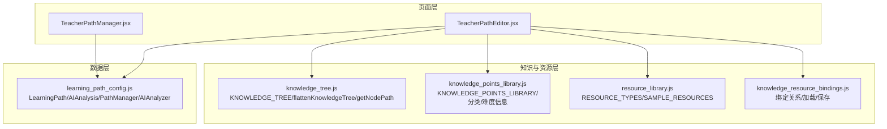
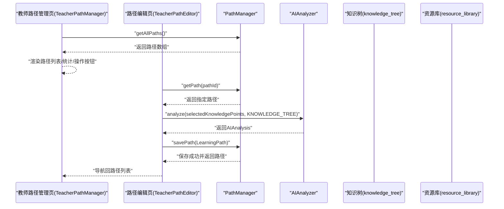
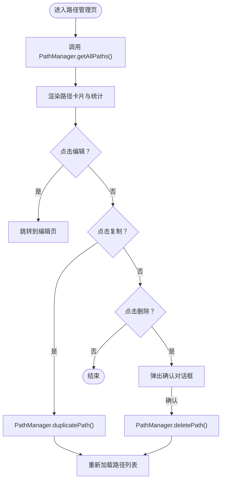
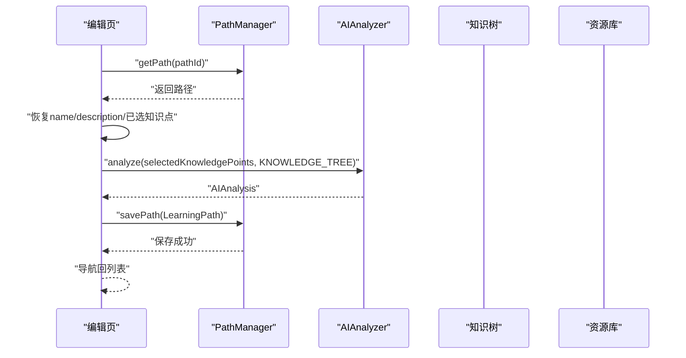
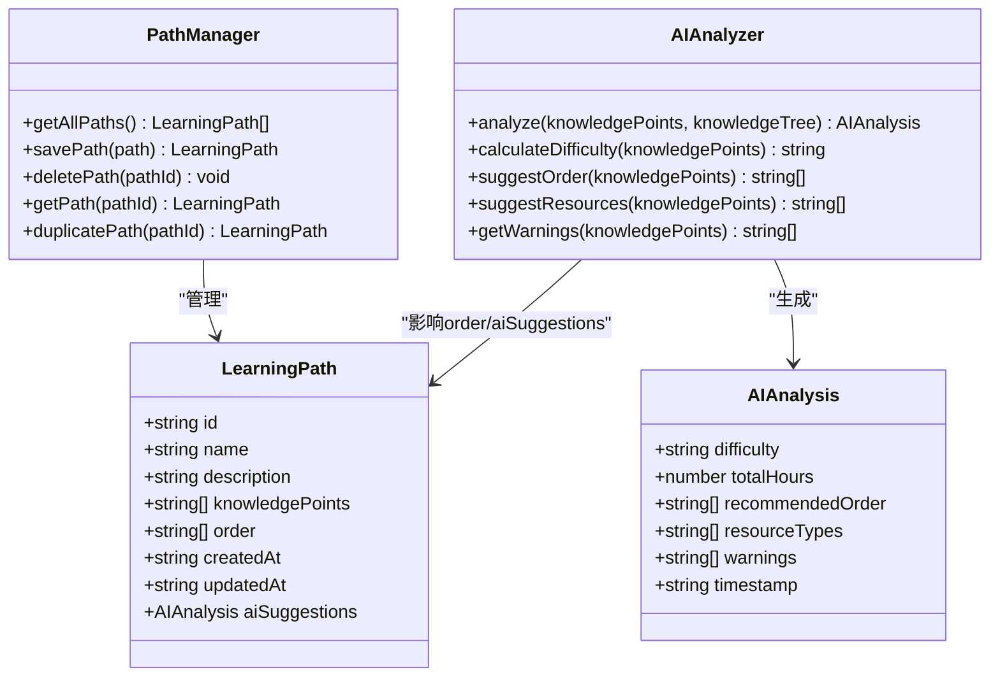
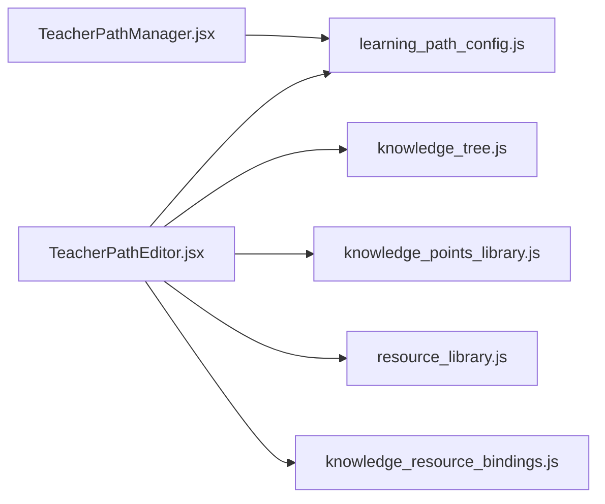

# 学习路径管理

<cite>
**本文引用的文件**
- [TeacherPathManager.jsx](file://src/pages/TeacherPathManager.jsx)
- [TeacherPathEditor.jsx](file://src/pages/TeacherPathEditor.jsx)
- [learning_path_config.js](file://src/data/learning_path_config.js)
- [knowledge_tree.js](file://src/data/knowledge_tree.js)
- [knowledge_points_library.js](file://src/data/knowledge_points_library.js)
- [resource_library.js](file://src/data/resource_library.js)
- [knowledge_resource_bindings.js](file://src/data/knowledge_resource_bindings.js)
- [student_path_data.js](file://src/data/student_path_data.js)
</cite>

## 目录
1. [引言](#引言)
2. [项目结构](#项目结构)
3. [核心组件](#核心组件)
4. [架构总览](#架构总览)
5. [详细组件分析](#详细组件分析)
6. [依赖分析](#依赖分析)
7. [性能考虑](#性能考虑)
8. [故障排查指南](#故障排查指南)
9. [结论](#结论)
10. [附录](#附录)

## 引言
本文件围绕教师端“学习路径管理”功能进行系统化文档化，重点覆盖以下方面：
- 教师路径管理界面（TeacherPathManager.jsx）的路径创建、编辑、复制、删除与展示逻辑
- 路径数据管理与持久化（PathManager 类与 localStorage 的交互）
- 知识点序列配置、预估学时与难度等级的来源与计算
- AI 建议（难度、总学时、学习顺序、资源类型、警告）的集成与呈现
- 版本控制与批量操作的最佳实践建议

## 项目结构
学习路径管理功能由三层组成：
- 页面层：教师路径管理界面与路径编辑界面
- 数据层：学习路径配置与 AI 分析工具
- 知识与资源层：知识点树、资源类型与绑定关系

图表来源
- [TeacherPathManager.jsx](file://src/pages/TeacherPathManager.jsx#L1-L288)
- [TeacherPathEditor.jsx](file://src/pages/TeacherPathEditor.jsx#L1-L393)
- [learning_path_config.js](file://src/data/learning_path_config.js#L1-L180)
- [knowledge_tree.js](file://src/data/knowledge_tree.js#L1-L378)
- [knowledge_points_library.js](file://src/data/knowledge_points_library.js#L1-L214)
- [resource_library.js](file://src/data/resource_library.js#L1-L113)
- [knowledge_resource_bindings.js](file://src/data/knowledge_resource_bindings.js#L1-L61)

章节来源
- [TeacherPathManager.jsx](file://src/pages/TeacherPathManager.jsx#L1-L288)
- [TeacherPathEditor.jsx](file://src/pages/TeacherPathEditor.jsx#L1-L393)
- [learning_path_config.js](file://src/data/learning_path_config.js#L1-L180)
- [knowledge_tree.js](file://src/data/knowledge_tree.js#L1-L378)
- [knowledge_points_library.js](file://src/data/knowledge_points_library.js#L1-L214)
- [resource_library.js](file://src/data/resource_library.js#L1-L113)
- [knowledge_resource_bindings.js](file://src/data/knowledge_resource_bindings.js#L1-L61)

## 核心组件
- 路径管理器（PathManager）
  - 提供路径的增删改查与复制、持久化至 localStorage
  - 维护 createdAt/updatedAt 时间戳
- 路径实体（LearningPath）
  - 字段：id、name、description、knowledgePoints、order、createdAt、updatedAt、aiSuggestions
- AI 分析器（AIAnalyzer）
  - 计算难度等级、总学时、推荐学习顺序、推荐资源类型、警告信息
- 知识点树与扁平化
  - 提供层级化知识点树、扁平化叶子节点、节点路径查询
- 资源类型与绑定
  - 定义资源类型、示例资源；根据知识点 ID 获取绑定资源

章节来源
- [learning_path_config.js](file://src/data/learning_path_config.js#L1-L180)
- [knowledge_tree.js](file://src/data/knowledge_tree.js#L1-L378)
- [resource_library.js](file://src/data/resource_library.js#L1-L113)
- [knowledge_resource_bindings.js](file://src/data/knowledge_resource_bindings.js#L1-L61)

## 架构总览
教师路径管理采用“页面-数据-知识/资源”分层架构：
- 页面层负责用户交互与路由跳转
- 数据层负责路径对象与 AI 分析
- 知识/资源层提供知识点树与资源绑定

图表来源
- [TeacherPathManager.jsx](file://src/pages/TeacherPathManager.jsx#L1-L288)
- [TeacherPathEditor.jsx](file://src/pages/TeacherPathEditor.jsx#L1-L393)
- [learning_path_config.js](file://src/data/learning_path_config.js#L1-L180)
- [knowledge_tree.js](file://src/data/knowledge_tree.js#L1-L378)
- [resource_library.js](file://src/data/resource_library.js#L1-L113)

## 详细组件分析

### 教师路径管理界面（TeacherPathManager.jsx）
- 功能要点
  - 加载全部学习路径并展示
  - 统计卡片：总路径数、总知识点数、平均学时
  - 每条路径展示：名称、描述、难度徽章、知识点数量、预估学时、AI推荐资源类型、创建/更新时间
  - 操作：编辑、复制、删除（带二次确认）
- 关键交互
  - 路径列表来源于 PathManager.getAllPaths()
  - 删除调用 PathManager.deletePath()，随后重新加载
  - 复制调用 PathManager.duplicatePath()，随后重新加载
  - 编辑跳转到 /teacher/path/edit/:id 或 /teacher/path/edit/new

图表来源
- [TeacherPathManager.jsx](file://src/pages/TeacherPathManager.jsx#L1-L288)
- [learning_path_config.js](file://src/data/learning_path_config.js#L1-L180)

章节来源
- [TeacherPathManager.jsx](file://src/pages/TeacherPathManager.jsx#L1-L288)

### 路径编辑界面（TeacherPathEditor.jsx）
- 功能要点
  - 基本信息：名称、描述
  - 知识点选择器：基于知识树的树形选择，支持展开/折叠与多选
  - AI 分析：难度、总学时、推荐资源类型、警告
  - 保存：构造 LearningPath 对象并调用 PathManager.savePath()
- 关键流程
  - 加载现有路径：PathManager.getPath(pathId)，恢复名称、描述与已选知识点
  - 选中知识点变化时，调用 AIAnalyzer.analyze 计算 AIAnalysis
  - 保存时，将 selectedKnowledgePoints 映射为知识 ID 数组，order 使用 AI 推荐顺序或回退到按叶子节点排序
  - 保存后导航回路径列表

图表来源
- [TeacherPathEditor.jsx](file://src/pages/TeacherPathEditor.jsx#L1-L393)
- [learning_path_config.js](file://src/data/learning_path_config.js#L1-L180)
- [knowledge_tree.js](file://src/data/knowledge_tree.js#L1-L378)
- [resource_library.js](file://src/data/resource_library.js#L1-L113)

章节来源
- [TeacherPathEditor.jsx](file://src/pages/TeacherPathEditor.jsx#L1-L393)

### PathManager 类与数据持久化（learning_path_config.js）
- 数据结构
  - LearningPath：包含 id、name、description、knowledgePoints、order、createdAt、updatedAt、aiSuggestions
  - AIAnalysis：包含 difficulty、totalHours、recommendedOrder、resourceTypes、warnings、timestamp
- 路径管理
  - getAllPaths：从 localStorage 读取并反序列化为 LearningPath 实例
  - savePath：根据 id 查找是否存在，存在则替换，否则新增；统一更新 updatedAt；写回 localStorage
  - deletePath：过滤掉指定 id 的路径后写回
  - getPath：按 id 查询
  - duplicatePath：复制原始路径，重命名并生成新的 id，同时更新 createdAt/updatedAt 后保存
- 持久化策略
  - 所有路径以数组形式存储在 localStorage 中，键名为 learningPaths
  - 通过 JSON 序列化/反序列化实现数据持久化

图表来源
- [learning_path_config.js](file://src/data/learning_path_config.js#L1-L180)

章节来源
- [learning_path_config.js](file://src/data/learning_path_config.js#L1-L180)

### 知识点序列、预估学时与难度等级
- 知识点序列
  - 编辑页通过知识树选择叶子节点作为知识点，AIAnalyzer.suggestOrder 返回按 ID 排序的推荐顺序
  - 若未生成 AI 分析，则回退为按叶子节点排序
- 预估学时
  - AIAnalyzer.analyze 对所选知识点的 estimatedHours 求和得到 totalHours
  - 知识点的 estimatedHours 来源于知识库（knowledge_points_library.js）
- 难度等级
  - AIAnalyzer.calculateDifficulty 基于难度映射（basic/intermediate/advanced）计算平均难度并归类为“基础/中等/高级”
  - 知识点难度来自知识库（knowledge_points_library.js）

章节来源
- [TeacherPathEditor.jsx](file://src/pages/TeacherPathEditor.jsx#L1-L393)
- [knowledge_tree.js](file://src/data/knowledge_tree.js#L1-L378)
- [knowledge_points_library.js](file://src/data/knowledge_points_library.js#L1-L214)
- [learning_path_config.js](file://src/data/learning_path_config.js#L1-L180)

### AI 建议集成
- 难度评级、总学时、推荐资源类型、警告信息均来自 AIAnalyzer.analyze
- 在编辑页中实时展示，并在保存时写入路径对象的 aiSuggestions 字段
- 管理页中展示难度徽章、预估学时与前三种推荐资源类型

章节来源
- [TeacherPathEditor.jsx](file://src/pages/TeacherPathEditor.jsx#L1-L393)
- [TeacherPathManager.jsx](file://src/pages/TeacherPathManager.jsx#L1-L288)
- [learning_path_config.js](file://src/data/learning_path_config.js#L1-L180)

### 知识点与资源绑定
- 资源类型定义（resource_library.js）与示例资源（SAMPLE_RESOURCES）
- 知识点与资源的绑定（knowledge_resource_bindings.js）支持按知识点 ID 查询绑定资源
- 编辑页在展示已选知识点时，可显示该知识点的关联资源列表

章节来源
- [resource_library.js](file://src/data/resource_library.js#L1-L113)
- [knowledge_resource_bindings.js](file://src/data/knowledge_resource_bindings.js#L1-L61)
- [TeacherPathEditor.jsx](file://src/pages/TeacherPathEditor.jsx#L1-L393)

### 版本控制与批量操作最佳实践
- 版本控制
  - 当前实现未提供显式的版本号字段或历史快照；建议在 LearningPath 中增加 version 字段与历史记录数组，以便追踪变更
  - 保存时可记录 updatedAt 与变更摘要，便于审计
- 批量操作
  - 复制路径：使用 PathManager.duplicatePath，适合快速复用模板
  - 批量删除：可扩展为多选删除，前端勾选多个路径后逐个调用 deletePath 并批量刷新
  - 批量编辑：可扩展为批量设置难度等级、资源类型或学习顺序，再统一调用 savePath

章节来源
- [learning_path_config.js](file://src/data/learning_path_config.js#L1-L180)
- [TeacherPathManager.jsx](file://src/pages/TeacherPathManager.jsx#L1-L288)

## 依赖分析
- 组件耦合
  - TeacherPathManager 仅依赖 PathManager，职责单一，耦合度低
  - TeacherPathEditor 依赖 PathManager、AIAnalyzer、知识树与资源库，承担编辑与分析职责
- 外部依赖
  - localStorage 作为唯一持久化介质，简化部署但需注意容量限制与跨设备同步问题
- 潜在循环依赖
  - 当前模块间无循环依赖，结构清晰

图表来源
- [TeacherPathManager.jsx](file://src/pages/TeacherPathManager.jsx#L1-L288)
- [TeacherPathEditor.jsx](file://src/pages/TeacherPathEditor.jsx#L1-L393)
- [learning_path_config.js](file://src/data/learning_path_config.js#L1-L180)
- [knowledge_tree.js](file://src/data/knowledge_tree.js#L1-L378)
- [knowledge_points_library.js](file://src/data/knowledge_points_library.js#L1-L214)
- [resource_library.js](file://src/data/resource_library.js#L1-L113)
- [knowledge_resource_bindings.js](file://src/data/knowledge_resource_bindings.js#L1-L61)

章节来源
- [TeacherPathManager.jsx](file://src/pages/TeacherPathManager.jsx#L1-L288)
- [TeacherPathEditor.jsx](file://src/pages/TeacherPathEditor.jsx#L1-L393)
- [learning_path_config.js](file://src/data/learning_path_config.js#L1-L180)
- [knowledge_tree.js](file://src/data/knowledge_tree.js#L1-L378)
- [knowledge_points_library.js](file://src/data/knowledge_points_library.js#L1-L214)
- [resource_library.js](file://src/data/resource_library.js#L1-L113)
- [knowledge_resource_bindings.js](file://src/data/knowledge_resource_bindings.js#L1-L61)

## 性能考虑
- 知识点树扁平化
  - 编辑页使用 flattenKnowledgeTree 将树扁平化以支持快速筛选与选择，注意大数据量时的渲染性能
- AI 分析触发频率
  - 选中知识点变化即触发 AI 分析，建议在高频变更场景下加入节流/防抖
- 本地存储
  - localStorage 写入为同步操作，大量路径或大对象时可能阻塞 UI；建议分批保存或延迟保存

## 故障排查指南
- 无法加载路径列表
  - 检查 localStorage 中 learningPaths 是否存在且格式正确
  - 参考路径：[learning_path_config.js](file://src/data/learning_path_config.js#L1-L180)
- 保存失败或未生效
  - 确认 savePath 返回值与 localStorage 写入是否成功
  - 参考路径：[learning_path_config.js](file://src/data/learning_path_config.js#L1-L180)
- AI 分析为空
  - 确保选中至少一个知识点，且知识树与资源库数据可用
  - 参考路径：[TeacherPathEditor.jsx](file://src/pages/TeacherPathEditor.jsx#L1-L393)
- 资源绑定无效
  - 检查 KNOWLEDGE_RESOURCE_BINDINGS 与 SAMPLE_RESOURCES 的匹配关系
  - 参考路径：[knowledge_resource_bindings.js](file://src/data/knowledge_resource_bindings.js#L1-L61)

章节来源
- [learning_path_config.js](file://src/data/learning_path_config.js#L1-L180)
- [TeacherPathEditor.jsx](file://src/pages/TeacherPathEditor.jsx#L1-L393)
- [knowledge_resource_bindings.js](file://src/data/knowledge_resource_bindings.js#L1-L61)

## 结论
学习路径管理功能以简洁的数据结构与清晰的页面职责实现了路径的创建、编辑、复制与删除，并通过 AI 分析提供难度、学时与资源建议。当前实现以 localStorage 为核心持久化手段，具备良好的可维护性与扩展性。建议后续引入版本控制与批量操作能力，以满足更复杂的教学管理需求。

## 附录
- 学生路径分配参考
  - 学生路径分配与进度更新逻辑可作为路径版本控制与批量操作的参考实现
  - 参考路径：[student_path_data.js](file://src/data/student_path_data.js#L82-L263)

章节来源
- [student_path_data.js](file://src/data/student_path_data.js#L82-L263)