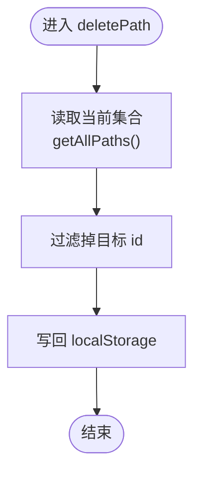

# 批量操作

<cite>
**本文引用的文件**
- [learning_path_config.js](file://src/data/learning_path_config.js)
- [TeacherPathManager.jsx](file://src/pages/TeacherPathManager.jsx)
- [TeacherPathEditor.jsx](file://src/pages/TeacherPathEditor.jsx)
- [storage_utils.js](file://src/utils/storage_utils.js)
</cite>

## 目录
1. [简介](#简介)
2. [项目结构](#项目结构)
3. [核心组件](#核心组件)
4. [架构总览](#架构总览)
5. [详细组件分析](#详细组件分析)
6. [依赖关系分析](#依赖关系分析)
7. [性能考量](#性能考量)
8. [故障排查指南](#故障排查指南)
9. [结论](#结论)
10. [附录](#附录)

## 简介
本文件聚焦“学习路径批量操作”功能，围绕 PathManager 类在 learning_path_config.js 中实现的路径复制与删除机制，结合 TeacherPathManager.jsx 的 UI 交互流程，系统阐述：
- duplicatePath 如何基于原始路径创建副本并生成唯一 ID；
- deletePath 如何从 localStorage 中移除指定路径；
- 教师端路径管理界面的批量操作交互（删除确认对话框与复制反馈）；
- 使用场景与数据一致性保障建议。

## 项目结构
与批量操作直接相关的模块分布如下：
- 数据层：学习路径模型与管理工具位于 learning_path_config.js，负责路径对象的构造、持久化与检索。
- 页面层：教师路径管理界面 TeacherPathManager.jsx 提供复制与删除的 UI 触发与列表刷新。
- 编辑器：TeacherPathEditor.jsx 用于创建/编辑路径，间接影响批量操作的数据来源。
- 其他存储工具：storage_utils.js 提供通用本地存储封装，但学习路径数据使用独立键名，不与之冲突。


图表来源
- [learning_path_config.js](file://src/data/learning_path_config.js#L3-L83)
- [TeacherPathManager.jsx](file://src/pages/TeacherPathManager.jsx#L1-L42)
- [TeacherPathEditor.jsx](file://src/pages/TeacherPathEditor.jsx#L1-L60)

章节来源
- [learning_path_config.js](file://src/data/learning_path_config.js#L3-L83)
- [TeacherPathManager.jsx](file://src/pages/TeacherPathManager.jsx#L1-L42)
- [TeacherPathEditor.jsx](file://src/pages/TeacherPathEditor.jsx#L1-L60)

## 核心组件
- LearningPath：学习路径数据模型，包含标识、名称、描述、知识点集合、学习顺序、时间戳与 AI 建议等字段。
- PathManager：路径管理工具，提供 getAllPaths、savePath、getPath、duplicatePath、deletePath 等方法，统一读写 localStorage 中的路径集合。
- TeacherPathManager：教师路径管理页面，负责渲染路径列表、触发复制/删除操作，并弹出删除确认对话框。

章节来源
- [learning_path_config.js](file://src/data/learning_path_config.js#L3-L14)
- [learning_path_config.js](file://src/data/learning_path_config.js#L29-L83)
- [TeacherPathManager.jsx](file://src/pages/TeacherPathManager.jsx#L1-L42)

## 架构总览
批量操作的端到端流程如下：
- 用户在教师路径管理页点击“复制”或“删除”按钮；
- 页面调用 PathManager 对应方法；
- PathManager 读取/写入 localStorage 中的路径集合；
- 页面重新加载路径列表，完成 UI 刷新。


图表来源
- [TeacherPathManager.jsx](file://src/pages/TeacherPathManager.jsx#L21-L32)
- [learning_path_config.js](file://src/data/learning_path_config.js#L31-L83)

## 详细组件分析

### PathManager 类与批量操作机制
- getAllPaths：从 localStorage 读取学习路径集合，若不存在返回空数组；解析后转换为 LearningPath 实例数组。
- savePath：先获取当前集合，定位同 id 的路径进行替换，否则追加；随后更新 updatedAt 并写回 localStorage。
- getPath：按 id 查找路径。
- duplicatePath：根据目标路径创建副本，重置 id 为“path-{当前毫秒时间戳}”，名称追加“(副本)”，createdAt/updatedAt 设为当前时间，再调用 savePath 持久化。
- deletePath：读取集合后过滤掉目标 id，再写回 localStorage。


图表来源
- [learning_path_config.js](file://src/data/learning_path_config.js#L3-L14)
- [learning_path_config.js](file://src/data/learning_path_config.js#L29-L83)
- [learning_path_config.js](file://src/data/learning_path_config.js#L85-L171)

章节来源
- [learning_path_config.js](file://src/data/learning_path_config.js#L31-L83)

### duplicatePath 方法：路径复制与唯一 ID 生成
- 输入：目标路径 id。
- 步骤：
  - 通过 getPath 获取原始路径；
  - 使用 LearningPath 构造函数创建副本，覆盖 id、name、createdAt、updatedAt 字段；
  - 调用 savePath 持久化副本；
  - 返回副本实例。
- 唯一性保证：副本 id 采用“path-{当前毫秒时间戳}”，确保在同域内全局唯一。
- 名称规范：在原名称基础上追加“(副本)”便于识别。


图表来源
- [learning_path_config.js](file://src/data/learning_path_config.js#L62-L83)

章节来源
- [learning_path_config.js](file://src/data/learning_path_config.js#L62-L83)

### deletePath 方法：从 localStorage 移除指定路径
- 输入：目标路径 id。
- 步骤：
  - 读取当前路径集合；
  - 过滤掉 id 等于目标值的项；
  - 将过滤后的集合写回 localStorage。
- 结果：目标路径从集合中移除，后续 getAllPaths 不再返回该路径。



图表来源
- [learning_path_config.js](file://src/data/learning_path_config.js#L31-L60)

章节来源
- [learning_path_config.js](file://src/data/learning_path_config.js#L55-L59)

### TeacherPathManager.jsx：批量操作的 UI 交互流程
- 路径列表渲染：每条路径展示名称、描述、知识点数量、预估学时、难度标签、创建/更新时间等。
- 复制操作：
  - 点击“复制”按钮触发 handleDuplicate(pathId)，内部调用 PathManager.duplicatePath 并刷新列表。
  - 当前实现为逐条复制，未提供多选批量复制的 UI。
- 删除操作：
  - 点击“删除”按钮设置 showDeleteConfirm 为对应 pathId；
  - 弹出确认对话框，包含“取消/删除”两个按钮；
  - 点击“删除”调用 handleDelete(pathId)，内部调用 PathManager.deletePath 并刷新列表，同时关闭确认框。
- 列表刷新：每次复制/删除后均重新加载路径集合，确保 UI 与存储一致。

```mermaid
sequenceDiagram
participant U as "用户"
participant UI as "TeacherPathManager.jsx"
participant PM as "PathManager"
participant LS as "localStorage"
U->>UI : 点击“复制”
UI->>PM : duplicatePath(pathId)
PM->>LS : 写入学习路径集合
UI->>UI : loadPaths()
U->>UI : 点击“删除”
UI->>UI : setShowDeleteConfirm(pathId)
U->>UI : 确认对话框点击“删除”
UI->>PM : deletePath(pathId)
PM->>LS : 写回过滤后的集合
UI->>UI : loadPaths(); setShowDeleteConfirm(null)
```

图表来源
- [TeacherPathManager.jsx](file://src/pages/TeacherPathManager.jsx#L21-L32)
- [TeacherPathManager.jsx](file://src/pages/TeacherPathManager.jsx#L246-L276)
- [learning_path_config.js](file://src/data/learning_path_config.js#L55-L83)

章节来源
- [TeacherPathManager.jsx](file://src/pages/TeacherPathManager.jsx#L21-L32)
- [TeacherPathManager.jsx](file://src/pages/TeacherPathManager.jsx#L246-L276)

### 使用场景与数据一致性保障建议
- 使用场景
  - 快速复用：复制现有路径作为模板，快速生成相似路径；
  - 版本管理：通过复制保留历史版本，便于对比与回滚；
  - 批量迁移：将路径从一个账号/环境迁移到另一个（需注意 id 唯一性）。
- 数据一致性保障
  - 读写原子性：PathManager 的 savePath 在一次读取后整体替换，避免并发写入导致的中间态；
  - 唯一 ID：duplicatePath 明确生成唯一 id，避免重复键冲突；
  - 时间戳：createdAt/updatedAt 自动维护，便于审计与排序；
  - UI 与存储同步：每次操作后立即刷新列表，确保视图与本地存储一致；
  - 错误处理：当目标路径不存在时，duplicatePath 返回 null，调用方应进行空值判断与提示。

章节来源
- [learning_path_config.js](file://src/data/learning_path_config.js#L31-L83)
- [TeacherPathManager.jsx](file://src/pages/TeacherPathManager.jsx#L21-L32)

## 依赖关系分析
- PathManager 依赖 localStorage 作为持久化介质；
- TeacherPathManager 依赖 PathManager 提供的 CRUD 能力；
- TeacherPathEditor 通过 PathManager.savePath 保存路径，间接参与批量操作的数据来源；
- storage_utils.js 提供其他业务数据的本地存储封装，与学习路径数据解耦。


图表来源
- [TeacherPathEditor.jsx](file://src/pages/TeacherPathEditor.jsx#L132-L154)
- [TeacherPathManager.jsx](file://src/pages/TeacherPathManager.jsx#L16-L19)
- [learning_path_config.js](file://src/data/learning_path_config.js#L31-L83)
- [storage_utils.js](file://src/utils/storage_utils.js#L1-L42)

章节来源
- [TeacherPathEditor.jsx](file://src/pages/TeacherPathEditor.jsx#L132-L154)
- [TeacherPathManager.jsx](file://src/pages/TeacherPathManager.jsx#L16-L19)
- [learning_path_config.js](file://src/data/learning_path_config.js#L31-L83)
- [storage_utils.js](file://src/utils/storage_utils.js#L1-L42)

## 性能考量
- 读写复杂度：getAllPaths/保存/删除均为线性扫描，路径数量较少时性能可接受；
- 本地存储瓶颈：localStorage 为同步阻塞，大量路径时建议分页或懒加载；
- UI 刷新成本：每次操作后全量刷新列表，简单直观但对大数据集可能造成抖动；
- 建议优化方向（通用建议）：
  - 对路径列表增加虚拟滚动；
  - 在复制/删除后仅局部更新受影响项；
  - 对高频操作增加节流/防抖；
  - 对大集合采用 IndexedDB 替代 localStorage。

## 故障排查指南
- 复制无效或无响应
  - 检查 duplicatePath 是否返回 null（目标路径不存在）；
  - 确认 localStorage 可用且未被清理；
  - 确认 handleDuplicate 已调用 loadPaths 刷新列表。
- 删除后仍可见
  - 确认 deletePath 已执行并写回 localStorage；
  - 确认 loadPaths 已重新拉取最新集合；
  - 检查是否有缓存或浏览器扩展干扰。
- 数据异常
  - 若出现重复 id，检查是否手动修改过 localStorage；
  - 确保新增路径时未复用旧 id。

章节来源
- [learning_path_config.js](file://src/data/learning_path_config.js#L55-L83)
- [TeacherPathManager.jsx](file://src/pages/TeacherPathManager.jsx#L21-L32)

## 结论
- PathManager 提供了简洁可靠的路径复制与删除能力，配合 localStorage 实现持久化；
- TeacherPathManager 的 UI 交互清晰，删除操作具备二次确认，复制操作即时生效；
- 当前实现为逐条操作，未提供多选批量复制/删除的 UI；如需批量操作，可在现有基础上扩展多选与批量处理逻辑；
- 数据一致性由 PathManager 的原子写入与 UI 刷新共同保障。

## 附录
- 术语
  - 学习路径：由一组知识点构成的学习计划，包含名称、描述、学习顺序与 AI 建议等。
  - 唯一 ID：用于区分不同路径的标识符，复制时会生成新的唯一 ID。
- 相关文件
  - [learning_path_config.js](file://src/data/learning_path_config.js#L3-L83)
  - [TeacherPathManager.jsx](file://src/pages/TeacherPathManager.jsx#L1-L42)
  - [TeacherPathEditor.jsx](file://src/pages/TeacherPathEditor.jsx#L132-L154)
  - [storage_utils.js](file://src/utils/storage_utils.js#L1-L42)