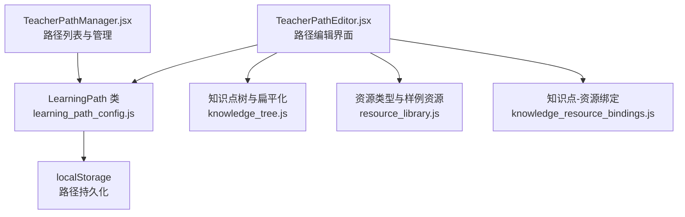
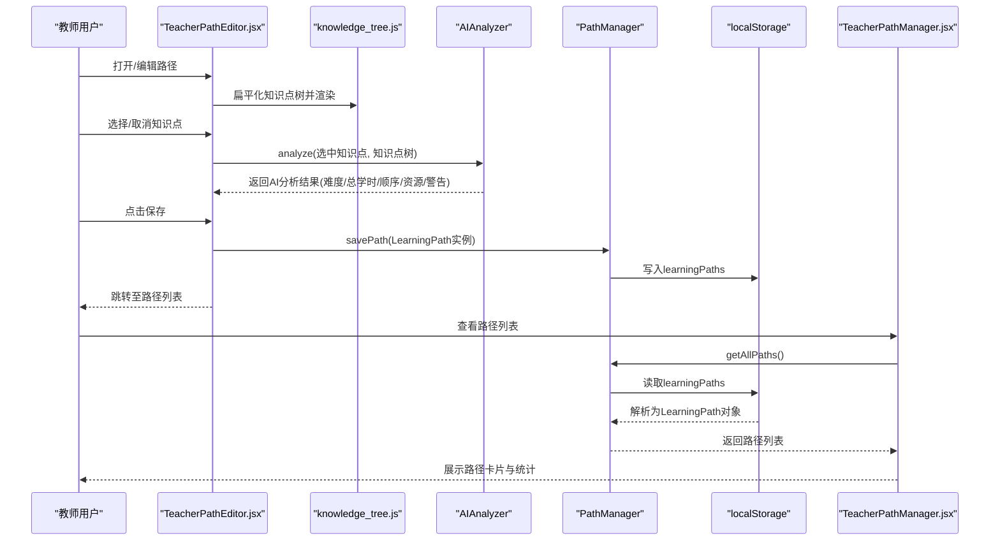
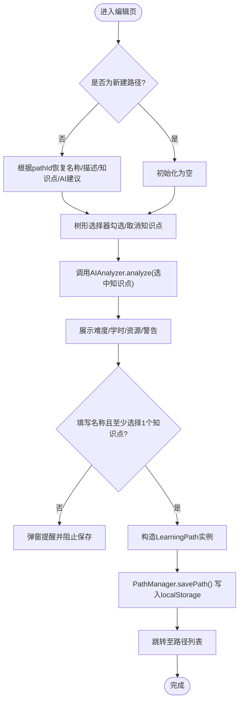
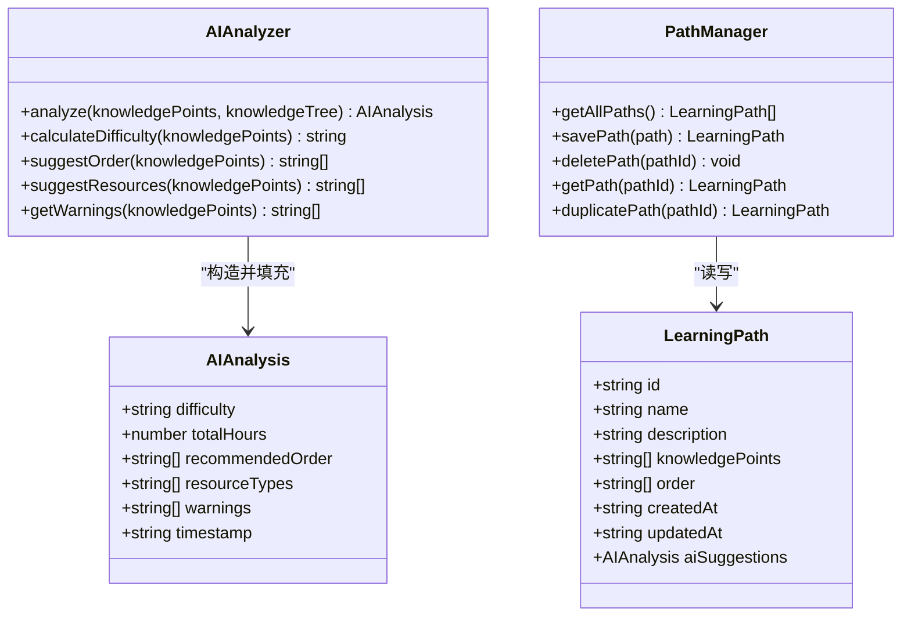
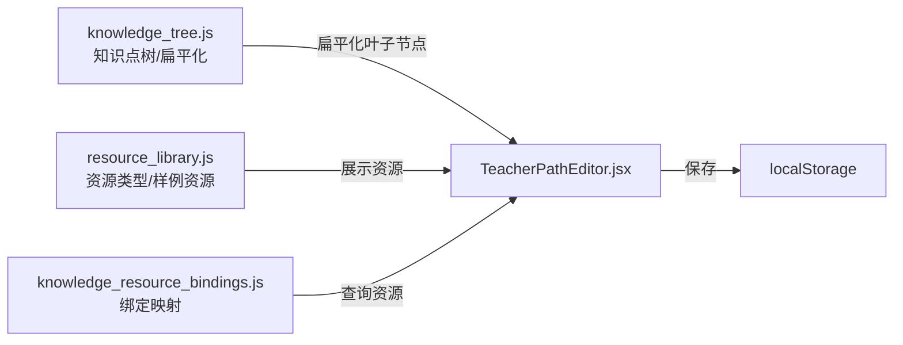
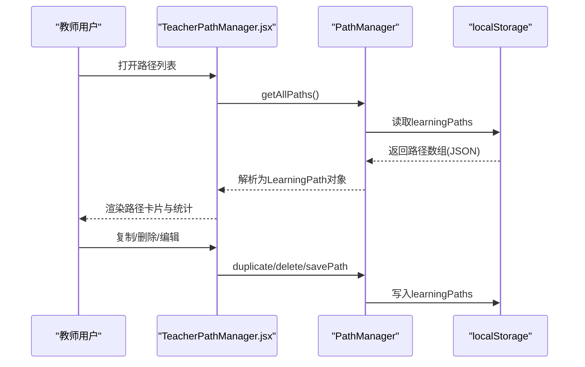
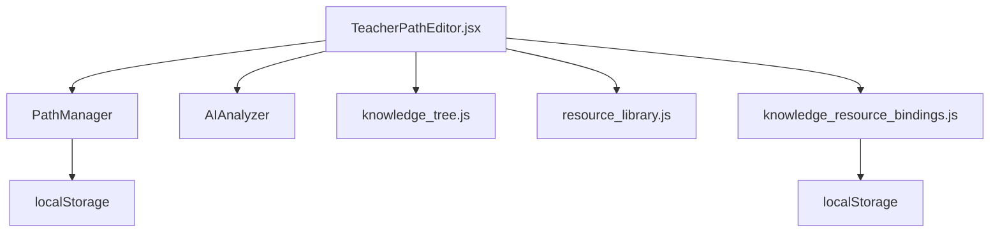

# 路径配置

<cite>
**本文引用的文件**
- [TeacherPathEditor.jsx](file://src/pages/TeacherPathEditor.jsx)
- [learning_path_config.js](file://src/data/learning_path_config.js)
- [knowledge_tree.js](file://src/data/knowledge_tree.js)
- [resource_library.js](file://src/data/resource_library.js)
- [knowledge_resource_bindings.js](file://src/data/knowledge_resource_bindings.js)
- [TeacherPathManager.jsx](file://src/pages/TeacherPathManager.jsx)
- [storage_utils.js](file://src/utils/storage_utils.js)
</cite>

## 目录
1. [简介](#简介)
2. [项目结构](#项目结构)
3. [核心组件](#核心组件)
4. [架构总览](#架构总览)
5. [详细组件分析](#详细组件分析)
6. [依赖分析](#依赖分析)
7. [性能考虑](#性能考虑)
8. [故障排查指南](#故障排查指南)
9. [结论](#结论)
10. [附录](#附录)

## 简介
本文件围绕教师端“学习路径配置”功能展开，重点说明以下方面：
- 在 TeacherPathEditor.jsx 中实现的路径创建、编辑与知识点序列配置流程
- LearningPath 类在 learning_path_config.js 中的数据结构与持久化策略
- 如何设置知识点的预估学时与难度等级
- 路径数据的本地存储与持久化机制
- 配置最佳实践：知识点选择的逻辑顺序与学时估算方法

## 项目结构
与“学习路径配置”直接相关的模块分布如下：
- 页面层：TeacherPathEditor.jsx（路径编辑）、TeacherPathManager.jsx（路径列表与管理）
- 数据层：learning_path_config.js（路径与AI分析模型）、knowledge_tree.js（知识点树与扁平化）、resource_library.js（资源类型与样例资源）、knowledge_resource_bindings.js（知识点与资源绑定）
- 工具层：storage_utils.js（通用本地存储工具，非路径专用）

图表来源
- [TeacherPathEditor.jsx](file://src/pages/TeacherPathEditor.jsx#L1-L180)
- [learning_path_config.js](file://src/data/learning_path_config.js#L1-L83)
- [knowledge_tree.js](file://src/data/knowledge_tree.js#L1-L60)
- [resource_library.js](file://src/data/resource_library.js#L1-L40)
- [knowledge_resource_bindings.js](file://src/data/knowledge_resource_bindings.js#L1-L20)
- [TeacherPathManager.jsx](file://src/pages/TeacherPathManager.jsx#L1-L80)

章节来源
- [TeacherPathEditor.jsx](file://src/pages/TeacherPathEditor.jsx#L1-L180)
- [learning_path_config.js](file://src/data/learning_path_config.js#L1-L83)
- [knowledge_tree.js](file://src/data/knowledge_tree.js#L1-L60)
- [resource_library.js](file://src/data/resource_library.js#L1-L40)
- [knowledge_resource_bindings.js](file://src/data/knowledge_resource_bindings.js#L1-L20)
- [TeacherPathManager.jsx](file://src/pages/TeacherPathManager.jsx#L1-L80)

## 核心组件
- LearningPath 类：封装路径的基本信息、知识点集合、学习顺序、AI分析结果以及时间戳字段
- AIAnalyzer：对选中知识点集合进行难度评估、总学时计算、学习顺序建议与资源类型推荐，并输出警告
- PathManager：提供路径的增删改查与复制、本地持久化（localStorage）
- 知识点树与扁平化：提供层级化的知识点树，支持扁平化以供选择与回填
- 资源绑定：将知识点与资源进行绑定，展示关联资源

章节来源
- [learning_path_config.js](file://src/data/learning_path_config.js#L1-L83)
- [learning_path_config.js](file://src/data/learning_path_config.js#L85-L172)
- [knowledge_tree.js](file://src/data/knowledge_tree.js#L308-L371)
- [resource_library.js](file://src/data/resource_library.js#L1-L40)
- [knowledge_resource_bindings.js](file://src/data/knowledge_resource_bindings.js#L1-L20)

## 架构总览
下图展示了从用户在编辑页选择知识点，到AI分析、保存路径并回到列表页的整体流程。

图表来源
- [TeacherPathEditor.jsx](file://src/pages/TeacherPathEditor.jsx#L1-L180)
- [knowledge_tree.js](file://src/data/knowledge_tree.js#L308-L371)
- [learning_path_config.js](file://src/data/learning_path_config.js#L85-L172)
- [learning_path_config.js](file://src/data/learning_path_config.js#L29-L83)
- [TeacherPathManager.jsx](file://src/pages/TeacherPathManager.jsx#L1-L120)

## 详细组件分析

### 组件A：TeacherPathEditor.jsx（路径编辑与知识点序列配置）
- 路径基本信息：名称与描述
- 知识点选择器：基于知识点树的树形选择，仅叶子节点可勾选；支持展开/收起
- AI分析展示：难度评级、总学时、推荐资源类型、警告信息
- 保存逻辑：构建 LearningPath 实例，写入 PathManager，跳转回路径列表

图表来源
- [TeacherPathEditor.jsx](file://src/pages/TeacherPathEditor.jsx#L1-L180)
- [learning_path_config.js](file://src/data/learning_path_config.js#L85-L172)
- [knowledge_tree.js](file://src/data/knowledge_tree.js#L308-L371)

章节来源
- [TeacherPathEditor.jsx](file://src/pages/TeacherPathEditor.jsx#L1-L180)
- [TeacherPathEditor.jsx](file://src/pages/TeacherPathEditor.jsx#L131-L155)

### 组件B：LearningPath 类与AI分析（learning_path_config.js）
- LearningPath 字段
  - id、name、description、knowledgePoints、order、createdAt、updatedAt、aiSuggestions
- AIAnalysis 字段
  - difficulty、totalHours、recommendedOrder、resourceTypes、warnings、timestamp
- AIAnalyzer 方法
  - analyze：汇总总学时、计算难度、建议顺序、推荐资源、生成警告
  - calculateDifficulty：按难度映射计算平均难度并分级
  - suggestOrder：按ID排序作为学习顺序（可扩展为更复杂拓扑排序）
  - suggestResources：按难度推荐资源类型
  - getWarnings：检查空集、数量过少/过多、总学时过高等风险提示
- PathManager 方法
  - getAllPaths、savePath、deletePath、getPath、duplicatePath
  - 使用 localStorage 键名 learningPaths 存储路径数组

图表来源
- [learning_path_config.js](file://src/data/learning_path_config.js#L1-L83)
- [learning_path_config.js](file://src/data/learning_path_config.js#L85-L172)
- [learning_path_config.js](file://src/data/learning_path_config.js#L29-L83)

章节来源
- [learning_path_config.js](file://src/data/learning_path_config.js#L1-L83)
- [learning_path_config.js](file://src/data/learning_path_config.js#L85-L172)
- [learning_path_config.js](file://src/data/learning_path_config.js#L29-L83)

### 组件C：知识点树与资源绑定（knowledge_tree.js、resource_library.js、knowledge_resource_bindings.js）
- 知识点树
  - 树形结构，叶子节点包含 estimatedHours、difficulty、tags 等属性
  - 提供 flattenKnowledgeTree 将树扁平化为可选择的叶子节点列表
  - 提供 getNodePath 生成面包屑路径字符串
- 资源类型与样例资源
  - 定义资源类型图标、颜色与名称
  - 提供样例资源库，用于展示与绑定
- 知识点-资源绑定
  - 通过 KNOWLEDGE_RESOURCE_BINDINGS 维护知识点ID到资源ID数组的映射
  - 提供 getResourcesForKnowledge 查询绑定资源
  - 支持本地持久化（localStorage 键名 knowledgeResourceBindings）

图表来源
- [knowledge_tree.js](file://src/data/knowledge_tree.js#L1-L60)
- [knowledge_tree.js](file://src/data/knowledge_tree.js#L308-L371)
- [resource_library.js](file://src/data/resource_library.js#L1-L40)
- [knowledge_resource_bindings.js](file://src/data/knowledge_resource_bindings.js#L1-L20)
- [TeacherPathEditor.jsx](file://src/pages/TeacherPathEditor.jsx#L220-L320)

章节来源
- [knowledge_tree.js](file://src/data/knowledge_tree.js#L1-L60)
- [knowledge_tree.js](file://src/data/knowledge_tree.js#L308-L371)
- [resource_library.js](file://src/data/resource_library.js#L1-L40)
- [knowledge_resource_bindings.js](file://src/data/knowledge_resource_bindings.js#L1-L20)
- [TeacherPathEditor.jsx](file://src/pages/TeacherPathEditor.jsx#L220-L320)

### 组件D：路径列表与管理（TeacherPathManager.jsx）
- 展示所有学习路径，包含名称、描述、知识点数量、预估学时、难度等级、创建/更新时间
- 支持复制、删除、编辑路径
- 通过 PathManager 读取与写入 localStorage

图表来源
- [TeacherPathManager.jsx](file://src/pages/TeacherPathManager.jsx#L1-L120)
- [learning_path_config.js](file://src/data/learning_path_config.js#L29-L83)

章节来源
- [TeacherPathManager.jsx](file://src/pages/TeacherPathManager.jsx#L1-L120)
- [learning_path_config.js](file://src/data/learning_path_config.js#L29-L83)

## 依赖分析
- TeacherPathEditor.jsx 依赖
  - 知识点树与扁平化：用于渲染树形选择器与回填已选知识点
  - AIAnalyzer：用于生成难度、总学时、学习顺序与资源推荐
  - PathManager：用于保存路径
  - 资源绑定：用于展示知识点关联资源
- PathManager 依赖 localStorage：键名为 learningPaths
- 知识点-资源绑定依赖 localStorage：键名为 knowledgeResourceBindings

图表来源
- [TeacherPathEditor.jsx](file://src/pages/TeacherPathEditor.jsx#L1-L180)
- [learning_path_config.js](file://src/data/learning_path_config.js#L29-L83)
- [knowledge_tree.js](file://src/data/knowledge_tree.js#L308-L371)
- [resource_library.js](file://src/data/resource_library.js#L1-L40)
- [knowledge_resource_bindings.js](file://src/data/knowledge_resource_bindings.js#L1-L20)

章节来源
- [TeacherPathEditor.jsx](file://src/pages/TeacherPathEditor.jsx#L1-L180)
- [learning_path_config.js](file://src/data/learning_path_config.js#L29-L83)
- [knowledge_resource_bindings.js](file://src/data/knowledge_resource_bindings.js#L40-L61)

## 性能考虑
- 知识点树扁平化：在渲染前一次性扁平化，避免每次渲染重复遍历
- AI分析：仅在选中知识点变化时触发，避免频繁计算
- 本地存储：路径与资源绑定均使用 localStorage，注意数据大小限制与序列化成本
- 列表页聚合统计：在列表页计算平均学时，避免在编辑页重复计算

[本节为通用指导，无需具体文件分析]

## 故障排查指南
- 保存失败或路径未显示
  - 检查是否填写路径名称且至少选择一个知识点
  - 确认 localStorage 是否可用
- AI分析未更新
  - 确保选中知识点发生变化后再触发分析
  - 检查知识点是否包含 estimatedHours 与 difficulty 字段
- 资源未显示
  - 确认知识点ID与资源绑定映射是否存在
  - 检查 localStorage 中 knowledgeResourceBindings 是否存在

章节来源
- [TeacherPathEditor.jsx](file://src/pages/TeacherPathEditor.jsx#L131-L155)
- [knowledge_resource_bindings.js](file://src/data/knowledge_resource_bindings.js#L1-L20)
- [TeacherPathManager.jsx](file://src/pages/TeacherPathManager.jsx#L1-L120)

## 结论
- TeacherPathEditor.jsx 提供了完整的路径创建与编辑体验，结合 AIAnalyzer 的智能分析，帮助教师快速生成合理的学习顺序与资源建议
- LearningPath 类与 PathManager 明确了路径数据结构与本地持久化策略，便于后续扩展与维护
- 知识点树与资源绑定模块提供了灵活的知识点选择与资源关联能力
- 建议在生产环境中进一步完善学习顺序算法（如拓扑排序）与资源推荐策略，并增加错误边界与数据校验

[本节为总结性内容，无需具体文件分析]

## 附录

### A. LearningPath 数据结构要点
- 字段说明
  - id：路径唯一标识
  - name：路径名称
  - description：路径描述
  - knowledgePoints：选中的知识点ID数组
  - order：学习顺序（由AI建议或手动指定）
  - createdAt/updatedAt：创建与更新时间
  - aiSuggestions：AI分析结果对象
- AI分析要点
  - difficulty：难度等级（基础/中等/高级）
  - totalHours：总学时（按知识点 estimatedHours 求和）
  - recommendedOrder：推荐学习顺序（按ID排序）
  - resourceTypes：推荐资源类型
  - warnings：风险提示信息

章节来源
- [learning_path_config.js](file://src/data/learning_path_config.js#L1-L83)
- [learning_path_config.js](file://src/data/learning_path_config.js#L85-L172)

### B. 知识点预估学时与难度等级设置
- 预估学时（estimatedHours）
  - 在知识点树的叶子节点上设置，AI分析时累加得到 totalHours
- 难度等级（difficulty）
  - 在知识点树的叶子节点上设置，AI分析时计算平均难度并分级
- 设置建议
  - 依据知识点复杂度、公式数量、推理步骤、练习量等因素设定
  - 保持同章节内难度一致性，避免跨章节跳跃过大

章节来源
- [knowledge_tree.js](file://src/data/knowledge_tree.js#L1-L60)
- [learning_path_config.js](file://src/data/learning_path_config.js#L111-L147)

### C. 路径数据的本地存储与持久化策略
- 路径持久化
  - PathManager 使用 localStorage 键名 learningPaths 存储 LearningPath 数组
  - 保存时更新 updatedAt，新增时生成新 id
- 资源绑定持久化
  - 知识点-资源绑定使用 localStorage 键名 knowledgeResourceBindings
  - 保存/加载时序列化/反序列化
- 通用存储工具
  - storage_utils.js 提供学习报告数据的本地存储工具，非路径专用

章节来源
- [learning_path_config.js](file://src/data/learning_path_config.js#L29-L83)
- [knowledge_resource_bindings.js](file://src/data/knowledge_resource_bindings.js#L40-L61)
- [storage_utils.js](file://src/utils/storage_utils.js#L1-L40)

### D. 配置最佳实践
- 知识点选择的逻辑顺序
  - 建议遵循“基础→进阶”的递进关系，避免跨章节跳跃
  - 可结合拓扑排序（基于知识点依赖关系）生成更合理的顺序
- 学时估算方法
  - 参考知识点复杂度、练习量、视频时长、阅读材料长度等综合估算
  - 同章节内尽量统一难度与学时，便于学生预期与规划
- 资源推荐
  - 根据难度等级推荐相应资源类型，确保资源与知识点匹配
  - 定期更新样例资源库，保证内容时效性

[本节为通用指导，无需具体文件分析]