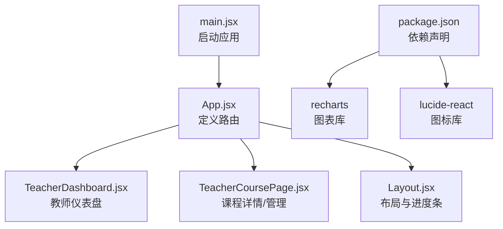
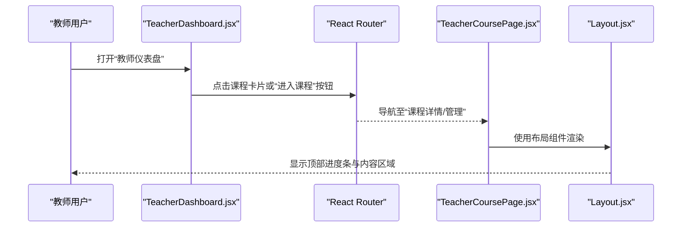
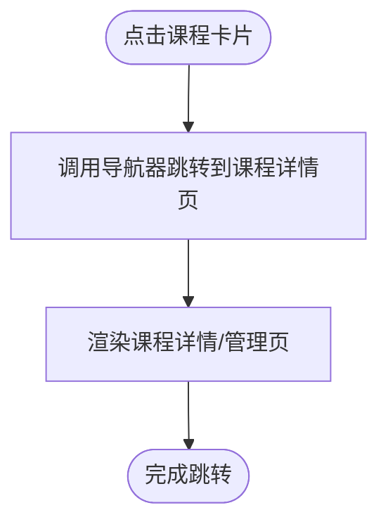
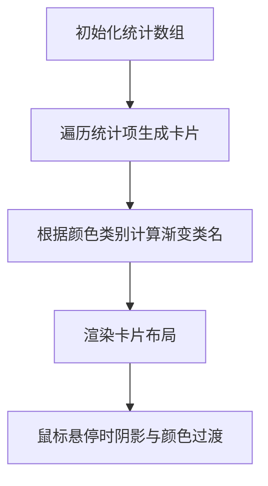
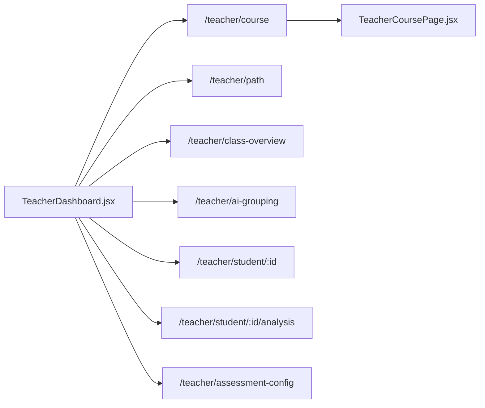
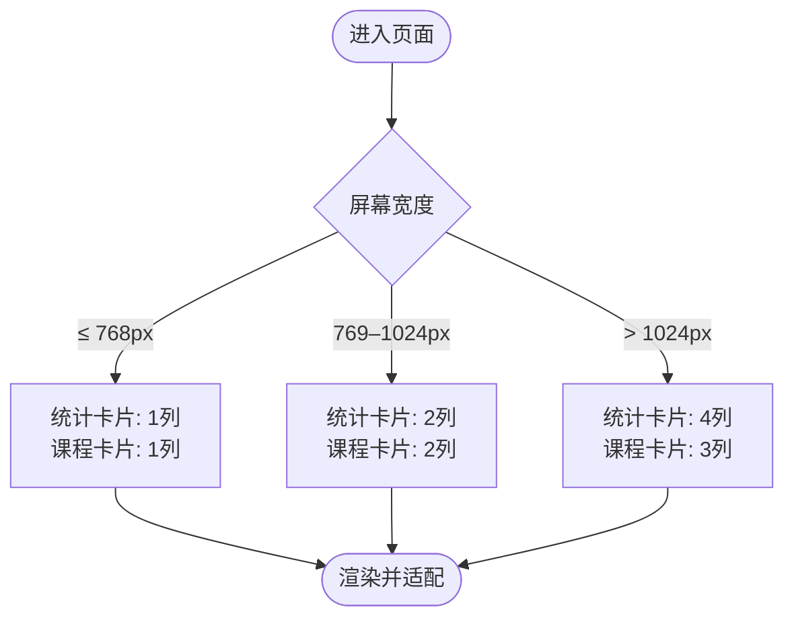
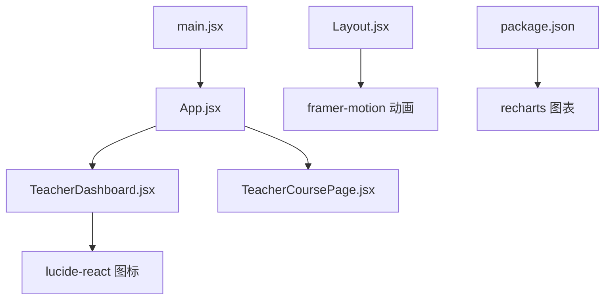

# 教师仪表盘

<cite>
**本文引用的文件列表**
- [TeacherDashboard.jsx](file://src/pages/TeacherDashboard.jsx)
- [App.jsx](file://src/App.jsx)
- [main.jsx](file://src/main.jsx)
- [TeacherCoursePage.jsx](file://src/pages/TeacherCoursePage.jsx)
- [Layout.jsx](file://src/components/Layout.jsx)
- [Header.jsx](file://src/components/Header.jsx)
- [package.json](file://package.json)
</cite>

## 目录
1. [简介](#简介)
2. [项目结构](#项目结构)
3. [核心组件](#核心组件)
4. [架构总览](#架构总览)
5. [组件详解](#组件详解)
6. [依赖关系分析](#依赖关系分析)
7. [性能与可扩展性](#性能与可扩展性)
8. [故障排查指南](#故障排查指南)
9. [结论](#结论)
10. [附录](#附录)

## 简介
本文件面向新入职教师，系统化讲解“教师仪表盘”的全局视图功能，包括课程卡片、统计数据展示与导航入口，并说明如何通过该界面快速进入课程管理、学生监控与教学资源。同时，文档覆盖数据可视化组件的使用方式与响应式适配策略，帮助教师在不同屏幕尺寸下高效管理多门课程与学生群体。

## 项目结构
教师仪表盘位于页面层，采用 React + React Router 的单页应用结构；路由通过 HashRouter 提供，教师相关页面集中在 /teacher 前缀下，便于统一导航与权限控制。

**图表来源**
- [main.jsx](file://src/main.jsx#L1-L14)
- [App.jsx](file://src/App.jsx#L77-L100)
- [TeacherDashboard.jsx](file://src/pages/TeacherDashboard.jsx#L1-L193)
- [TeacherCoursePage.jsx](file://src/pages/TeacherCoursePage.jsx#L1-L135)
- [Layout.jsx](file://src/components/Layout.jsx#L1-L90)
- [package.json](file://package.json#L12-L29)

**章节来源**
- [main.jsx](file://src/main.jsx#L1-L14)
- [App.jsx](file://src/App.jsx#L77-L100)

## 核心组件
- 教师仪表盘（TeacherDashboard）：提供课程卡片、统计数据卡片与导航入口，支持快速跳转到课程管理与教学资源。
- 课程详情页（TeacherCoursePage）：承载课程管理入口与学习路径管理等子功能。
- 布局组件（Layout）：提供顶部进度条与面包屑导航，增强流程化学习体验。
- 头部组件（Header）：基础头部样式与帮助入口，用于统一风格。

**章节来源**
- [TeacherDashboard.jsx](file://src/pages/TeacherDashboard.jsx#L1-L193)
- [TeacherCoursePage.jsx](file://src/pages/TeacherCoursePage.jsx#L1-L135)
- [Layout.jsx](file://src/components/Layout.jsx#L1-L90)
- [Header.jsx](file://src/components/Header.jsx#L1-L27)

## 架构总览
教师仪表盘作为入口页，通过路由与导航组件串联起课程管理、学习路径与学生分析等模块。整体交互流程如下：

**图表来源**
- [TeacherDashboard.jsx](file://src/pages/TeacherDashboard.jsx#L116-L186)
- [App.jsx](file://src/App.jsx#L85-L96)
- [TeacherCoursePage.jsx](file://src/pages/TeacherCoursePage.jsx#L1-L135)
- [Layout.jsx](file://src/components/Layout.jsx#L1-L90)

## 组件详解

### 1) 课程卡片（Course Card）
- 功能要点
  - 展示课程封面、分类标签、标题与学生人数。
  - 显示课程进度条与待批改作业数量（当存在时）。
  - 点击卡片或“进入课程”按钮跳转到课程详情/管理页。
- 交互细节
  - 鼠标悬停时卡片边框与阴影变化，按钮文字与箭头平滑过渡。
  - 图片缩放与渐变背景提升视觉层次。
- 数据来源
  - 课程数据为本地模拟数组，包含课程ID、标题、分类、封面、进度、作业数与待批改数。

**图表来源**
- [TeacherDashboard.jsx](file://src/pages/TeacherDashboard.jsx#L116-L186)
- [App.jsx](file://src/App.jsx#L85-L96)

**章节来源**
- [TeacherDashboard.jsx](file://src/pages/TeacherDashboard.jsx#L116-L186)

### 2) 统计数据展示（Stats Cards）
- 功能要点
  - 以四宫格形式展示“课程总数”“学生总数”“待批改”“本周作业”等关键指标。
  - 每个卡片包含对应图标、颜色主题与数值。
- 设计细节
  - 使用渐变色背景与悬浮阴影，提升可读性与交互反馈。
  - 颜色映射通过工具函数按类别返回，保证一致性。

**图表来源**
- [TeacherDashboard.jsx](file://src/pages/TeacherDashboard.jsx#L43-L105)

**章节来源**
- [TeacherDashboard.jsx](file://src/pages/TeacherDashboard.jsx#L43-L105)

### 3) 导航入口与路由
- 入口说明
  - 仪表盘提供“创建新课程”按钮与课程卡片点击跳转。
  - 路由集中于 App.jsx 中的 /teacher 前缀，涵盖课程管理、难度设置、学习路径、班级概览、AI分组、学生分析与评估配置等。
- 路由配置
  - /teacher -> 教师仪表盘
  - /teacher/course -> 课程详情/管理
  - /teacher/course/difficulty-settings -> 课程难度设置
  - /teacher/path -> 学习路径管理
  - /teacher/path/edit/:pathId -> 学习路径编辑
  - /teacher/class-overview -> 班级路径概览
  - /teacher/ai-grouping -> AI分组建议
  - /teacher/student/:studentId -> 学生路径详情
  - /teacher/student/:studentId/analysis -> 学生分析报告
  - /teacher/assessment-config -> 知识评估配置

**图表来源**
- [App.jsx](file://src/App.jsx#L85-L96)
- [TeacherDashboard.jsx](file://src/pages/TeacherDashboard.jsx#L116-L186)

**章节来源**
- [App.jsx](file://src/App.jsx#L85-L96)

### 4) 响应式适配
- 断点策略
  - 统计卡片网格：1列（小屏）→ 4列（大屏），确保信息密度与可读性平衡。
  - 课程卡片网格：1列（小屏）→ 2列（中屏）→ 3列（大屏），兼顾触摸点击与视觉浏览。
  - 头部与主内容区使用最大宽度容器与内边距，避免内容拥挤。
- 交互优化
  - 卡片悬停与按钮过渡动画，提升移动端触控反馈。
  - 图片缩放与渐变叠加，增强层级感但不牺牲加载性能。

**图表来源**
- [TeacherDashboard.jsx](file://src/pages/TeacherDashboard.jsx#L87-L186)

**章节来源**
- [TeacherDashboard.jsx](file://src/pages/TeacherDashboard.jsx#L87-L186)

### 5) 数据可视化组件使用方式
- 依赖声明
  - 项目已引入 recharts 作为图表库，用于学习报告与趋势分析等场景。
- 使用建议
  - 在需要展示趋势、对比或分布时，优先采用 AreaChart、BarChart、LineChart 等组件。
  - 使用 ResponsiveContainer 使图表自适应容器宽度与高度，确保在不同设备上保持一致观感。
  - 通过 Tooltip、CartesianGrid、XAxis/YAxis 等子组件提升可读性与交互体验。
- 注意事项
  - 图表数据需结构化，字段命名规范且与组件绑定一致。
  - 在移动端适当降低字体大小与刻度密度，避免拥挤。

**章节来源**
- [package.json](file://package.json#L22-L26)

### 6) 新教师操作指南
- 快速上手
  - 登录后进入“教师仪表盘”，查看“课程总数”“学生总数”“待批改”“本周作业”等关键指标，了解整体情况。
  - 点击任一课程卡片或“进入课程”按钮，进入课程详情/管理页。
- 课程管理
  - 在课程详情页中，可切换“学习路径管理”“难度设置”“作业布置与批改”等子功能。
  - 使用“创建新课程”按钮快速新增课程。
- 学生监控
  - 通过“班级路径概览”“AI分组建议”“学生分析报告”等入口，跟踪学生学习进度与薄弱环节。
- 教学资源
  - 在课程详情页中访问“学习路径管理”，为不同学生群体配置个性化学习路径与资源。
- 响应式使用
  - 小屏设备上优先使用卡片点击与底部导航；大屏设备上充分利用四宫格统计与三列课程布局。

**章节来源**
- [TeacherDashboard.jsx](file://src/pages/TeacherDashboard.jsx#L87-L186)
- [TeacherCoursePage.jsx](file://src/pages/TeacherCoursePage.jsx#L120-L135)
- [App.jsx](file://src/App.jsx#L85-L96)

## 依赖关系分析
- 路由与导航
  - main.jsx 使用 HashRouter 包裹应用，App.jsx 定义 /teacher 前缀下的所有教师相关路由。
- 组件与图标
  - TeacherDashboard 引入 lucide-react 图标库，用于课程、学生、进度、时间、日历等图标。
- 可视化与动画
  - recharts 用于趋势与对比图表；framer-motion 用于布局切换动画（Layout 组件）。
- UI 一致性
  - Header 提供统一头部样式；UiverseCard/GlassCard 等组件在其他页面中体现一致的设计语言。

**图表来源**
- [main.jsx](file://src/main.jsx#L1-L14)
- [App.jsx](file://src/App.jsx#L77-L100)
- [TeacherDashboard.jsx](file://src/pages/TeacherDashboard.jsx#L1-L193)
- [TeacherCoursePage.jsx](file://src/pages/TeacherCoursePage.jsx#L1-L135)
- [Layout.jsx](file://src/components/Layout.jsx#L1-L90)
- [package.json](file://package.json#L12-L29)

**章节来源**
- [main.jsx](file://src/main.jsx#L1-L14)
- [App.jsx](file://src/App.jsx#L77-L100)
- [package.json](file://package.json#L12-L29)

## 性能与可扩展性
- 性能优化建议
  - 课程卡片图片使用懒加载与合适的尺寸，避免首屏阻塞。
  - 统计卡片与课程卡片采用虚拟滚动或分页，当课程数量增长时提升渲染效率。
  - 图表组件仅在需要时渲染，避免不必要的重绘。
- 可扩展性建议
  - 将课程数据与统计数据抽象为可注入的数据源，便于对接后端接口。
  - 将颜色主题与图标映射集中管理，统一风格与维护成本。
  - 将导航入口抽离为通用组件，复用到其他页面。

[本节为通用指导，无需特定文件引用]

## 故障排查指南
- 无法进入课程详情页
  - 检查路由是否正确注册于 App.jsx 的 /teacher 前缀下。
  - 确认导航调用的目标路径与路由定义一致。
- 图标显示异常
  - 确认 lucide-react 已安装并在组件中正确导入。
- 图表不显示
  - 确认 recharts 已安装并在需要的页面中引入相应组件与容器。
- 响应式布局错乱
  - 检查 Tailwind 断点类名是否正确，确认容器最大宽度与内边距设置合理。

**章节来源**
- [App.jsx](file://src/App.jsx#L85-L96)
- [package.json](file://package.json#L12-L29)

## 结论
教师仪表盘以简洁直观的方式呈现课程与学生的关键信息，结合响应式布局与导航入口，帮助教师快速定位课程管理与教学资源。通过合理的数据可视化与组件复用，系统具备良好的可扩展性与维护性。建议后续逐步接入真实数据源与后端接口，进一步完善教师的教学与管理体验。

[本节为总结性内容，无需特定文件引用]

## 附录
- 关键路径参考
  - 仪表盘入口：/teacher
  - 课程详情/管理：/teacher/course
  - 学习路径管理：/teacher/path
  - 班级路径概览：/teacher/class-overview
  - AI分组建议：/teacher/ai-grouping
  - 学生分析报告：/teacher/student/:id/analysis
  - 评估配置：/teacher/assessment-config

**章节来源**
- [App.jsx](file://src/App.jsx#L85-L96)