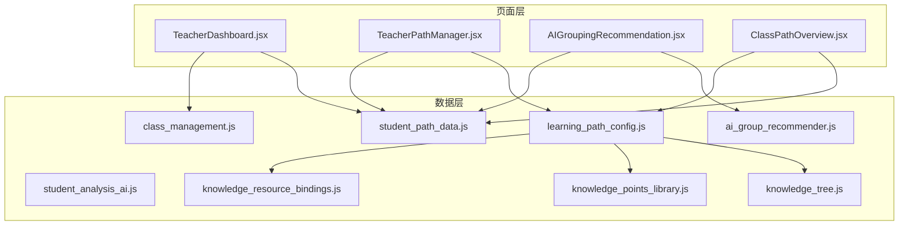
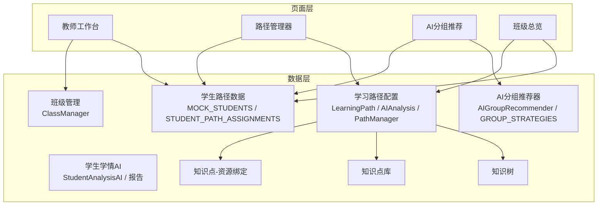
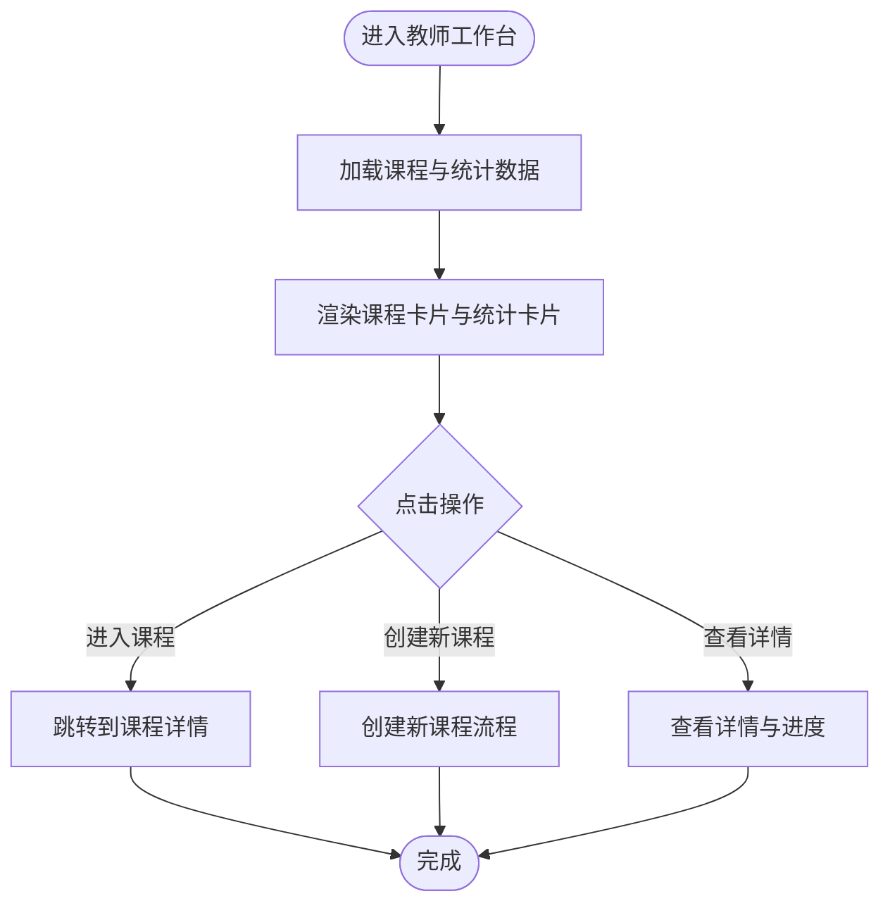
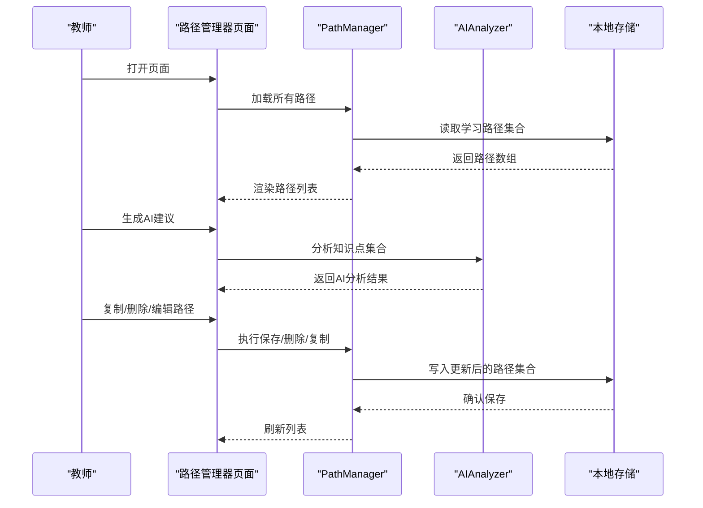
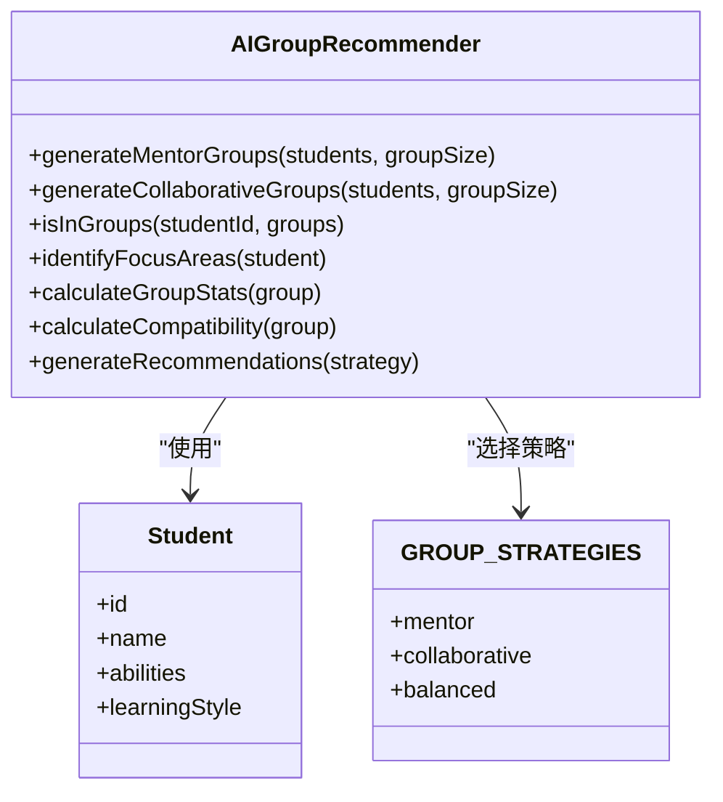
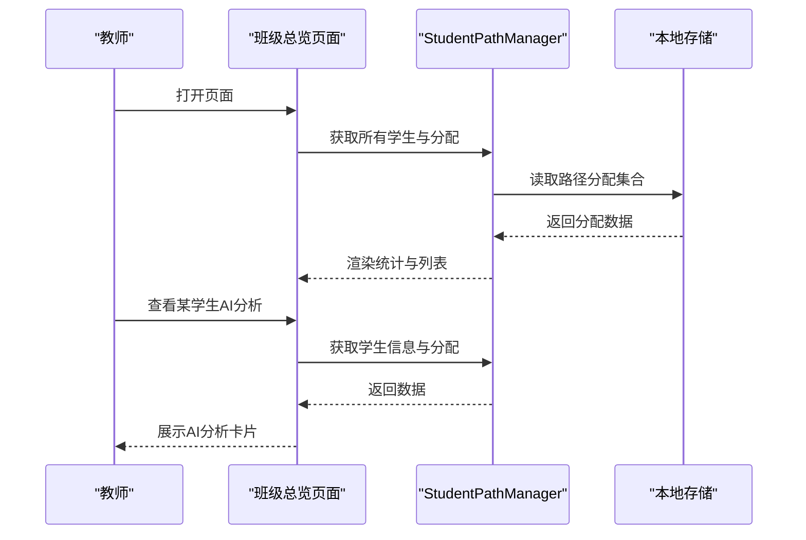
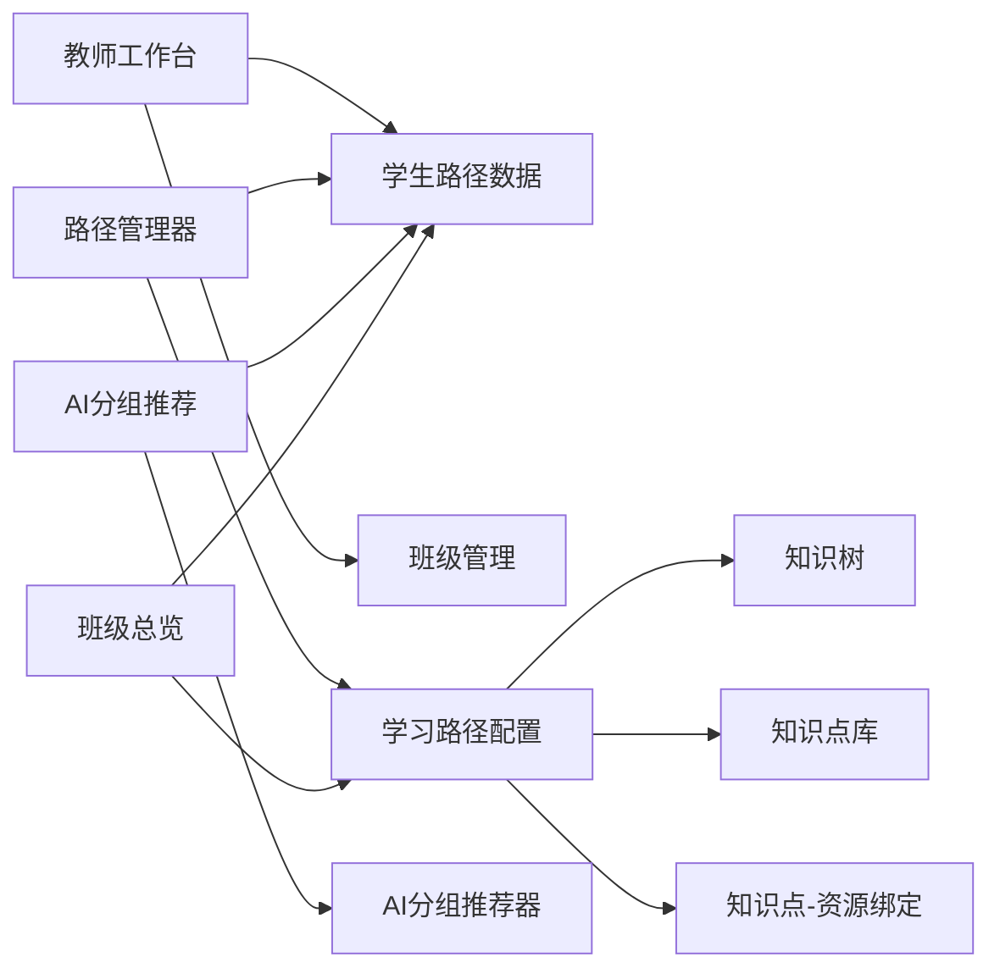

# 教师系统

<cite>
**本文引用的文件**
- [TeacherDashboard.jsx](file://src/pages/TeacherDashboard.jsx)
- [TeacherPathManager.jsx](file://src/pages/TeacherPathManager.jsx)
- [AIGroupingRecommendation.jsx](file://src/pages/AIGroupingRecommendation.jsx)
- [ClassPathOverview.jsx](file://src/pages/ClassPathOverview.jsx)
- [ai_group_recommender.js](file://src/data/ai_group_recommender.js)
- [student_path_data.js](file://src/data/student_path_data.js)
- [learning_path_config.js](file://src/data/learning_path_config.js)
- [class_management.js](file://src/data/class_management.js)
- [student_analysis_ai.js](file://src/data/student_analysis_ai.js)
- [knowledge_tree.js](file://src/data/knowledge_tree.js)
- [knowledge_points_library.js](file://src/data/knowledge_points_library.js)
- [knowledge_resource_bindings.js](file://src/data/knowledge_resource_bindings.js)
- [README.md](file://README.md)
</cite>

## 目录
1. [引言](#引言)
2. [项目结构](#项目结构)
3. [核心组件](#核心组件)
4. [架构总览](#架构总览)
5. [详细组件分析](#详细组件分析)
6. [依赖分析](#依赖分析)
7. [性能考虑](#性能考虑)
8. [故障排查指南](#故障排查指南)
9. [结论](#结论)
10. [附录](#附录)

## 引言
本文件聚焦教师系统的关键页面与数据模块，围绕以下四个主题展开：
- 教师全局视图：教师工作台提供课程概览、统计数据与入口导航。
- 学习路径管理：教师路径管理器支持路径的创建、复制、删除与AI建议展示。
- AI分组算法：智能学习小组推荐，支持“传帮带”“强强联合”“均衡分组”三种策略。
- 班级进度监控：班级学习路径总览，聚合全班进度、路径分布与学生个体详情。

文档同时解释教师端与学生端数据的关联性，说明教师操作如何影响学生的学习体验，并为教育管理者提供清晰的功能使用指南与技术实现背景。

## 项目结构
系统采用按页面与数据模块分离的组织方式：
- 页面层：src/pages 下的各功能页面，负责UI与交互。
- 数据层：src/data 下的数据与算法模块，封装业务数据结构、AI分析与管理工具。
- 组件层：src/components 下通用UI组件（本文件不深入分析）。
- 应用入口：src/App.jsx、src/main.jsx（本文件不深入分析）。

图表来源
- [TeacherDashboard.jsx](file://src/pages/TeacherDashboard.jsx#L1-L194)
- [TeacherPathManager.jsx](file://src/pages/TeacherPathManager.jsx#L1-L288)
- [AIGroupingRecommendation.jsx](file://src/pages/AIGroupingRecommendation.jsx#L1-L269)
- [ClassPathOverview.jsx](file://src/pages/ClassPathOverview.jsx#L1-L251)
- [student_path_data.js](file://src/data/student_path_data.js#L1-L305)
- [learning_path_config.js](file://src/data/learning_path_config.js#L1-L180)
- [ai_group_recommender.js](file://src/data/ai_group_recommender.js#L1-L215)
- [class_management.js](file://src/data/class_management.js#L1-L66)
- [student_analysis_ai.js](file://src/data/student_analysis_ai.js#L1-L162)
- [knowledge_tree.js](file://src/data/knowledge_tree.js#L1-L378)
- [knowledge_points_library.js](file://src/data/knowledge_points_library.js#L1-L214)
- [knowledge_resource_bindings.js](file://src/data/knowledge_resource_bindings.js#L1-L60)

章节来源
- [README.md](file://README.md#L1-L18)

## 核心组件
- 教师工作台（全局视图）
  - 提供课程卡片网格、统计卡片与快速入口，帮助教师快速掌握班级与课程总体情况。
  - 关键数据：课程列表、统计指标（课程总数、学生总数、待批改、本周作业）。
- 教师路径管理器（学习路径管理）
  - 支持路径列表展示、复制、删除、编辑；展示AI建议（难度、总学时、推荐资源类型）。
  - 关键数据：路径集合、AI分析结果（难度、总学时、推荐顺序、资源类型、警告）。
- AI智能学习小组推荐
  - 支持多种分组策略，生成小组成员、导师配对、共同目标与兼容度评分。
  - 关键数据：策略枚举、推荐结果对象（策略、小组集合、统计指标、时间戳）。
- 班级学习路径总览
  - 展示班级统计（总人数、平均进度、路径种类、总学时）、路径分布、学生进度与能力雷达。
  - 关键数据：学生集合、路径分配集合、班级统计（路径分布、平均进度）。

章节来源
- [TeacherDashboard.jsx](file://src/pages/TeacherDashboard.jsx#L1-L194)
- [TeacherPathManager.jsx](file://src/pages/TeacherPathManager.jsx#L1-L288)
- [AIGroupingRecommendation.jsx](file://src/pages/AIGroupingRecommendation.jsx#L1-L269)
- [ClassPathOverview.jsx](file://src/pages/ClassPathOverview.jsx#L1-L251)

## 架构总览
教师系统以“页面-数据-算法”三层协作：
- 页面层负责用户交互与展示。
- 数据层提供持久化存储、统计计算与AI分析。
- 算法层提供分组策略与学习路径建议。

图表来源
- [TeacherDashboard.jsx](file://src/pages/TeacherDashboard.jsx#L1-L194)
- [TeacherPathManager.jsx](file://src/pages/TeacherPathManager.jsx#L1-L288)
- [AIGroupingRecommendation.jsx](file://src/pages/AIGroupingRecommendation.jsx#L1-L269)
- [ClassPathOverview.jsx](file://src/pages/ClassPathOverview.jsx#L1-L251)
- [student_path_data.js](file://src/data/student_path_data.js#L1-L305)
- [learning_path_config.js](file://src/data/learning_path_config.js#L1-L180)
- [ai_group_recommender.js](file://src/data/ai_group_recommender.js#L1-L215)
- [class_management.js](file://src/data/class_management.js#L1-L66)
- [student_analysis_ai.js](file://src/data/student_analysis_ai.js#L1-L162)
- [knowledge_tree.js](file://src/data/knowledge_tree.js#L1-L378)
- [knowledge_points_library.js](file://src/data/knowledge_points_library.js#L1-L214)
- [knowledge_resource_bindings.js](file://src/data/knowledge_resource_bindings.js#L1-L60)

## 详细组件分析

### 教师工作台（全局视图）
- 功能要点
  - 课程卡片网格：展示课程封面、类别、学生数、作业数、进度与待批改数。
  - 统计卡片：课程总数、学生总数、待批改、本周作业。
  - 交互：进入课程、创建新课程。
- 数据来源
  - 课程列表与统计指标来自页面内模拟数据。
  - 头像与教师信息为静态展示。
- 教学干预与资源调配
  - 通过“待批改”与“作业数”指标识别教学压力点，合理安排作业与反馈节奏。
  - 通过“课程进度”识别整体学习节奏，必要时调整教学计划或增加复习路径。

图表来源
- [TeacherDashboard.jsx](file://src/pages/TeacherDashboard.jsx#L1-L194)

章节来源
- [TeacherDashboard.jsx](file://src/pages/TeacherDashboard.jsx#L1-L194)

### 教师路径管理器（学习路径管理）
- 功能要点
  - 路径列表：名称、描述、知识点数、预估学时、创建/更新时间、AI建议标签。
  - 操作：编辑、复制、删除（含确认弹窗）。
  - 统计：总路径数、总知识点、平均学时。
- 数据来源
  - 路径集合来自本地存储，经 PathManager 管理。
  - AI分析结果来自 AIAnalyzer，包含难度、总学时、推荐顺序、资源类型与警告。
- 教学干预与资源调配
  - 通过“平均学时”与“资源类型”建议，优化路径长度与资源匹配，避免过长或过短路径。
  - 通过“难度”标签指导分层教学，确保路径难度与学生能力相匹配。

图表来源
- [TeacherPathManager.jsx](file://src/pages/TeacherPathManager.jsx#L1-L288)
- [learning_path_config.js](file://src/data/learning_path_config.js#L1-L180)

章节来源
- [TeacherPathManager.jsx](file://src/pages/TeacherPathManager.jsx#L1-L288)
- [learning_path_config.js](file://src/data/learning_path_config.js#L1-L180)

### AI智能学习小组推荐（分组算法应用）
- 功能要点
  - 策略选择：传帮带、强强联合、均衡分组。
  - 推荐展示：小组编号、成员列表、导师配对、共同目标、兼容度评分。
  - 操作：采纳分组、调整成员。
- 算法实现
  - 传帮带：按能力排序，每组配置1名导师与若干学员，生成配对关系与关注领域。
  - 强强联合：按能力排序分组，按平均能力设定共同目标。
  - 兼容度评分：基于能力差距与成员数量，计算适配度。
  - 统计指标：平均能力、最高/最低能力、能力差距、成员数。
- 教学干预与资源调配
  - 通过“兼容度评分”与“能力差距”识别小组适配性，必要时微调分组。
  - “共同目标”帮助教师引导小组协作方向，促进团队学习氛围。

图表来源
- [ai_group_recommender.js](file://src/data/ai_group_recommender.js#L1-L215)
- [AIGroupingRecommendation.jsx](file://src/pages/AIGroupingRecommendation.jsx#L1-L269)

章节来源
- [AIGroupingRecommendation.jsx](file://src/pages/AIGroupingRecommendation.jsx#L1-L269)
- [ai_group_recommender.js](file://src/data/ai_group_recommender.js#L1-L215)

### 班级学习路径总览（班级进度监控）
- 功能要点
  - 班级统计：总人数、平均进度、路径种类、总学时。
  - 路径分布：按路径名称展示人数占比与进度条。
  - 学生列表：头像、姓名、学号、学习进度、能力雷达、当前节点与已完成节点数、进度条。
  - 操作：查看AI学情分析。
- 数据来源
  - 学生集合与路径分配集合来自本地存储，经 StudentPathManager 管理。
  - 班级统计由 StudentPathManager 计算得出。
- 教学干预与资源调配
  - 通过“平均进度”与“路径分布”识别整体学习节奏与路径选择合理性，必要时调整路径或资源。
  - 通过“能力雷达”与“当前节点”定位学生薄弱环节，提供针对性干预与资源推荐。

图表来源
- [ClassPathOverview.jsx](file://src/pages/ClassPathOverview.jsx#L1-L251)
- [student_path_data.js](file://src/data/student_path_data.js#L1-L305)

章节来源
- [ClassPathOverview.jsx](file://src/pages/ClassPathOverview.jsx#L1-L251)
- [student_path_data.js](file://src/data/student_path_data.js#L1-L305)

## 依赖分析
- 页面与数据模块耦合
  - 教师工作台依赖学生路径数据与班级管理模块，用于展示课程与统计。
  - 路径管理器依赖学习路径配置模块与学生路径数据，用于展示与管理路径。
  - AI分组推荐依赖AI分组推荐器与学生路径数据，用于生成分组建议。
  - 班级总览依赖学生路径数据与学习路径配置，用于统计与展示。
- 外部依赖
  - 本地存储：用于持久化路径、分配与绑定关系。
  - 图标库：lucide-react，用于界面图标。
- 潜在循环依赖
  - 当前模块间为单向依赖，未发现循环依赖风险。

图表来源
- [TeacherDashboard.jsx](file://src/pages/TeacherDashboard.jsx#L1-L194)
- [TeacherPathManager.jsx](file://src/pages/TeacherPathManager.jsx#L1-L288)
- [AIGroupingRecommendation.jsx](file://src/pages/AIGroupingRecommendation.jsx#L1-L269)
- [ClassPathOverview.jsx](file://src/pages/ClassPathOverview.jsx#L1-L251)
- [student_path_data.js](file://src/data/student_path_data.js#L1-L305)
- [learning_path_config.js](file://src/data/learning_path_config.js#L1-L180)
- [ai_group_recommender.js](file://src/data/ai_group_recommender.js#L1-L215)
- [class_management.js](file://src/data/class_management.js#L1-L66)
- [knowledge_tree.js](file://src/data/knowledge_tree.js#L1-L378)
- [knowledge_points_library.js](file://src/data/knowledge_points_library.js#L1-L214)
- [knowledge_resource_bindings.js](file://src/data/knowledge_resource_bindings.js#L1-L60)

章节来源
- [student_path_data.js](file://src/data/student_path_data.js#L1-L305)
- [learning_path_config.js](file://src/data/learning_path_config.js#L1-L180)
- [ai_group_recommender.js](file://src/data/ai_group_recommender.js#L1-L215)
- [class_management.js](file://src/data/class_management.js#L1-L66)
- [knowledge_tree.js](file://src/data/knowledge_tree.js#L1-L378)
- [knowledge_points_library.js](file://src/data/knowledge_points_library.js#L1-L214)
- [knowledge_resource_bindings.js](file://src/data/knowledge_resource_bindings.js#L1-L60)

## 性能考虑
- 数据访问
  - 页面首次渲染时从本地存储读取路径与分配数据，建议在数据量增大时引入分页或懒加载。
- 计算复杂度
  - AI分组算法按学生数线性处理，分组数量与组大小决定最终复杂度；建议在大数据场景下限制组大小或采用分批处理。
- 渲染优化
  - 使用虚拟滚动或分页展示大量学生列表，减少DOM节点数量。
- 本地存储
  - 避免频繁写入，合并批量更新，降低I/O开销。

## 故障排查指南
- 路径管理器为空
  - 检查本地存储中是否存在学习路径集合；若无，需先创建路径。
  - 参考路径管理器加载逻辑与本地存储键名。
- 班级总览统计异常
  - 检查路径分配集合是否完整；确认路径名称与进度字段存在。
  - 参考班级统计计算逻辑（路径分布、平均进度）。
- AI分组推荐未生成
  - 确认已选择分组策略并触发生成；检查学生集合是否可用。
  - 参考AI分组推荐器的策略选择与生成流程。
- 教师工作台课程数据为空
  - 页面使用模拟数据，若期望真实数据，需扩展后端接口与数据源。

章节来源
- [TeacherPathManager.jsx](file://src/pages/TeacherPathManager.jsx#L1-L288)
- [ClassPathOverview.jsx](file://src/pages/ClassPathOverview.jsx#L1-L251)
- [AIGroupingRecommendation.jsx](file://src/pages/AIGroupingRecommendation.jsx#L1-L269)
- [TeacherDashboard.jsx](file://src/pages/TeacherDashboard.jsx#L1-L194)

## 结论
教师系统通过“全局视图—路径管理—AI分组—班级监控”的闭环，帮助教师高效开展教学干预与资源调配。页面层以直观的统计与列表呈现关键指标，数据层以本地存储与AI分析支撑决策，算法层提供可解释的分组策略与学习路径建议。教师可通过这些工具精准识别学习薄弱环节、优化小组协作与路径设计，从而提升整体教学效果与学生学习体验。

## 附录
- 教育管理者使用建议
  - 全局视图：定期查看“待批改”“作业数”“课程进度”，识别教学压力与节奏偏差。
  - 路径管理：结合“平均学时”“资源类型”建议，控制路径长度与难度，确保可执行性。
  - AI分组：优先采用“传帮带”策略提升协作氛围；对高能力学生采用“强强联合”策略。
  - 班级监控：关注“平均进度”与“路径分布”，及时调整教学计划与资源投放。
- 技术实现背景
  - 本地存储：路径、分配、绑定关系均以JSON形式持久化，便于快速读写与离线使用。
  - 数据结构：学习路径、AI分析、学生路径分配、策略枚举等均以类与常量形式定义，便于扩展与维护。
  - 知识体系：知识树、知识点库与资源绑定为路径设计提供结构化支撑。