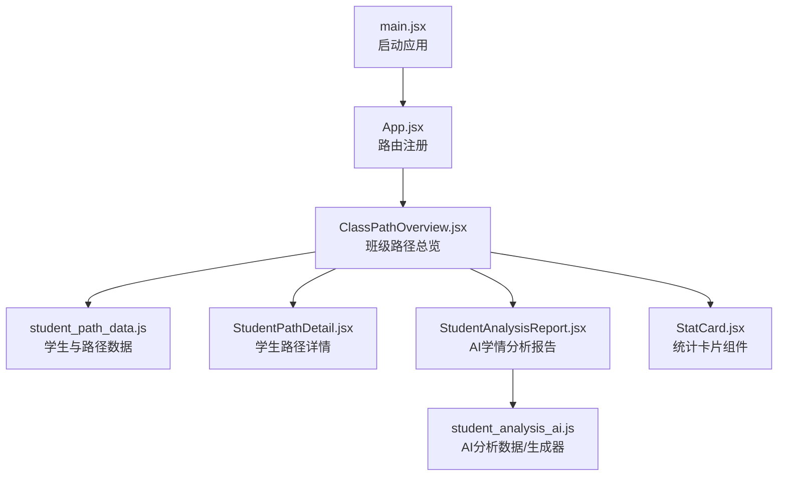
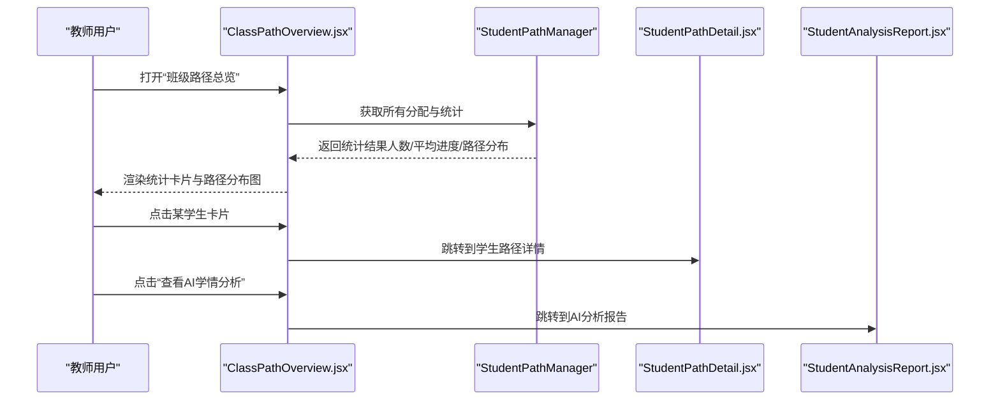
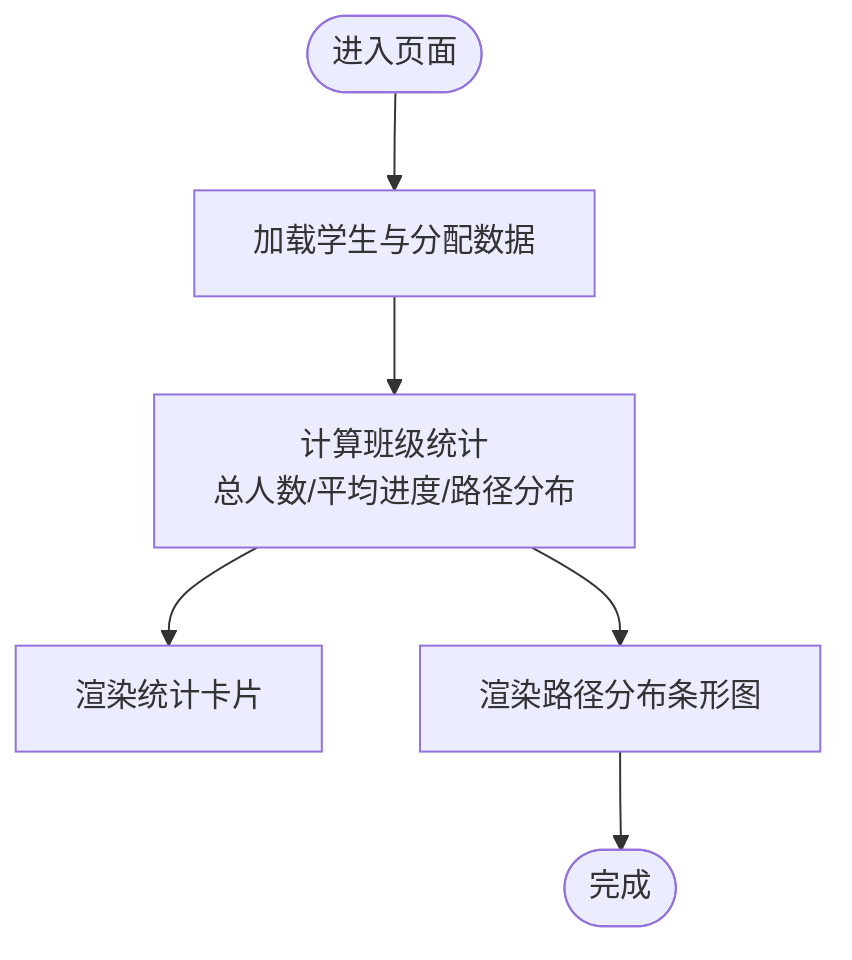
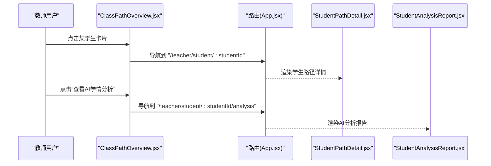
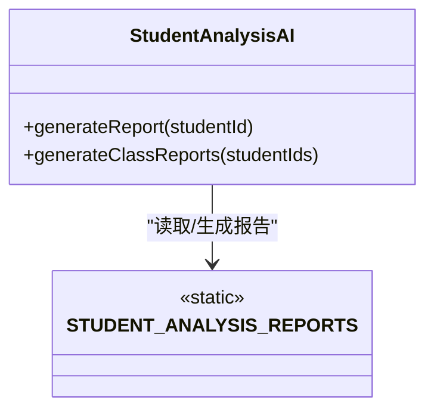
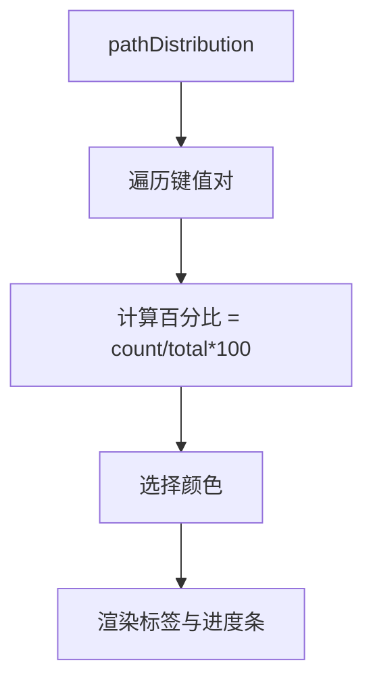
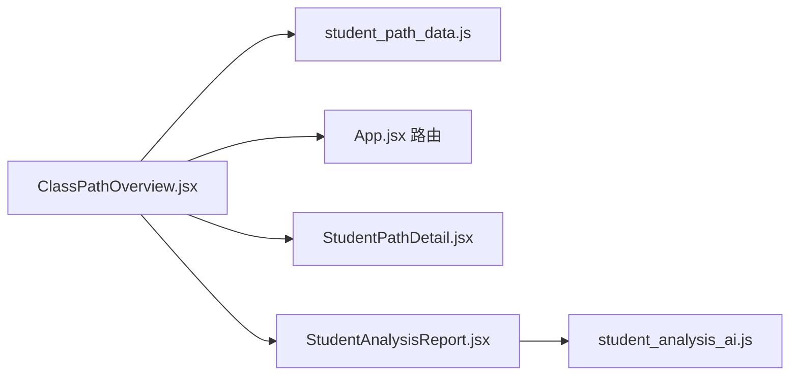

# 班级路径概览

<cite>
**本文引用的文件**
- [ClassPathOverview.jsx](file://src/pages/ClassPathOverview.jsx)
- [student_path_data.js](file://src/data/student_path_data.js)
- [StatCard.jsx](file://src/components/uiverse/StatCard.jsx)
- [StudentAnalysisReport.jsx](file://src/pages/StudentAnalysisReport.jsx)
- [StudentPathDetail.jsx](file://src/pages/StudentPathDetail.jsx)
- [student_analysis_ai.js](file://src/data/student_analysis_ai.js)
- [App.jsx](file://src/App.jsx)
- [main.jsx](file://src/main.jsx)
- [class_management.js](file://src/data/class_management.js)
</cite>

## 目录
1. [引言](#引言)
2. [项目结构](#项目结构)
3. [核心组件](#核心组件)
4. [架构总览](#架构总览)
5. [详细组件分析](#详细组件分析)
6. [依赖分析](#依赖分析)
7. [性能考虑](#性能考虑)
8. [故障排查指南](#故障排查指南)
9. [结论](#结论)
10. [附录](#附录)

## 引言
本文件围绕“班级学习路径总览”页面（ClassPathOverview.jsx）进行系统化技术文档梳理，重点解释其如何通过统计卡片展示班级学生总数、平均进度与路径分布，并说明路径分布图的可视化原理；同时阐述学生列表的交互设计（点击查看详情、AI学情分析入口、进度跟踪机制），帮助教师识别学习困难学生并据此调整教学策略。

## 项目结构
ClassPathOverview 属于教师端页面，位于 src/pages 下，配合数据层 src/data 中的学生路径数据与分析数据，路由由 App.jsx 统一注册。整体采用前端单页应用（SPA）结构，使用 HashRouter 提供路由能力。

图表来源
- [main.jsx](file://src/main.jsx#L1-L14)
- [App.jsx](file://src/App.jsx#L85-L96)
- [ClassPathOverview.jsx](file://src/pages/ClassPathOverview.jsx#L1-L251)
- [student_path_data.js](file://src/data/student_path_data.js#L1-L305)
- [StudentPathDetail.jsx](file://src/pages/StudentPathDetail.jsx#L1-L361)
- [StudentAnalysisReport.jsx](file://src/pages/StudentAnalysisReport.jsx#L1-L298)
- [StatCard.jsx](file://src/components/uiverse/StatCard.jsx#L1-L108)
- [student_analysis_ai.js](file://src/data/student_analysis_ai.js#L1-L162)

章节来源
- [main.jsx](file://src/main.jsx#L1-L14)
- [App.jsx](file://src/App.jsx#L85-L96)

## 核心组件
- 班级路径总览页面（ClassPathOverview.jsx）：负责渲染统计卡片、路径分布图与学生列表，提供跳转到学生详情与AI分析的能力。
- 学生路径数据（student_path_data.js）：提供模拟学生数据、路径分配与进度，以及统计计算（平均进度、路径分布）。
- 统计卡片组件（StatCard.jsx）：通用统计卡片组件，支持数字动画与趋势展示（本页面未直接使用，但可复用）。
- 学生路径详情（StudentPathDetail.jsx）：展示单个学生的路径节点、能力雷达与学习轨迹。
- AI学情分析（StudentAnalysisReport.jsx + student_analysis_ai.js）：生成并展示AI学情分析报告，包含能力维度、薄弱环节、个性化建议与学习预测。

章节来源
- [ClassPathOverview.jsx](file://src/pages/ClassPathOverview.jsx#L1-L251)
- [student_path_data.js](file://src/data/student_path_data.js#L1-L305)
- [StatCard.jsx](file://src/components/uiverse/StatCard.jsx#L1-L108)
- [StudentPathDetail.jsx](file://src/pages/StudentPathDetail.jsx#L1-L361)
- [StudentAnalysisReport.jsx](file://src/pages/StudentAnalysisReport.jsx#L1-L298)
- [student_analysis_ai.js](file://src/data/student_analysis_ai.js#L1-L162)

## 架构总览
ClassPathOverview.jsx 作为教师端入口，承担以下职责：
- 初始化：读取模拟学生与路径分配数据，计算班级统计（总人数、平均进度、路径分布）。
- 展示：统计卡片、路径分布图、学生列表。
- 交互：点击学生卡片进入学生路径详情；点击“查看AI学情分析”进入AI分析报告页。
- 数据来源：本地存储的路径分配数据与模拟学生数据，统计由 StudentPathManager 计算。

图表来源
- [ClassPathOverview.jsx](file://src/pages/ClassPathOverview.jsx#L1-L251)
- [student_path_data.js](file://src/data/student_path_data.js#L223-L298)
- [StudentPathDetail.jsx](file://src/pages/StudentPathDetail.jsx#L1-L361)
- [StudentAnalysisReport.jsx](file://src/pages/StudentAnalysisReport.jsx#L1-L298)

## 详细组件分析

### 统计卡片与路径分布图
- 统计卡片
  - 总学生数：来自统计结果中的 totalStudents。
  - 平均进度：来自统计结果中的 avgProgress（百分比）。
  - 路径种类：基于路径分布对象键的数量。
  - 总学时：累加所有分配记录的实际学习时长。
- 路径分布图
  - 依据统计结果中的 pathDistribution，按路径名称遍历，计算每种路径的人数占比，绘制横向进度条，颜色循环使用。
  - 百分比显示为整数，条形宽度按百分比设置。

图表来源
- [ClassPathOverview.jsx](file://src/pages/ClassPathOverview.jsx#L1-L251)
- [student_path_data.js](file://src/data/student_path_data.js#L278-L298)

章节来源
- [ClassPathOverview.jsx](file://src/pages/ClassPathOverview.jsx#L58-L132)
- [student_path_data.js](file://src/data/student_path_data.js#L278-L298)

### 学生列表交互设计
- 列表项
  - 头像、姓名、学号、学习进度百分比。
  - 能力雷达：代数、几何、分析三项能力值。
  - 路径信息：当前路径名称、已学时长、当前节点、已完成/总节点数。
  - 进度条：展示当前百分比。
- 交互行为
  - 点击整行卡片：跳转到该学生的“学习路径详情”页面。
  - 点击“查看AI学情分析”按钮：跳转到该学生的“AI学情分析报告”页面。
- 进度跟踪机制
  - 通过 StudentPathManager.getAllAssignments() 获取分配记录，结合 getStudentWithAssignment(studentId) 合并学生与分配数据，实时展示进度与节点信息。

图表来源
- [ClassPathOverview.jsx](file://src/pages/ClassPathOverview.jsx#L134-L244)
- [App.jsx](file://src/App.jsx#L85-L96)
- [StudentPathDetail.jsx](file://src/pages/StudentPathDetail.jsx#L1-L361)
- [StudentAnalysisReport.jsx](file://src/pages/StudentAnalysisReport.jsx#L1-L298)

章节来源
- [ClassPathOverview.jsx](file://src/pages/ClassPathOverview.jsx#L134-L244)
- [App.jsx](file://src/App.jsx#L85-L96)

### AI学情分析入口与数据支撑
- 入口
  - 在每个学生卡片底部提供“查看AI学情分析”按钮，点击后进入分析报告页。
- 报告内容
  - 学习状态评估（总体评分、趋势）、能力维度分析（代数/几何/分析等）、薄弱环节诊断（严重/中等/轻微）、个性化建议（优先级与资源）、学习预测（下一周进度、预计完成时间、风险等级）。
- 数据来源
  - student_analysis_ai.js 提供模拟报告与生成器；StudentAnalysisAI.generateReport(studentId) 可根据学生ID生成或返回已有报告。
- 教学策略建议
  - 结合“薄弱环节诊断”与“个性化建议”，教师可针对不同学生制定差异化教学策略；结合“学习预测”的风险等级，提前干预可能落后或有风险的学生。

图表来源
- [student_analysis_ai.js](file://src/data/student_analysis_ai.js#L1-L162)
- [StudentAnalysisReport.jsx](file://src/pages/StudentAnalysisReport.jsx#L1-L298)

章节来源
- [StudentAnalysisReport.jsx](file://src/pages/StudentAnalysisReport.jsx#L1-L298)
- [student_analysis_ai.js](file://src/data/student_analysis_ai.js#L1-L162)

### 路径分布图的可视化原理
- 数据来源：统计结果中的 pathDistribution，键为路径名称，值为人数。
- 可视化步骤：
  - 遍历 entries，计算每条路径的百分比（人数/总人数×100）。
  - 使用循环颜色数组为每条路径分配颜色。
  - 渲染文本标签（路径名、人数与百分比）与横向进度条，宽度等于百分比。
- 适用场景：快速识别班级中不同路径的分布情况，辅助教师判断是否需要调整分层策略或资源分配。

图表来源
- [ClassPathOverview.jsx](file://src/pages/ClassPathOverview.jsx#L102-L132)
- [student_path_data.js](file://src/data/student_path_data.js#L278-L298)

章节来源
- [ClassPathOverview.jsx](file://src/pages/ClassPathOverview.jsx#L102-L132)
- [student_path_data.js](file://src/data/student_path_data.js#L278-L298)

### 教师识别学习困难学生与调整策略
- 识别指标
  - 学生列表中“学习进度”较低且“已学时长”偏少，或“当前节点”长期未推进。
  - 能力雷达中某项能力显著低于其他项，或整体能力偏低。
  - AI分析报告中的“薄弱环节诊断”与“风险等级”提示。
- 调整策略
  - 针对薄弱环节提供个性化建议与资源推荐。
  - 降低难度或调整路径顺序，确保基础巩固后再进阶。
  - 增加个别化关注与学习提醒，改善学习时间分配与习惯。

章节来源
- [ClassPathOverview.jsx](file://src/pages/ClassPathOverview.jsx#L134-L244)
- [StudentPathDetail.jsx](file://src/pages/StudentPathDetail.jsx#L1-L361)
- [StudentAnalysisReport.jsx](file://src/pages/StudentAnalysisReport.jsx#L1-L298)
- [student_analysis_ai.js](file://src/data/student_analysis_ai.js#L1-L162)

## 依赖分析
- 页面依赖
  - ClassPathOverview.jsx 依赖 student_path_data.js 提供的数据与统计方法。
  - 路由由 App.jsx 注册，ClassPathOverview.jsx 通过 react-router-dom 的 useNavigate 进行页面跳转。
- 组件耦合
  - 统计卡片组件 StatCard.jsx 与 ClassPathOverview.jsx 解耦，可在其他页面复用。
  - 学生详情与AI分析报告分别独立，通过路由参数 studentId 关联到同一学生数据源。
- 外部依赖
  - 图标库 lucide-react 提供统一图标风格。
  - 本地存储 localStorage 用于持久化路径分配数据。

图表来源
- [ClassPathOverview.jsx](file://src/pages/ClassPathOverview.jsx#L1-L251)
- [student_path_data.js](file://src/data/student_path_data.js#L1-L305)
- [App.jsx](file://src/App.jsx#L85-L96)
- [StudentPathDetail.jsx](file://src/pages/StudentPathDetail.jsx#L1-L361)
- [StudentAnalysisReport.jsx](file://src/pages/StudentAnalysisReport.jsx#L1-L298)
- [student_analysis_ai.js](file://src/data/student_analysis_ai.js#L1-L162)

章节来源
- [ClassPathOverview.jsx](file://src/pages/ClassPathOverview.jsx#L1-L251)
- [App.jsx](file://src/App.jsx#L85-L96)

## 性能考虑
- 数据加载
  - 使用 useEffect 在挂载时一次性加载数据，避免重复请求；若数据量增大，可考虑分页或懒加载。
- 渲染优化
  - 路径分布图与学生列表均为简单循环渲染，复杂度与学生数量线性相关；可通过虚拟滚动优化超大列表。
- 统计计算
  - 统计计算在客户端完成，复杂度与分配记录数量线性相关；若数据量增长，可考虑服务端聚合或缓存。
- 交互流畅性
  - 路由跳转使用 HashRouter，避免刷新；按钮与卡片 hover 效果使用过渡动画，注意在低端设备上的性能表现。

## 故障排查指南
- 页面空白或数据未显示
  - 检查 student_path_data.js 中的 MOCK_STUDENTS 与 STUDENT_PATH_ASSIGNMENTS 是否存在；确认 StudentPathManager.getAllAssignments() 能正常读取本地存储。
- 统计异常
  - 确认 StudentPathManager.getClassStats() 的计算逻辑：路径分布统计、平均进度计算与总人数一致。
- 路由跳转失败
  - 检查 App.jsx 中的路由配置是否包含 "/teacher/student/:studentId" 与 "/teacher/student/:studentId/analysis"。
- AI分析报告为空
  - 确认 student_analysis_ai.js 中是否存在 STUDENT_ANALYSIS_REPORTS 或 generateReport 能返回默认报告。
- 班级切换
  - 若需支持多班级，可参考 class_management.js 中 ClassManager.getCurrentClass() 的思路，将当前班级ID写入 localStorage 并在数据层按班级过滤。

章节来源
- [student_path_data.js](file://src/data/student_path_data.js#L223-L298)
- [App.jsx](file://src/App.jsx#L85-L96)
- [student_analysis_ai.js](file://src/data/student_analysis_ai.js#L1-L162)
- [class_management.js](file://src/data/class_management.js#L1-L66)

## 结论
ClassPathOverview.jsx 通过简洁直观的统计卡片与路径分布图，为教师提供了班级整体学习态势的快速概览；通过学生列表与AI分析报告入口，教师可以深入洞察个体差异，识别学习困难学生并制定针对性教学策略。数据层与路由层清晰分离，便于扩展与维护。

## 附录
- 路由与页面导航
  - 班级路径总览：/teacher/class-overview
  - 学生路径详情：/teacher/student/:studentId
  - AI学情分析：/teacher/student/:studentId/analysis
- 数据来源与统计
  - 学生与路径分配：student_path_data.js
  - AI分析报告：student_analysis_ai.js
  - 班级管理：class_management.js（可选）