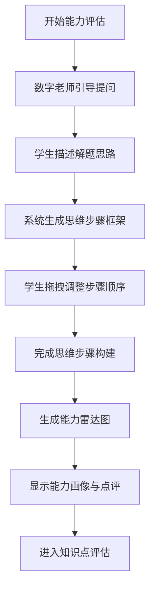
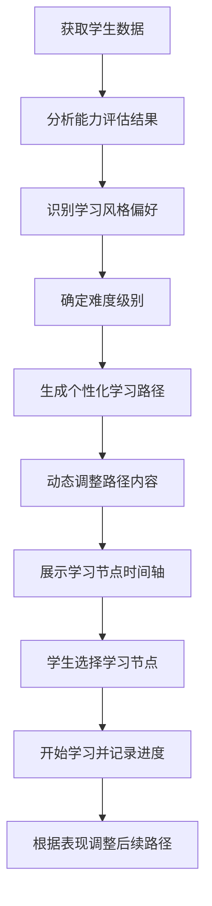
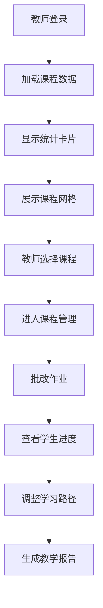
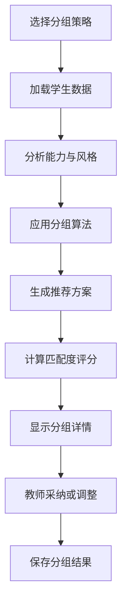
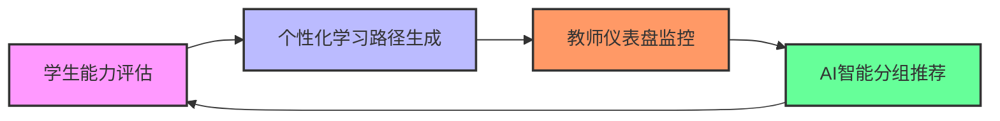

# 核心功能

<cite>
**本文档引用文件**   
- [AbilityAssessmentPage.jsx](file://src/pages/AbilityAssessmentPage.jsx)
- [ability_assessment_data.ts](file://src/data/ability_assessment_data.ts)
- [AbilityRadarPage.jsx](file://src/pages/AbilityRadarPage.jsx)
- [ability_radar_data.ts](file://src/data/ability_radar_data.ts)
- [LearningPathPage.jsx](file://src/pages/LearningPathPage.jsx)
- [UnifiedAssessmentPage.jsx](file://src/pages/UnifiedAssessmentPage.jsx)
- [Dashboard.jsx](file://src/pages/Dashboard.jsx)
- [TeacherDashboard.jsx](file://src/pages/TeacherDashboard.jsx)
- [AIGroupingRecommendation.jsx](file://src/pages/AIGroupingRecommendation.jsx)
- [ai_group_recommender.js](file://src/data/ai_group_recommender.js)
- [student_path_data.js](file://src/data/student_path_data.js)
- [LearningReportOverview.jsx](file://src/pages/LearningReportOverview.jsx)
- [LearningReportDetails.jsx](file://src/pages/LearningReportDetails.jsx)
- [LearningReportRecommendations.jsx](file://src/pages/LearningReportRecommendations.jsx)
</cite>

## 目录
1. [学生能力评估](#学生能力评估)
2. [个性化学习路径生成](#个性化学习路径生成)
3. [教师仪表盘监控](#教师仪表盘监控)
4. [AI智能分组推荐](#ai智能分组推荐)
5. [功能协同关系](#功能协同关系)

## 学生能力评估

学生能力评估功能是gemini项目的核心入口，旨在通过交互式对话和思维步骤构建，全面评估学生的学习能力。该功能通过`AbilityAssessmentPage.jsx`实现，结合`ability_assessment_data.ts`中的预设数据，引导学生描述解题思路并整理思维步骤。评估过程分为两个阶段：首先通过聊天界面收集学生对复杂问题的解决思路，然后在右侧区域提供可拖拽的步骤卡片，让学生构建自己的解题框架。

评估完成后，系统会生成能力雷达图，可视化展示学生的各项能力指标。`AbilityRadarPage.jsx`页面利用`recharts`库绘制雷达图，基于`ability_radar_data.ts`中的数据展示分析力、解决问题、逻辑思维、概念理解和理解力等维度的评估结果。这种评估方式不仅关注最终答案，更重视解题过程和思维模式，为后续个性化学习路径的生成提供关键数据支持。

**Section sources**
- [AbilityAssessmentPage.jsx](file://src/pages/AbilityAssessmentPage.jsx#L1-L117)
- [ability_assessment_data.ts](file://src/data/ability_assessment_data.ts#L1-L21)
- [AbilityRadarPage.jsx](file://src/pages/AbilityRadarPage.jsx#L1-L91)
- [ability_radar_data.ts](file://src/data/ability_radar_data.ts#L1-L10)

**Diagram sources**
- [AbilityAssessmentPage.jsx](file://src/pages/AbilityAssessmentPage.jsx#L1-L117)
- [AbilityRadarPage.jsx](file://src/pages/AbilityRadarPage.jsx#L1-L91)

## 个性化学习路径生成

个性化学习路径生成功能基于学生的能力评估结果和学习风格，为每位学生定制专属的学习旅程。该功能的核心实现位于`LearningPathPage.jsx`，通过`getPathContent()`函数动态生成学习内容。系统根据学生类型（视觉型、逻辑型、实战型）和难度级别（简单、中等、困难）提供不同的学习路径。

学习路径以时间轴形式展示，包含视频、测验、练习和阅读等多种学习形式。每个节点都有明确的状态标识（已完成、进行中、已锁定），学生可以点击节点查看详情并开始学习。路径生成逻辑充分考虑了学生的个体差异，例如视觉型学生会优先看到可视化演示内容，而逻辑型学生则会获得更深入的逻辑推导材料。这种个性化设计确保了学习内容与学生的学习偏好相匹配，提高了学习效率和参与度。

**Section sources**
- [LearningPathPage.jsx](file://src/pages/LearningPathPage.jsx#L1-L166)
- [UnifiedAssessmentPage.jsx](file://src/pages/UnifiedAssessmentPage.jsx#L1-L208)

**Diagram sources**
- [LearningPathPage.jsx](file://src/pages/LearningPathPage.jsx#L1-L166)
- [UnifiedAssessmentPage.jsx](file://src/pages/UnifiedAssessmentPage.jsx#L1-L208)

## 教师仪表盘监控

教师仪表盘监控功能为教师提供了全面的课程管理和学生监控工具。`TeacherDashboard.jsx`页面展示了教师工作台的概览，包括课程总数、学生总数、待批改作业等关键统计数据。教师可以查看每个课程的详细信息，如学生人数、课程进度和待批改作业数量。

仪表盘采用卡片式布局，每个课程以独立卡片形式展示，包含封面图片、课程标题、分类、学生人数和进度条等信息。教师可以点击课程卡片进入详细管理页面，进行作业批改、学习路径调整等操作。这种设计使教师能够快速掌握班级整体情况，及时发现需要关注的学生，提高了教学管理的效率和精准度。

**Section sources**
- [TeacherDashboard.jsx](file://src/pages/TeacherDashboard.jsx#L1-L194)
- [Dashboard.jsx](file://src/pages/Dashboard.jsx#L1-L211)

**Diagram sources**
- [TeacherDashboard.jsx](file://src/pages/TeacherDashboard.jsx#L1-L194)

## AI智能分组推荐

AI智能分组推荐功能基于学生的能力数据和学习目标，智能生成最优的学习小组。该功能由`AIGroupingRecommendation.jsx`页面和`ai_group_recommender.js`中的`AIGroupRecommender`类共同实现。系统提供三种分组策略：传帮带分组、强强联合分组和均衡分组。

传帮带分组算法将高能力学生与低能力学生配对，促进互帮互助；强强联合分组则将能力相近的学生组合，激发竞争力；均衡分组确保各组整体水平相当，实现公平竞争。推荐系统不仅考虑能力匹配度，还分析学生的学习风格和目标，生成包含匹配度评分、能力统计和成员列表的详细推荐方案。教师可以采纳推荐方案，也可以进行手动调整。

**Section sources**
- [AIGroupingRecommendation.jsx](file://src/pages/AIGroupingRecommendation.jsx#L1-L269)
- [ai_group_recommender.js](file://src/data/ai_group_recommender.js#L1-L215)
- [student_path_data.js](file://src/data/student_path_data.js#L1-L305)

**Diagram sources**
- [AIGroupingRecommendation.jsx](file://src/pages/AIGroupingRecommendation.jsx#L1-L269)
- [ai_group_recommender.js](file://src/data/ai_group_recommender.js#L1-L215)

## 功能协同关系

gemini项目的四大核心功能相互关联，形成一个完整的教育闭环。学生能力评估是整个系统的起点，其生成的评估数据直接驱动个性化学习路径的生成。`UnifiedAssessmentPage.jsx`中的评估流程不仅收集学生的能力信息，还识别其学习风格，这些数据被传递给`LearningPathPage.jsx`用于生成定制化学习内容。

教师仪表盘监控功能则为教师提供了全局视角，使其能够基于AI生成的评估报告和学习路径，进行更精准的教学干预。`TeacherDashboard.jsx`中的课程管理功能与学生的学习进度数据实时同步，确保教师能够及时了解每个学生的学习状态。

AI智能分组推荐功能进一步利用评估数据，将学生按能力、风格和目标进行智能分组。`AIGroupRecommender`类的`generateRecommendations`方法直接使用`student_path_data.js`中的学生数据，生成最优分组方案。这种协同关系确保了从评估到教学的无缝衔接，实现了真正的个性化教育。

**Section sources**
- [LearningReportOverview.jsx](file://src/pages/LearningReportOverview.jsx#L1-L269)
- [LearningReportDetails.jsx](file://src/pages/LearningReportDetails.jsx#L1-L422)
- [LearningReportRecommendations.jsx](file://src/pages/LearningReportRecommendations.jsx#L1-L292)

**Diagram sources**
- [LearningReportOverview.jsx](file://src/pages/LearningReportOverview.jsx#L1-L269)
- [LearningReportDetails.jsx](file://src/pages/LearningReportDetails.jsx#L1-L422)
- [LearningReportRecommendations.jsx](file://src/pages/LearningReportRecommendations.jsx#L1-L292)