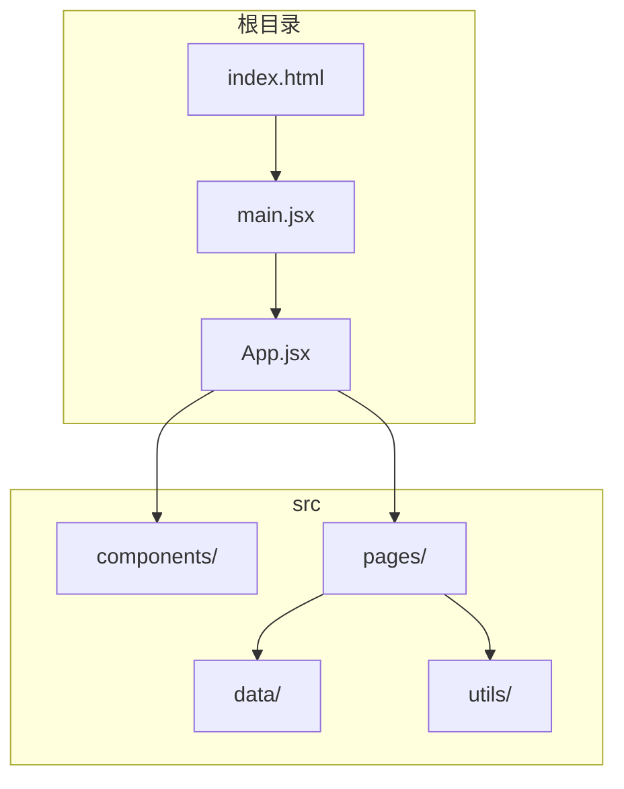
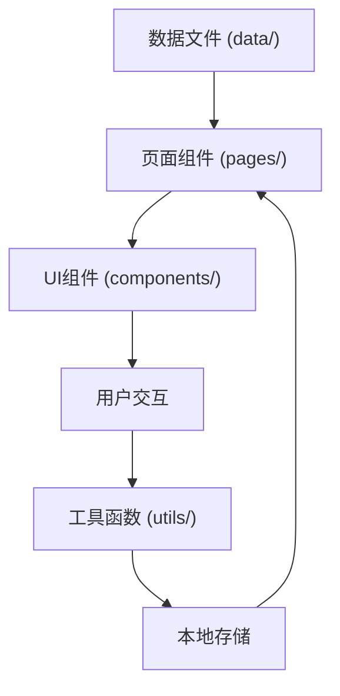
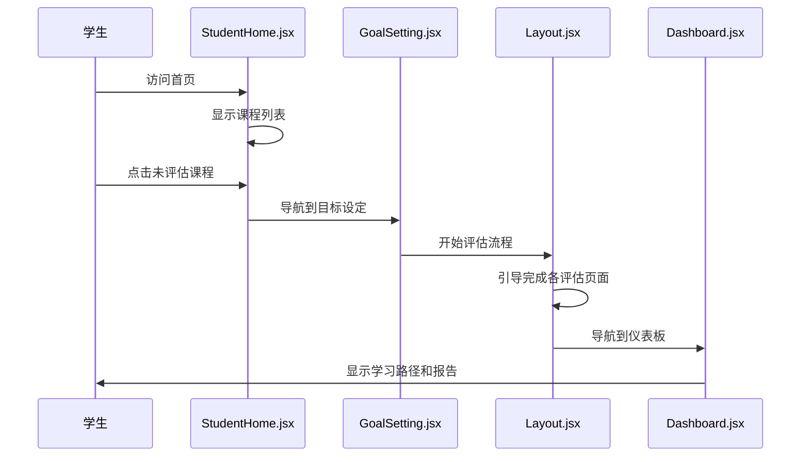

# 项目概述

<cite>
**本文档引用的文件**
- [main.jsx](file://src/main.jsx)
- [App.jsx](file://src/App.jsx)
- [Layout.jsx](file://src/components/Layout.jsx)
- [StudentHome.jsx](file://src/pages/StudentHome.jsx)
- [Dashboard.jsx](file://src/pages/Dashboard.jsx)
- [TeacherDashboard.jsx](file://src/pages/TeacherDashboard.jsx)
- [learning_path_data.js](file://src/data/learning_path_data.js)
- [knowledge_tree.js](file://src/data/knowledge_tree.js)
- [ability_assessment_data.ts](file://src/data/ability_assessment_data.ts)
- [ability_radar_data.ts](file://src/data/ability_radar_data.ts)
- [recommendations_data.js](file://src/data/recommendations_data.js)
- [LearningDialoguePage.jsx](file://src/pages/LearningDialoguePage.jsx)
</cite>

## 目录
1. [项目简介](#项目简介)
2. [项目结构](#项目结构)
3. [核心功能与设计目的](#核心功能与设计目的)
4. [目标用户与使用场景](#目标用户与使用场景)
5. [系统价值主张](#系统价值主张)
6. [系统架构与数据流](#系统架构与数据流)
7. [角色划分与交互流程](#角色划分与交互流程)
8. [启动入口](#启动入口)

## 项目简介

gemini项目是一个AI驱动的个性化教育学习平台，旨在通过智能化手段提升学生的学习效率和教师的教学管理能力。该平台结合了现代前端技术栈（React、Vite、Tailwind CSS）与人工智能算法，为学生提供多维度的能力评估、个性化的学习路径推荐、知识图谱的可视化展示，并为教师提供全面的教学分析工具。项目以“数字老师”为核心概念，通过模拟真实教学场景，实现对学生学习过程的精准跟踪与指导。

**Section sources**
- [README.md](file://README.md)
- [package.json](file://package.json)

## 项目结构

项目采用基于功能的文件组织方式，主要分为`src/components`、`src/pages`、`src/data`和`src/utils`四个核心目录。`components`目录存放可复用的UI组件，如聊天小部件和卡片组件；`pages`目录包含所有页面组件，清晰地划分了学生端和教师端的功能模块；`data`目录集中管理所有静态数据和配置，包括学习路径、知识树、评估数据等；`utils`目录则包含对话处理和存储相关的工具函数。项目使用React Router进行路由管理，通过HashRouter实现前端路由导航。

**Diagram sources**
- [index.html](file://index.html)
- [main.jsx](file://src/main.jsx)
- [App.jsx](file://src/App.jsx)

## 核心功能与设计目的

gemini平台的核心功能围绕“评估-分析-推荐-学习”的闭环设计。首先，通过`AbilityAssessmentPage`和`AttitudeAssessmentPage`等页面对学生进行多维度能力评估，利用`ability_assessment_data.ts`和`ability_radar_data.ts`中的数据模型生成能力雷达图。其次，基于评估结果，系统通过`learning_path_data.js`中的学习路径数据，为学生生成个性化的学习路径。知识图谱功能通过`knowledge_tree.js`中的层级化知识点数据，以可视化的方式展示知识体系。最后，`LearningDialoguePage`提供了一个沉浸式的AI对话学习环境，结合`recommendations_data.js`中的建议数据，实现动态的内容推送和练习推荐。

**Section sources**
- [ability_assessment_data.ts](file://src/data/ability_assessment_data.ts)
- [ability_radar_data.ts](file://src/data/ability_radar_data.ts)
- [learning_path_data.js](file://src/data/learning_path_data.js)
- [knowledge_tree.js](file://src/data/knowledge_tree.js)
- [recommendations_data.js](file://src/data/recommendations_data.js)

## 目标用户与使用场景

平台的目标用户主要分为两类：学生和教师。对于学生，核心使用场景包括：通过`StudentHome.jsx`进入课程，完成`GoalSelectionPage`中的目标设定，经历`Layout.jsx`定义的评估流程，最终在`Dashboard.jsx`中查看学习报告和进入`MyLearningPathPage`进行学习。对于教师，`TeacherDashboard.jsx`提供了课程管理和学生分析的入口，可以查看班级整体学习情况，进行难度设置和路径编辑。学生在学习过程中，可以通过`LearningDialoguePage`与AI教师进行互动，获取实时的学习支持。

**Section sources**
- [StudentHome.jsx](file://src/pages/StudentHome.jsx)
- [Dashboard.jsx](file://src/pages/Dashboard.jsx)
- [TeacherDashboard.jsx](file://src/pages/TeacherDashboard.jsx)
- [LearningDialoguePage.jsx](file://src/pages/LearningDialoguePage.jsx)

## 系统价值主张

gemini平台的整体价值在于将传统教育的“标准化教学”转变为“个性化学习”。对于学生，系统通过AI算法分析其学习风格和能力水平，推荐最适合的学习内容和路径，避免了“一刀切”的教学模式。对于教师，平台提供了强大的数据分析能力，如`AIGroupingRecommendation`页面中的AI分组推荐和`StudentAnalysisReport`中的学生分析报告，帮助教师更高效地进行教学决策。系统的数据驱动特性确保了教学活动的科学性和有效性，实现了教育公平与效率的双重提升。

**Section sources**
- [App.jsx](file://src/App.jsx)
- [data/](file://src/data/)

## 系统架构与数据流

系统采用典型的前端MVC架构，`App.jsx`作为应用的根组件，负责路由分发和状态管理。`Layout.jsx`作为布局组件，为评估流程提供统一的导航和进度条。数据流从`data`目录中的静态数据文件开始，通过页面组件的导入，传递给UI组件进行渲染。例如，在`LearningDialoguePage`中，多个数据文件（`learning_dialogue_qa_data`、`learning_dialogue_resources_data`等）被导入并结合`dialogueUtils.js`中的工具函数，实现复杂的对话逻辑。用户交互产生的数据通过`storage_utils.js`进行本地存储，确保学习进度的持久化。

**Diagram sources**
- [App.jsx](file://src/App.jsx)
- [Layout.jsx](file://src/components/Layout.jsx)
- [LearningDialoguePage.jsx](file://src/pages/LearningDialoguePage.jsx)
- [utils/](file://src/utils/)

## 角色划分与交互流程

系统明确划分了学生和教师两种角色。学生的主要交互流程始于`StudentHome`页面，点击未评估的课程后进入`GoalSetting`，随后通过`Layout`组件引导完成一系列评估页面（`AbilityAssessment` -> `AbilityRadar` -> `KnowledgeNebula`等），最终到达`Dashboard`。教师则通过`StudentHome`中的“教师端”按钮进入`TeacherDashboard`，可访问`TeacherPathManager`进行路径管理，或通过`ClassPathOverview`查看班级整体情况。两种角色的权限和功能通过路由配置（`App.jsx`中的`<Route>`组件）进行隔离。

**Diagram sources**
- [StudentHome.jsx](file://src/pages/StudentHome.jsx)
- [GoalSetting.jsx](file://src/pages/GoalSetting.jsx)
- [Layout.jsx](file://src/components/Layout.jsx)
- [Dashboard.jsx](file://src/pages/Dashboard.jsx)

## 启动入口

项目的启动入口为`main.jsx`，它通过`createRoot`将`App`组件渲染到DOM中，并包裹`HashRouter`以启用前端路由。`App.jsx`作为应用的主组件，定义了所有路由规则，是整个应用的控制中心。`index.html`作为HTML模板，加载了必要的CSS和JavaScript文件，为应用提供了运行环境。开发者可以通过运行`npm run dev`命令启动开发服务器，访问`http://localhost:5173`查看应用。

**Section sources**
- [main.jsx](file://src/main.jsx)
- [index.html](file://index.html)
- [App.jsx](file://src/App.jsx)